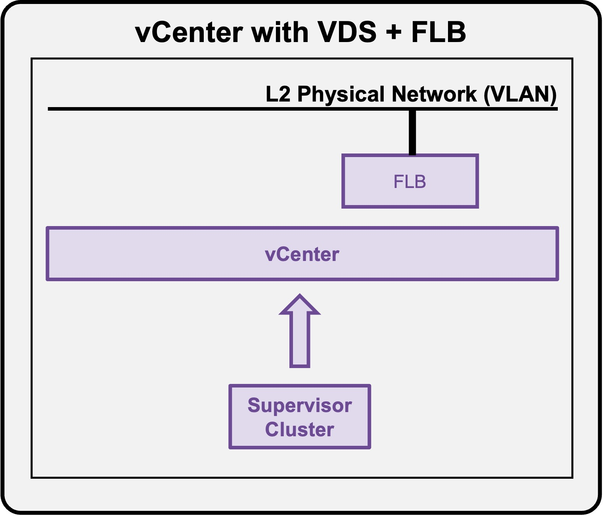
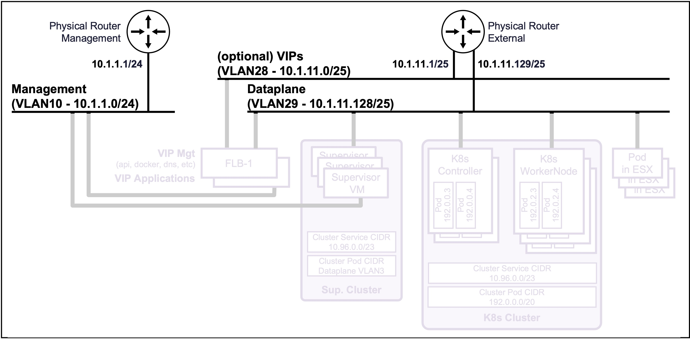
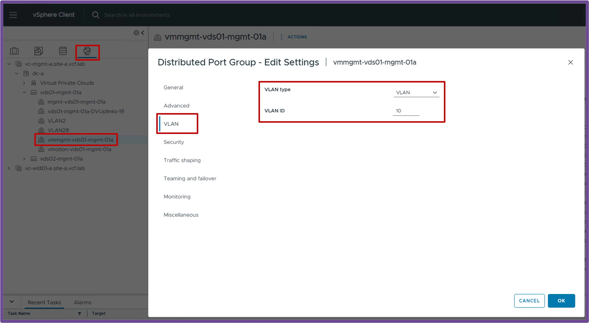
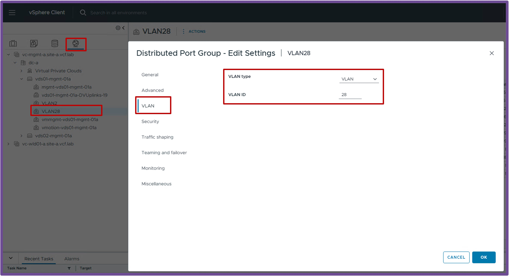
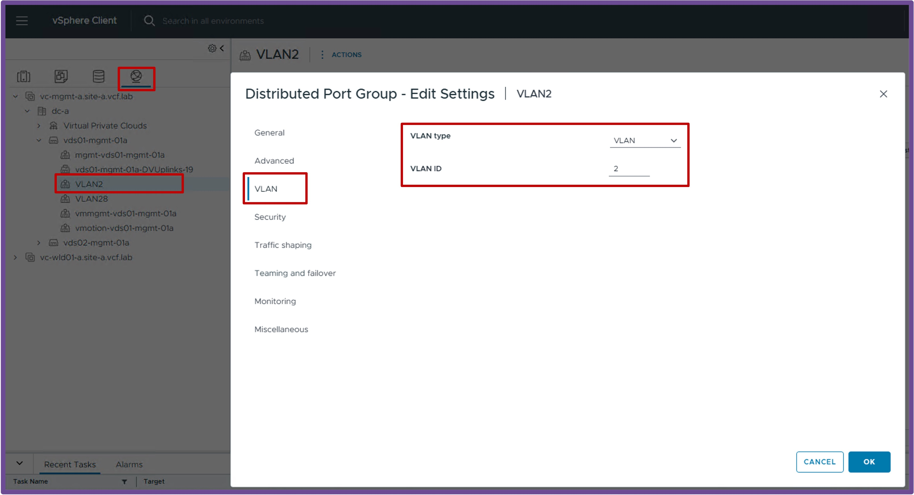

<h1>
   Supervisor with "VDS + FLB"
</h1>

This section describes the requirements for **deploying the Supervisor utilizing a "VDS + FLB" architecture** inside a vSphere environment.

* [**Requirements**](#requirements)

{ width="100%" }

---

## Requirements {: #requirements }

VKS Supervisor with "VDS + FLB" has the following networking requirements:  
{ width="80%" style="display: block; margin: 0 auto;" }

### Physical Fabric {: #physical_fabric }

#### **2 or 3 Subnets/VLANs**  
* **Management**:  
    Can be an existing Management subnet/VLAN that already hosts other components (such as vCenter).  
    Requires 7 consecutive IPs (5 for the Supervisor Cluster + 2 for the FLB VMs).
* **Dataplane**:  
    Can be an existing subnet/VLAN that already hosts other components (such as Physical Servers).  
    A large pool of IPs is required (for future K8s Controller nodes, Worker nodes, and VIPs).
* **(Optional) VIPs**:  
    Can be an existing subnet/VLAN that already hosts other components.  
    A large pool of IPs is required for future K8s VIPs.

***Note:** No requirement for dynamic routing (such as BGP).*

### vCenter {: #vcenter }

#### **VDS Port Groups**  
* **Management**:  
    VDS Port Group VLAN for the Management traffic.  

    ??? info "Status Validation"
        Navigate to **vCenter** > **Networking** > **VDS-PortGroup** > **Edit Settings** > **VLAN**.  
        Ensure the VLAN Type is "VLAN" with the right "VLAN ID":
        { width="95%" style="display: block; margin: 0 auto;" }

* **Dataplane**:  
    VDS Port Group VLAN for the K8s Dataplane traffic.

    ??? info "Status Validation"
        Navigate to **vCenter** > **Networking** > **VDS-PortGroup** > **Edit Settings** > **VLAN**.  
        Ensure the VLAN Type is "VLAN" with the right "VLAN ID":
        { width="95%" style="display: block; margin: 0 auto;" }

* **(Optional) VIPs**:  
    VDS Port Group VLAN for the K8s VIPs traffic.

    ??? info "Status Validation"
        Navigate to **vCenter** > **Networking** > **VDS-PortGroup** > **Edit Settings** > **VLAN**.  
        Ensure the VLAN Type is "VLAN" with the right "VLAN ID":
        { width="95%" style="display: block; margin: 0 auto;" }

