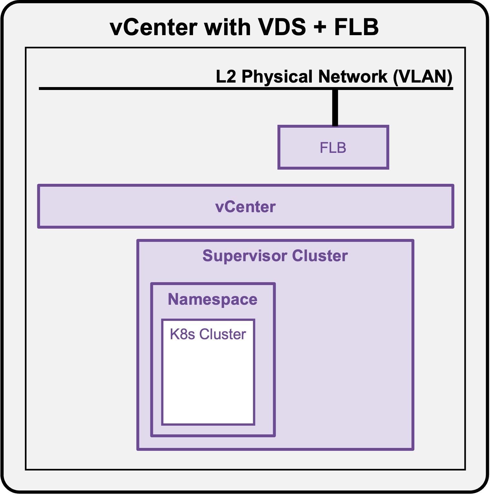
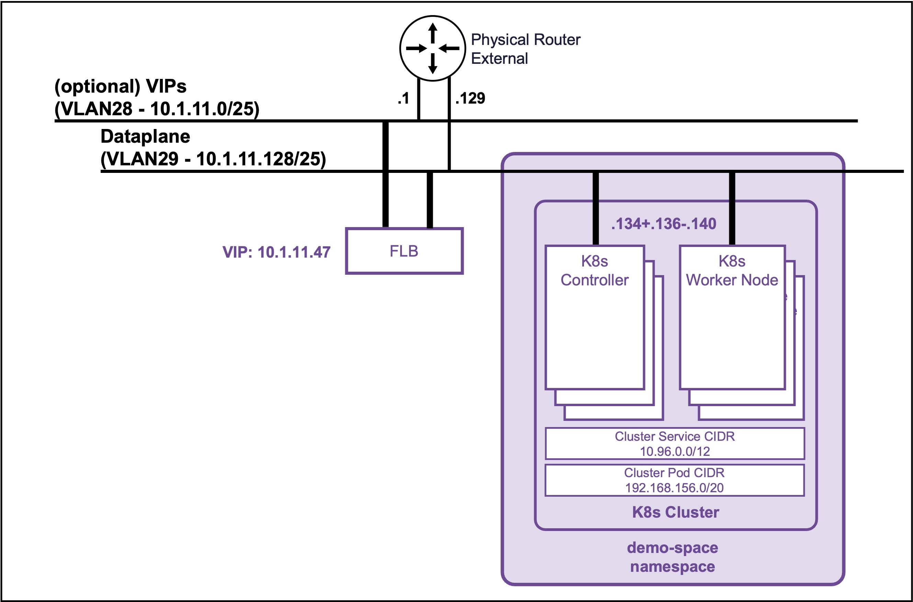

<h1>
   Supervisor with "VDS + FLB"
</h1>

<div class="grid" markdown style="grid-template-columns: 60% 40%">

<div markdown>

This section describes the procedures for **deploying a K8s Cluster in a Namespace utilizing a "VDS + FLB" architecture** inside a vSphere environment.

* **K8s Cluster Deployment**
    * [**via CLI**](#deployment_k8s)

</div>

<div markdown>
{ width="100%" }
</div>
</div>

---

## K8s Cluster Deployment {: #deployment_k8s }

{ width="80%" style="display: block; margin: 0 auto;" }

??? info ":material-laptop: Client Operating System"
    While the command outputs below are captured from a **Windows client**, the `vcf` and `kubectl` CLI tools operate identically across **Linux** and **macOS** environments.

### Connect to the Supervisor Namespace

* **List the Supervisor Namespaces**  
    ```text
    vcf context list
    ```

    ??? abstract "Output example"
        <pre><code>PS C:\Users\Administrator\Documents> <b>vcf context list</b>
        NAME                             CURRENT  TYPE
        supervisor-mgt                   false    kubernetes
        <b>supervisor-mgt:demo-space        true     kubernetes</b>
        supervisor-mgt:svc-cci-ns-hzbv0  false    kubernetes
        supervisor-mgt:svc-tkg-m829h     false    kubernetes
        supervisor-mgt:svc-velero-xqgz5  false    kubernetes
        &nbsp;
        [i] Use '--wide' to view additional columns.
        </code></pre>

* **Connect to the Supervisor Namespace**  
If the current context is not the good one, connect to the Supervisor Namespace
    ```text
    vcf context use supervisor-mgt:demo-space
    ```

    ??? abstract "Output example"
        <pre><code>PS C:\Users\Administrator\Documents> <b>vcf context use supervisor-mgt:demo-space</b>
        [ok] Token is still active. Skipped the token refresh for context "supervisor-mgt:demo-space"
        </b>[i] Successfully activated context 'supervisor-mgt:demo-space' (Type: kubernetes)</b>
        [i] Fetching recommended plugins for active context 'supervisor-mgt:demo-space'...
        </code></pre>


---

### Create K8s Cluster

#### Check all K8s Cluster resources

* **Check TKR releases available**
    ```text
    kubectl get kubernetesreleases
    ```

    ??? abstract "Output example"
        <pre><code>PS C:\Users\Administrator\Documents> <b>kubectl get kubernetesreleases</b>
        NAME                                      VERSION                                 READY   COMPATIBLE   CREATED   TYPE
        <snip>
        v1.35.5---vmware.1-vkr.1                  v1.35.5+vmware.1-vkr.1                  True    True         4d8h<
        <snip>
        </code></pre>

* **Check VM Class available**
    ```text
    kubectl get virtualmachineclass
    ```

    ??? abstract "Output example"
        <pre><code>PS C:\Users\Administrator\Documents> <b>kubectl get virtualmachineclass</b>
        NAME                 CPU   MEMORY
        best-effort-medium   2     8Gi
        best-effort-small    2     4Gi
        guaranteed-medium    2     8Gi
        guaranteed-small     2     4Gi
        </code></pre>

* **Check Storage Class availablee**
    ```text
    kubectl get storageclass
    ```

    ??? abstract "Output example"
        <pre><code>PS C:\Users\Administrator\Documents> <b>kubectl get storageclass</b>
        NAME                                                   PROVISIONER              RECLAIMPOLICY   VOLUMEBINDINGMODE      ALLOWVOLUMEEXPANSION   AGE
        <snip>
        vsan-default-storage-policy                            csi.vsphere.vmware.com   Delete          Immediate              true                   22h
        <snip>
        </code></pre>


#### Create the K8s Cluster yaml file 
Create file "my-cluster.yaml"

??? info "my-cluster.yaml file"
    ```text
    apiVersion: cluster.x-k8s.io/v1beta2
    kind: Cluster
    metadata:
      name: my-cluster
      namespace: demo-space
    spec:
      clusterNetwork:
        services:
          cidrBlocks: ["10.96.0.0/12"]
        pods:
          cidrBlocks: ["192.168.156.0/20"]
        serviceDomain: "cluster.local"
      topology:
        classRef:
          name: builtin-generic-v3.6.0
        version: v1.35.5---vmware.1-vkr.1
        controlPlane:
          replicas: 3
        workers:
          machineDeployments:
            - class: node-pool
              name: workers
              metadata:
                annotations:
                  cluster.x-k8s.io/cluster-api-autoscaler-node-group-min-size: "3"
                  cluster.x-k8s.io/cluster-api-autoscaler-node-group-max-size: "5"
        variables:
          - name: vmClass
            value: best-effort-small
          - name: storageClass
            value: vsan-default-storage-policy
    ```

#### Deploy the K8s Cluster yaml file 
```text
kubectl apply -f my-cluster.yaml
```

??? abstract "Output example"
    <pre><code>PS C:\Users\Administrator\Documents> <b>kubectl apply -f my-cluster.yaml</b>
    cluster.cluster.x-k8s.io/my-cluster created
    </code></pre>


---

### Validate Deployment

#### **Validate K8s Cluster Status** 
It takes around 5 minutes to get the K8s Cluster ready
```text
kubectl get cluster
```

??? abstract "Output example"
    <pre><code>PS C:\Users\Administrator\Documents> <b>kubectl get cluster</b>
    NAME         CLUSTERCLASS             <b>AVAILABLE</b>   CP DESIRED   <b>CP AVAILABLE</b>   CP UP-TO-DATE   <b>W DESIRED</b>   W AVAILABLE   W UP-TO-DATE   <b>PHASE</b>         AGE    VERSION
    my-cluster   builtin-generic-v3.6.0   <b>True</b>        3            <b>3</b>              3               <b>3</b>           3             3              <b>Provisioned</b>   7m32s   v1.35.5+vmware.1
    </code></pre>

#### **Validate K8s Nodes Status** 
```text
kubectl get machines
```

??? abstract "Output example"
    <pre><code>PS C:\Users\Administrator\Documents> <b>kubectl get machines</b>
    NAME                                   CLUSTER      NODE NAME                              READY   AVAILABLE   UP-TO-DATE   PHASE     AGE   VERSION
    my-cluster-t9kts-khnwk                 my-cluster   my-cluster-t9kts-khnwk                 True    True        True         Running   34m   v1.35.5+vmware.1
    my-cluster-t9kts-vp9vg                 my-cluster   my-cluster-t9kts-vp9vg                 True    True        True         Running   36m   v1.35.5+vmware.1
    my-cluster-t9kts-x6ct8                 my-cluster   my-cluster-t9kts-x6ct8                 True    True        True         Running   39m   v1.35.5+vmware.1
    my-cluster-workers-tpq48-bk2rz-4zx2n   my-cluster   my-cluster-workers-tpq48-bk2rz-4zx2n   True    True        True         Running   39m   v1.35.5+vmware.1
    my-cluster-workers-tpq48-bk2rz-6dm7f   my-cluster   my-cluster-workers-tpq48-bk2rz-6dm7f   True    True        True         Running   39m   v1.35.5+vmware.1
    my-cluster-workers-tpq48-bk2rz-pskrn   my-cluster   my-cluster-workers-tpq48-bk2rz-pskrn   True    True        True         Running   39m   v1.35.5+vmware.1
    </code></pre>

---

### Connect to the K8s Cluster {: #connect_k8s }

#### **Create K8s Cluster kubeconfig file** 
<pre><code>[System.IO.File]::WriteAllBytes("$pwd\my-cluster-kubeconfig.yaml", [System.Convert]::FromBase64String((kubectl get secret <b>my-cluster-kubeconfig</b> -n <b>demo-space</b> -o jsonpath='{.data.value}')))
</code></pre>

??? abstract "Output example"
    <pre><code>PS C:\Users\Administrator\Documents> <b>[System.IO.File]::WriteAllBytes("$pwd\my-cluster-kubeconfig.yaml", [System.Convert]::FromBase64String((kubectl get secret my-cluster-kubeconfig -n demo-space -o jsonpath='{.data.value}')))</b>
    </code></pre>

??? info "File "my-cluster-kubeconfig.yaml" created"
    ```text
    apiVersion: v1
    clusters:
    - cluster:
        certificate-authority-data: LS0tLS1CRUdJTiBDRVJUSUZJQ0FURS0tLS0tCk1JSUM2akNDQWRLZ0F3SUJBZ0lCQURBTkJna3Foa2lHOXcwQkFRc0ZBREFWTVJNd0VRWURWUVFERXdwcmRXSmwKY201bGRHVnpNQjRYRFRJMk1EY3hNekl6TXpBeE0xb1hEVE0yTURjeE1ESXpNelV4TTFvd0ZURVRNQkVHQTFVRQpBeE1LYTNWaVpYSnVaWFJsY3pDQ0FTSXdEUVlKS29aSWh2Y05BUUVCQlFBRGdnRVBBRENDQVFvQ2dnRUJBS2RLCkdKRjBnb3VlanJDQVVyZ3BXT1lIMlllRWJEcElyZkRPUkRwRTlxelpDQWo3Q2JNdHFJTExwZ1ZucytadUpHcVAKNEFiVm80R01PcUl4eW5Wa3c2dmliSEJPTHdERE55SVFkaVBaSHRrS245c1ZTSWltUTlYS29mSTZuazBGL3o4cQo4M2pya0pXakoxRjZ4clhlL2krcmd0bGl1Y01BWlM3OGdqWE9EeGlISEE1b3VNNENiQ1dOdHBMMEUyMUFJUWxoCkl0ZGdUZmtGeWhzYWNHb3BXR090dDB4a1JXNVZGWGdzNzU5eU96enRrbFV4VVJ6cVdZUHZzSUw5WWZrN0h3TXcKTnVFSFZnY1hIcHZxS0RHRElyR2JkWGwzaHdzek90aEJpa1pjNkJKeC9Pb1BZNVB2TUkvSUNuK0hXenNid2l1bQpxekg2ay9aM1Z2VXZLRXA3NzA4Q0F3RUFBYU5GTUVNd0RnWURWUjBQQVFIL0JBUURBZ0trTUJJR0ExVWRFd0VCCi93UUlNQVlCQWY4Q0FRQXdIUVlEVlIwT0JCWUVGRGU2WlZUNnJ6cFdDK1FLekd3Q2Y1RHZTNFQ4TUEwR0NTcUcKU0liM0RRRUJDd1VBQTRJQkFRQmVqRWY0emdVSkxDOUpqUTBFTkZWT1FRT3B1UWFTWmZ4L1FnQU5LQ1RpN05TeQoxckR4dkZWTHVnbnRHWGRzSVdzQlJhUVMzV1NGVzhHSzUzdjcrZm1vNmV5dFRoQWw0N0g3RGZvQnZJRHBvSmtuCkdWVHlGWldFVHZFREl3YXpMcnFBMnhRbVE2SDlwVkd0YzRJU2g5RExLMG5XR1pHL1dqM3VHOEtPS2VhWTJ3VVQKK3J1MC9Tdm5xVjZhZVlCTkUxVW14cHdjMTNSK3ltVE9IV2tTOUt4UTMrM3NOejR6eUM0dWF5dW8rZXgveUhhZAp2WDN1dHU5SHlRaW1KWS9PSFpkSys3RTRmK2diWU5veEx2L2tNVm5ZU0VzSGpla2hGUUdzVmxzdURuWEdhcEpICktIVjM1Q2ZBQlRIUXZSNDFtT3pQaWZTTUMzVEdFNWIreDA4RWozSjkKLS0tLS1FTkQgQ0VSVElGSUNBVEUtLS0tLQo=
        server: https://10.1.11.47:6443
      name: my-cluster
    contexts:
    - context:
        cluster: my-cluster
        user: my-cluster-admin
      name: my-cluster-admin@my-cluster
    current-context: my-cluster-admin@my-cluster
    kind: Config
    users:
    - name: my-cluster-admin
      user:
        client-certificate-data: LS0tLS1CRUdJTiBDRVJUSUZJQ0FURS0tLS0tCk1JSURFekNDQWZ1Z0F3SUJBZ0lJTGdDVVZqbzdVdFV3RFFZSktvWklodmNOQVFFTEJRQXdGVEVUTUJFR0ExVUUKQXhNS2EzVmlaWEp1WlhSbGN6QWVGdzB5TmpBM01UTXlNek13TVROYUZ3MHlOekEzTVRNeU16TTFNVFJhTURReApGekFWQmdOVkJBb1REbk41YzNSbGJUcHRZWE4wWlhKek1Sa3dGd1lEVlFRREV4QnJkV0psY201bGRHVnpMV0ZrCmJXbHVNSUlCSWpBTkJna3Foa2lHOXcwQkFRRUZBQU9DQVE4QU1JSUJDZ0tDQVFFQW00SHZsVUVNL1dJd3VmODYKMGJMazYrbVliQzJYVlR6aEZmK1lQeTJKR0Q5M3pYS0U4OWtSZGJqUnB0M095bWJxWm1WSVdoNUtqU2VPczY2bQpPNERDelRaK1J4bkpYSEpxeWplWU5JUHVCbVFxVVgwOXhzL0JDQVBDSElGY0l6YVB5SUJnWTVrSWorQmVxRmx6CkpsYTRXOCtHb05MbndoK0ZaVTJJVmErVEFSTndWa213NjZPSTdGaUFzelFwamx1cHlReWJXcE0wVlkwM0ZHU0IKNlAwYngvZDQvdTZMKzdZOGVaUXUxYmtvR2ZwTHR3dmt1dS93QlROTDFXYUpkSTJsUFJqY2E4TXhJZ3dzSm85bQo3MUZHeExwRkJLbEdCeDF3R3N2VzNrVWFjcWt6OUEwTTNNb3NsRlVRNkVuQklKMW9LYTdzUWtPZEVXblpjUko3ClMrSm0yd0lEQVFBQm8wZ3dSakFPQmdOVkhROEJBZjhFQkFNQ0JhQXdFd1lEVlIwbEJBd3dDZ1lJS3dZQkJRVUgKQXdJd0h3WURWUjBqQkJnd0ZvQVVON3BsVlBxdk9sWUw1QXJNYkFKL2tPOUxoUHd3RFFZSktvWklodmNOQVFFTApCUUFEZ2dFQkFHTENVUEppanRNVXJCTFQ0ZDdKK3AzdDFHSHZRK3lUUUx6b3ZlQlBnaWliZU5tT3FTSTgzNkNUClprMjhyL00xQVovZTNONnRINmhOL29rVmZFYUNudUN4TkZkVDJCQTFhem1UdFlZcU1xdWtqVmx0T1ByekQyS3YKVlJVZ1g1ekttRWtSUEtxamFqaXlpQTZsQy9YeDY0MDliM0xGdWpXeG1SWm9LWnlGOURsdmRpSEN6QlluVWoyUApQNzMzUkxwK0cxT29QdUJhWDFHSzFMOWU1a1h2NE9xVHZmL2lQd0FRV0NXMjREVUNUdzRJd09ackhXTXdCQ1NHCmRKU0hnVHhySlFnT2pZQW45ZWlGTDcrNkJsdmZ6c3pLQnJFRk8rYnBYY2ROTTVONGQwTUFKNkg2SmVFR0U4NTQKdndIR01HYUJrUEJUK3p2dWc3Wk52VFZMMy9ad3ZHRT0KLS0tLS1FTkQgQ0VSVElGSUNBVEUtLS0tLQo=
        client-key-data: LS0tLS1CRUdJTiBSU0EgUFJJVkFURSBLRVktLS0tLQpNSUlFb2dJQkFBS0NBUUVBbTRIdmxVRU0vV0l3dWY4NjBiTGs2K21ZYkMyWFZUemhGZitZUHkySkdEOTN6WEtFCjg5a1JkYmpScHQzT3ltYnFabVZJV2g1S2pTZU9zNjZtTzREQ3pUWitSeG5KWEhKcXlqZVlOSVB1Qm1RcVVYMDkKeHMvQkNBUENISUZjSXphUHlJQmdZNWtJaitCZXFGbHpKbGE0VzgrR29OTG53aCtGWlUySVZhK1RBUk53Vmttdwo2Nk9JN0ZpQXN6UXBqbHVweVF5YldwTTBWWTAzRkdTQjZQMGJ4L2Q0L3U2TCs3WThlWlF1MWJrb0dmcEx0d3ZrCnV1L3dCVE5MMVdhSmRJMmxQUmpjYThNeElnd3NKbzltNzFGR3hMcEZCS2xHQngxd0dzdlcza1VhY3FrejlBME0KM01vc2xGVVE2RW5CSUoxb0thN3NRa09kRVduWmNSSjdTK0ptMndJREFRQUJBb0lCQUJRY2xCRGdZVjdjZ0podwpNYm9RekxvcXMyRDdsOUN1ZDNQWFl4TFBWUHJkcTgrcnljQnZFMEFxTk1uRHg2eWdtUnhyYVVDU2MxVFp5QU1RCkNZVmZpK2RyYnAzTHhYYmZLMVdDSnRLcWoxeFBQd2t4VFRpTEFrTFlRdXRaMnV5SThCazFGU3puREFHWTVIL0UKVmMxTEM1RXExVUFKRnNVaDVpZ3ByMWRabTRXdUVNZlJpZVc0dEJLMUR4VDBHVk8yc1V0L1FNSDhFemtOcSttMwpyWHZYekRtMlQrak1UOTJEVWhqbVdiY0JWWHZDWVpOQ1ZrQWQyeWp5YnkwS0xzV09ocW0rMTdvOGlMWWdVeFViCnpSTzQ3b1YzQXFkYnVtQ2c2VDl0cjUwdWVIck9oT2t6RXVDYVJGeGY1RmdLTlJXdGlmM2pSRkVIYzNpR0ZDZXoKWEZ4UGpxRUNnWUVBemNmY1RuandMbXRWVWN0VnVMT1Iyc1k4NWJyZzBGSVNia1A0MzArL0o2elFpODJYUE1wTgp6OGZjSlJVSFJSL0ZTVmRueW5NVk9NYUlQZXdwVE9YYjBhSnJrd01QYjFmTjBINzJKSnZ2T3NzamtudDhlRUlwCnp0WTkwR1dFeG1zK3l3aTIrNFpPMUx0NW92ZHhUc3ZacmhOWUJMVitpOGR6cG5yYStDN01QNkVDZ1lFQXdYVkQKWFcwcEJjZmU5ZUdRNW1IWHYwODYxLzVIZUE5UUFkZDhQdnljOTNwK1RUaTBPd2NCc2ExcjZCcjJMcUptUXRnRAp5RGJPYU5vN3pRNEtteVhJcGhXWEJ3ODkxRFJNRUdvcHh2NTBtWGRxWXFCVzgySFFwSlcvdHIwSFlJek45RDNUCjE4b3RWQnpaQXZqWkRwWmpWbG80RnpvdUpVVHcvNmhmTUFzeGhQc0NnWUI3bExGcnR4bVc1d0xBTW5yeWgzVHEKaSs3NmtEWi9KU3JJYWEzR2ZwL3Y5Y3J3aXJGdTRwZkVWdVNRcUlaTEx2OU9RbDJrcVdSdlNsdDd4SjR3L2tINwpMYTJwQmtkNHVLUnp1Q3VlWkw5UThib1ZPRy9SMFBwR3EwZElKZytORWM4T0k5ZXdTa0tCWTIxelAyTWV6VEdYClp5cU8rV2hjRFpZWXZ1Tk45TnpZd1FLQmdIdG80YXRrcW1tc29mZTZpQ1BmUUxFaXlzZmt4eFM0dC9JazAzYWUKMFVjeUZnWU82VEpLZXZNc1RRekl2a2pyZ2s2YjNIWEpPSTA4d2k5Q0NOUUdHMlNQbTBOK25wT1ROUDYzcXFUdAp4OVhxanF3UjJzWHhuUmFSRExaM0NaQzI0ZDh2M2Nibmkxai8raFBpU1J6OEpLeCthdyt1SnFmUnZlZHBNaWZFCnpEY25Bb0dBTmFiQjk0bHRibnBRUWhjaGI5QVNMN0s4dTdXbWpvUnc0L1ptOUVEZHRzalV5U2Y0eXgyUVBaLzEKbHhHUkwzOVRYaVEyQ0kwSVZ1d0FjR2RKeFlpK2p6QVFLckY3eEw3Y1doVE45dStsY1YzT3duby84TjFUbWc3VgoyVWJYWitHVTFyOFZ3TEg5THFwRllOdEkrQ1VzU3FHQUNHamdoSVR0K3RDYk9mbUxxNWc9Ci0tLS0tRU5EIFJTQSBQUklWQVRFIEtFWS0tLS0tCg==
    ```

#### **Connect to the K8s Cluster** 

* **Create KUBECONFIG variable**
    ```text
    $env:KUBECONFIG="$pwd\my-cluster-kubeconfig.yaml"
    ```

    ??? abstract "Output example"
        <pre><code>PS C:\Users\Administrator\Documents> <b>$env:KUBECONFIG="$pwd\my-cluster-kubeconfig.yaml"</b>
        </code></pre>
        Note: To connect back to the Supervisor Namespace (demo-space)
        <pre><code>PS C:\Users\Administrator\Documents> <b>$env:KUBECONFIG = $null</b>
        </code></pre>

* **Change context to my K8s Cluster**
    ```text
    kubectl config use-context my-cluster-admin@my-cluster
    ```

    ??? abstract "Output example"
        <pre><code>PS C:\Users\Administrator\Documents> <b>kubectl config use-context my-cluster-admin@my-cluster</b>
        Switched to context "my-cluster-admin@my-cluster".
        </code></pre>

* **Validate Context is the K8s Cluster**
    ```text
    kubectl config get-contexts
    ```

    ??? abstract "Output example"
        The current context is:  
        . **Cluster: my-cluster**  
        . **Namespace: default (empty)**  
        <pre><code>PS C:\Users\Administrator\Documents> <b>kubectl config get-contexts</b>
        CURRENT   NAME                          CLUSTER      AUTHINFO           NAMESPACE
        *         my-cluster-admin@my-cluster   my-cluster   my-cluster-admin
        </code></pre>

* **Validate K8s Cluster connection**
    ```text
    kubectl get nodes
    ```

    ??? abstract "Output example"
        <pre><code>PS C:\Users\Administrator\Documents> <b>kubectl get nodes</b>
        NAME                                   STATUS   ROLES           AGE   VERSION
        my-cluster-t9kts-khnwk                 Ready    control-plane   34m   v1.35.5+vmware.1
        my-cluster-t9kts-vp9vg                 Ready    control-plane   36m   v1.35.5+vmware.1
        my-cluster-t9kts-x6ct8                 Ready    control-plane   39m   v1.35.5+vmware.1
        my-cluster-workers-tpq48-bk2rz-4zx2n   Ready    <none>          36m   v1.35.5+vmware.1
        my-cluster-workers-tpq48-bk2rz-6dm7f   Ready    <none>          37m   v1.35.5+vmware.1
        my-cluster-workers-tpq48-bk2rz-pskrn   Ready    <none>          36m   v1.35.5+vmware.1
        </code></pre>

