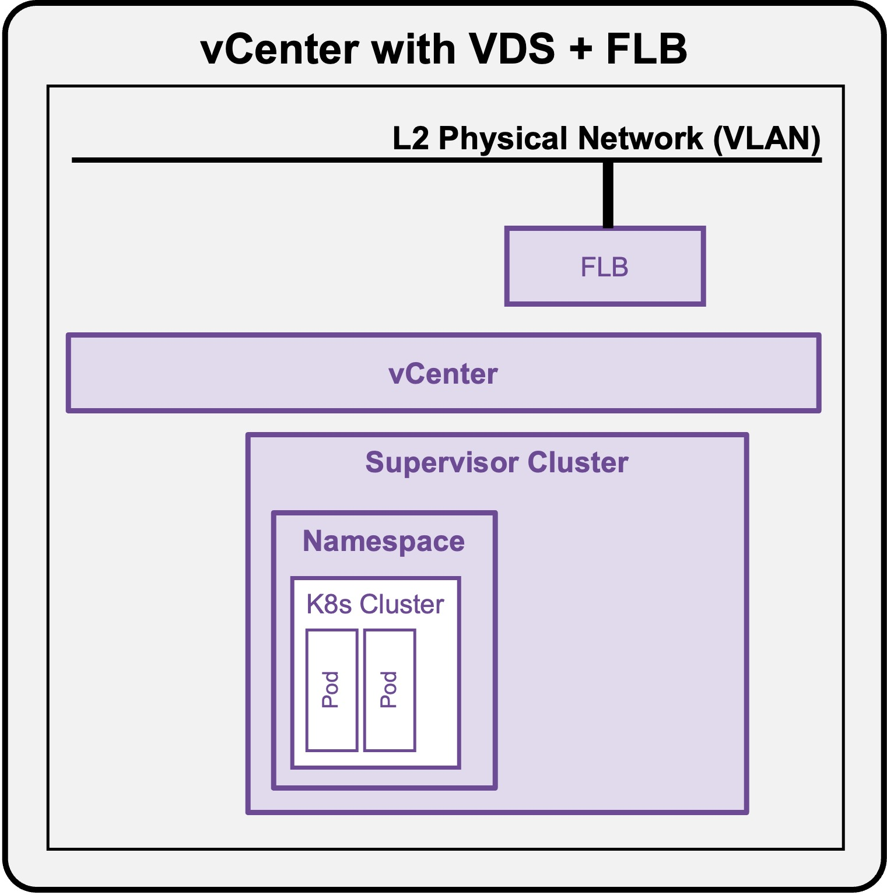
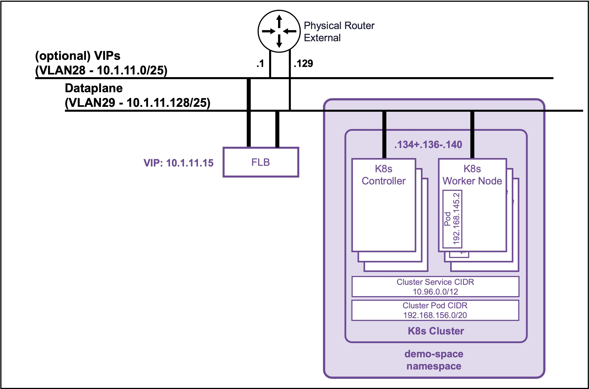

<h1>
   Supervisor with "VDS + FLB"
</h1>

<div class="grid" markdown style="grid-template-columns: 60% 40%">

<div markdown>

This section describes the procedures for **deploying an application (VMs/K8s) into the VKS Namespace utilizing a "VDS + FLB" architecture** inside a vSphere environment.

* [Deployment App (VMs)](1e2-deployment-vms.md)
* [**Deployment App (k8s)**](#deployment_k8s)
</div>

<div markdown>
{ width="100%" }
</div>
</div>

---

## Deployment App (k8s) {: #deployment_k8s }

{ width="80%" style="display: block; margin: 0 auto;" }

??? info ":material-laptop: Client Operating System"
    While the command outputs below are captured from a **Windows client**, the `vcf` and `kubectl` CLI tools operate identically across **Linux** and **macOS** environments.

### Deploy a Full Application (Load Balancer + Pods)

#### Connect to the K8s Cluster  
See [Connect to the K8s Cluster](2e2-deployment-k8s.md#connect_k8s)

#### (Optional) Create a Namespace in the K8s Cluster  
Create a Namespace if you want to deploy the application (pod) in a specific K8s Cluster Namespace (not default).  
```text
kubectl create namespace ns1
```  

??? abstract "Output example"
    <pre><code>PS C:\Users\Administrator\Documents> <b>kubectl create namespace ns1</b>
    namespace/ns1 created
    </code></pre>
#### Allow the deployment of applications in the Namespace.  
```text
kubectl label ns ns1 pod-security.kubernetes.io/enforce=baseline
```  

??? abstract "Output example"
    <pre><code>PS C:\Users\Administrator\Documents> <b>kubectl label ns ns1 pod-security.kubernetes.io/enforce=baseline</b>
    namespace/ns1 labeled
    </code></pre>

#### Create application (LB + 2 Pods apache) yaml file  
Create file "apache-k8s.yaml"

??? info "apache-k8s.yaml file"
    ```text
    apiVersion: v1
    kind: Service
    metadata:
      name: apache-vip-service
      namespace: ns1
    spec:
      type: LoadBalancer
      ports:
        - port: 80
          targetPort: 8080
          protocol: TCP
      selector:
        app: apache-web
    ---
    apiVersion: apps/v1
    kind: Deployment
    metadata:
      name: apache-deployment
      namespace: ns1
    spec:
      replicas: 2
      selector:
        matchLabels:
          app: apache-web
      template:
        metadata:
          labels:
            app: apache-web
        spec:
          containers:
            - name: apache
              image: public.ecr.aws/docker/library/httpd:2.4
              ports:
                - containerPort: 8080
                  protocol: TCP
              # Intercept startup to write the file, THEN start Apache
              command: ["/bin/sh", "-c"]
              args: 
                - 'sed -i "s/Listen 80/Listen 8080/g" /usr/local/apache2/conf/httpd.conf && echo "<h1>It works - Pod: $HOSTNAME</h1>" > /usr/local/apache2/htdocs/index.html && httpd-foreground'
    ```

#### Deploy the application (LB + 2 Pods apache) 
```text
kubectl apply -f apache-k8s.yaml
```

??? abstract "Output example"
    <pre><code>PS C:\Users\Administrator\Documents> <b>kubectl apply -f apache-k8s.yaml</b>
    service/apache-vip-service created
    deployment.apps/apache-deployment created
    </code></pre>

---

### Validate deployment of the application (LB + 2 Pods apache) 
* **Check application VIP**  
```text
kubectl get service apache-vip-service -n ns1
```

    ??? abstract "Output example"
        <pre><code>PS C:\Users\Administrator\Documents> <b>kubectl get service apache-vip-service -n ns1</b>
        NAME                 TYPE           CLUSTER-IP       EXTERNAL-IP   PORT(S)        AGE
        apache-vip-service   LoadBalancer   10.101.178.230   10.1.11.15    80:32176/TCP   3m34s
        </code></pre>


* **Check application Pods**  
```text
kubectl get pods -n ns1
```
    
    ??? abstract "Output example"
        <pre><code>PS C:\Users\Administrator\Documents> <b>kubectl get pods -n ns1</b>
        NAME                                 READY   STATUS    RESTARTS   AGE
        apache-deployment-58bf9564f6-mx6rb   1/1     Running   0          3m52s
        apache-deployment-58bf9564f6-vjpqw   1/1     Running   0          3m52s
        </code></pre>

---

### Access the application (LB + 2 Pods apache) 
```text
curl http://10.1.11.15
```

??? abstract "Output example"
    <pre><code>PS C:\Users\Administrator\Documents> <b>curl http://10.1.11.15</b>
    &lt;h1&gt;It works - Pod: <b>apache-deployment-58bf9564f6-mx6rb</b>&lt;/h1&gt;
    &nbsp;
    PS C:\Users\Administrator\Documents> <b>curl http://10.1.11.15</b>
    &lt;h1&gt;It works - Pod: <b>apache-deployment-58bf9564f6-vjpqw</b>&lt;/h1&gt;
    </code></pre>
    
    The external load balancer (NSX) load balances (round-robin mode) to the Worker Nodes. Then, each Worker Node load balances to the Apache pods (random). So, to validate the load balancing to the different Apache pods, run the `curl` command multiple times.
