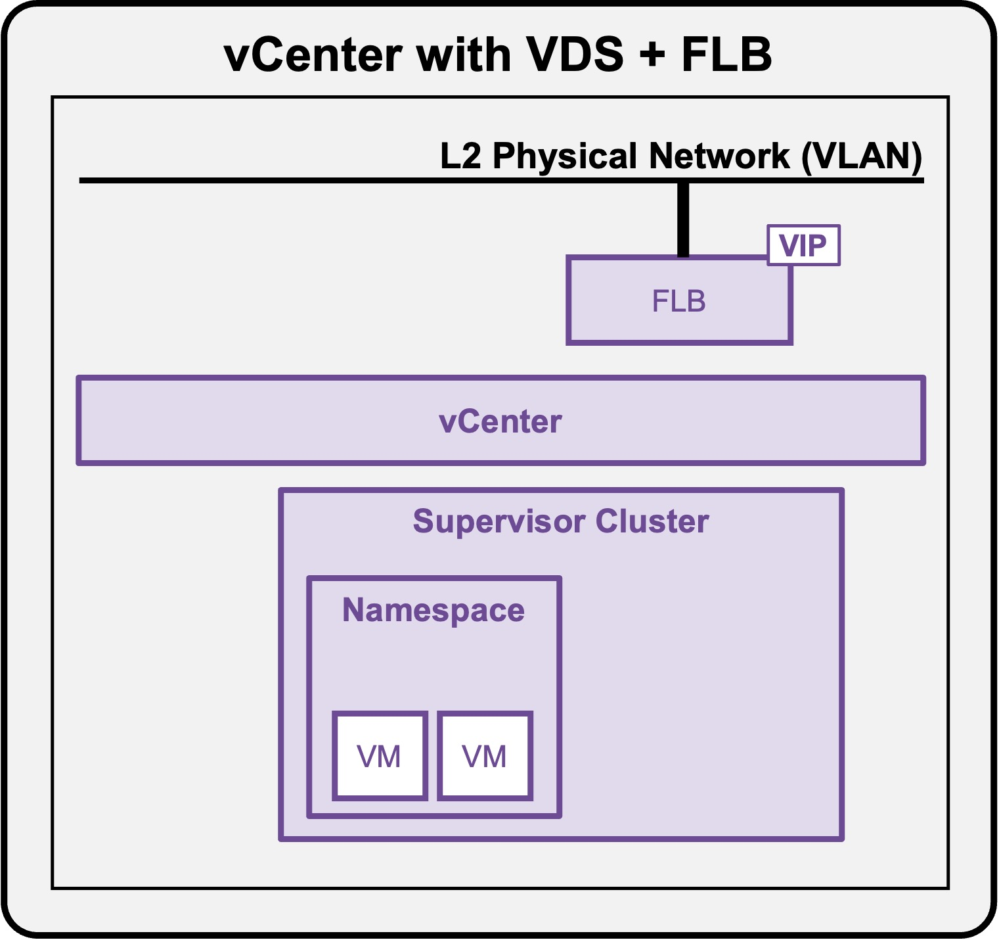
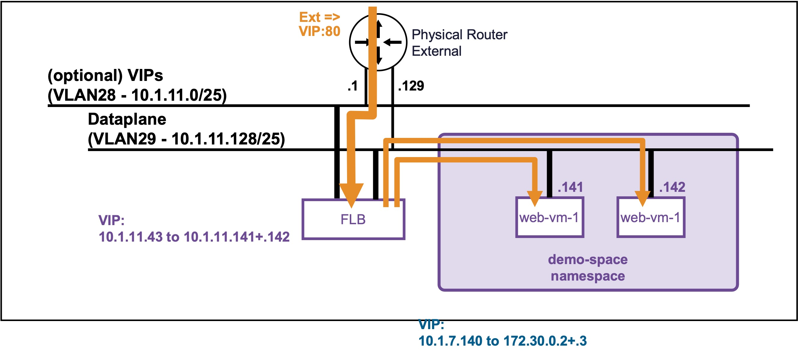

<h1>
   Supervisor with "NSX + DTGW/VNA"
</h1>

This section describes the procedures for **provisioning and managing Network Services within a VKS Namespace utilizing a "VDS + FLB" architecture"** inside a vSphere environment.

* **Network Services**
    * [**VM Load Balancers**](#networkservices)

{ width="100%" }

---

## Network Services: VM Load Balancers {: #networkservices }

The primary use case for configuring a **VM Load Balancer** is to efficiently distribute inbound network traffic across a designated pool of backend Virtual Machines.

{ width="80%" style="display: block; margin: 0 auto;" }

!!! warning "Current Limitation: No Application Health Checks"
    Currently, the vCenter Namespace VM Load Balancer does not perform application-level health checks on backend VMs.  
    If a backend VM goes down, the load balancer VIP will continue forwarding traffic to it.  
    This section will be updated once active health monitoring becomes officially available.

### Create a VM Load Balancer

In the "VDS + FLB" architecture", the load balancer service is only available via CLI.  
See [Deploy App (VMs)](1e2-deployment-vms.md#deployment_vms).

---

### Validate VM Load Balancer

See [Deploy App (VMs)](1e2-deployment-vms.md#deployment_vms).

