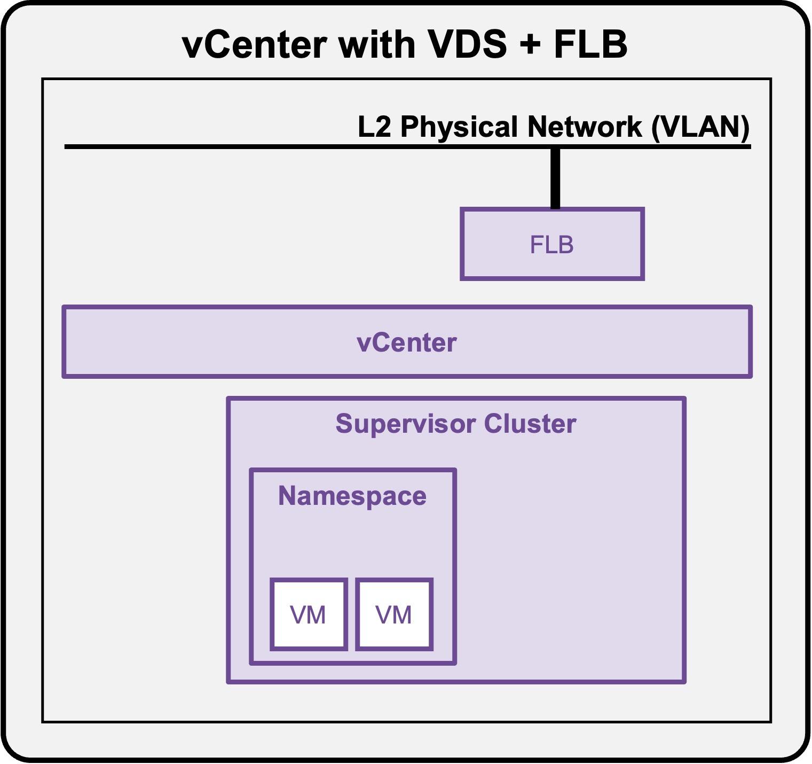
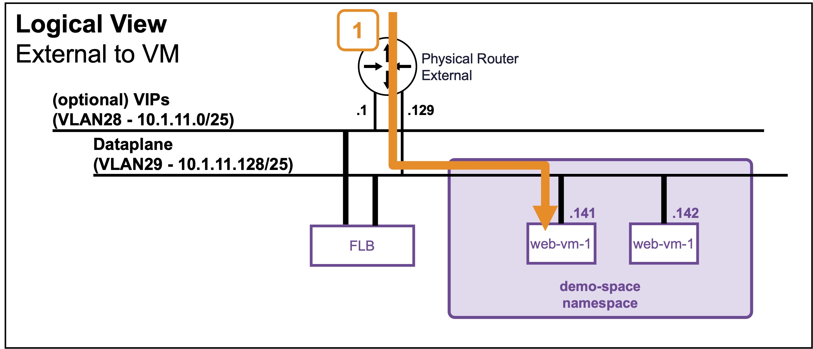
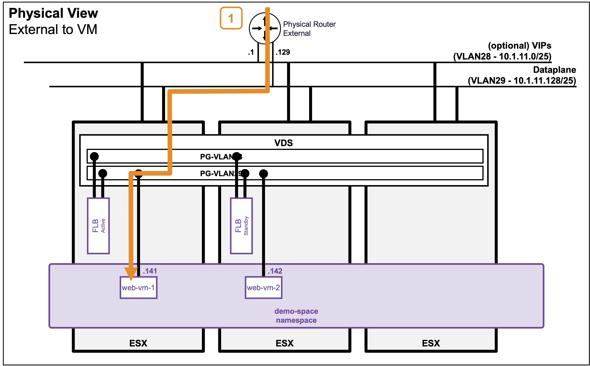

<h1>
   Supervisor with "VDS + FLB"
</h1>

This section describes the procedures for **Troubleshooting Network Services into the VKS Namespace utilizing a "VDS + FLB" architecture"** inside a vSphere environment.

* **Packet Walk**  
    * [N/S External to VIP](1h1-packetwalk-ext_vip.md)  
    * [**N/S External to VM**](#packetwalk)  
    * [E/W Pod to Pod](1h3-packetwalk-pod_pod.md)  
    * [E/W VM to VM](1h4-packetwalk-vm_vm.md)  

{ width="100%" }

---

## Packet Walk - N/S External to VM {: #packetwalk }

One or a few VMs have been deployed (see [Application Deployment > App Deployment (VMs) > via CLI](1e2-deployment-vms.md#deployment_vms)).

### View

#### Logical View
{ width="80%" style="display: block; margin: 0 auto;" }

#### Physical View
* **Use case: VM connected to Public Subnet**  
{ width="90%" style="display: block; margin: 0 auto;" }

---

### Packet Walk

* **Step1: External Client accesses the VM**  
`Client-IP => VM (10.1.11.141)`  

    The traffic enters the ESX hosting the VM.

