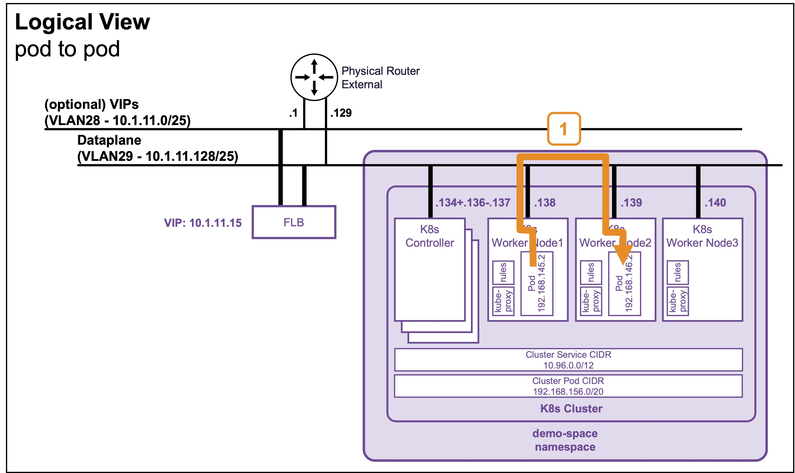
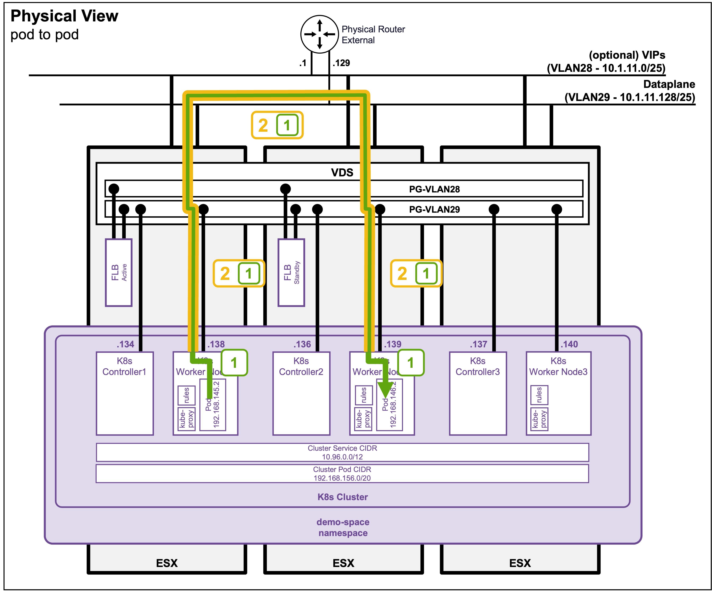

<h1>
   Supervisor with "VDS + FLB"
</h1>

<div class="grid" markdown style="grid-template-columns: 60% 40%">

<div markdown>

This section describes the procedures for **Troubleshooting Network Services into the VKS Namespace utilizing a "VDS + FLB" architecture"** inside a vSphere environment.

* **Packet Walk** 
    * [N/S External to VIP](1h1-packetwalk-ext_vip.md)  
    * [N/S External to VM](1h2-packetwalk-ext_vm.md)  
    * [**E/W Pod to Pod**](#packetwalk)  
    * [E/W VM to VM](1h4-packetwalk-vm_vm.md)  

</div>

<div markdown>
{ width="100%" }
</div>
</div>

---

## Packet Walk - E/W pod to pod {: #packetwalk }

A Full Application (Load Balancer + Pods) has been deployed (see [Application Deployment > App Deployment (K8s) > via CLI](1f1-deployment-pods.md#deployment_pods)).

### View

#### Logical View
{ width="80%" style="display: block; margin: 0 auto;" }

#### Physical View
{ width="90%" style="display: block; margin: 0 auto;" }

---

### Packet Walk Explanation

* **Step 1: Traffic leaves the Source Pod**  
`Source-Pod-IP (192.168.145.2) => Destination-Pod-IP (192.168.146.2)`  

    The traffic exits the source pod and hits the Worker Node's local routing engine (managed by `kube-proxy` and the CNI agent, such as Antrea).  

* **Step 2: Cross-Node Encapsulation**  
```text
WorkerNode1-IP (10.1.11.138) => WorkerNode2-IP (10.1.11.139)
  [Source-Pod-IP (192.168.145.2) => Destination-Pod-IP (192.168.146.2)]
```
    The destination pod is on a different node, so the Worker Node encapsulates the original packet inside a node-to-node tunnel packet.  


* **Step 3: Destination Node Decapsulation and Delivery (encapsulation2)**    
    `Source-Pod-IP (192.168.145.2) => Destination-Pod-IP (192.168.146.2)`

    The destination Worker Node receives the node-to-node packet and strips away the encapsulation header. The local routing rules then deliver the unencapsulated packet directly into the destination Pod's network interface.