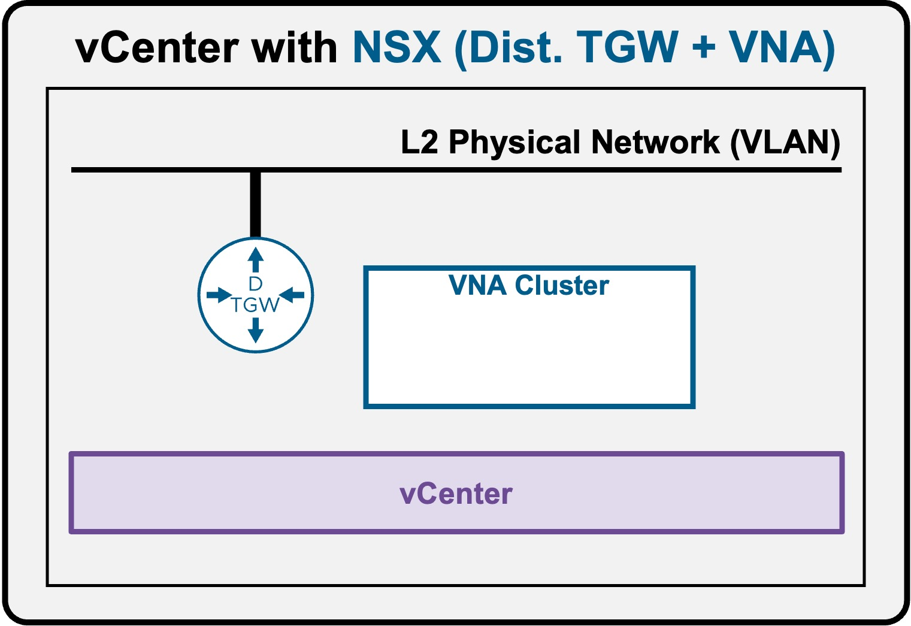
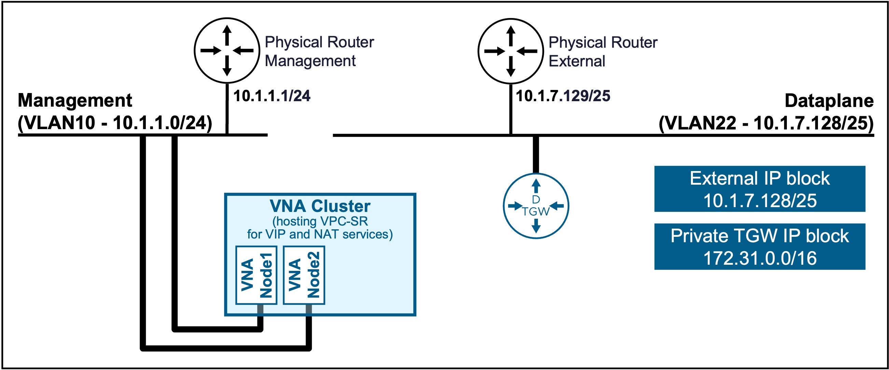
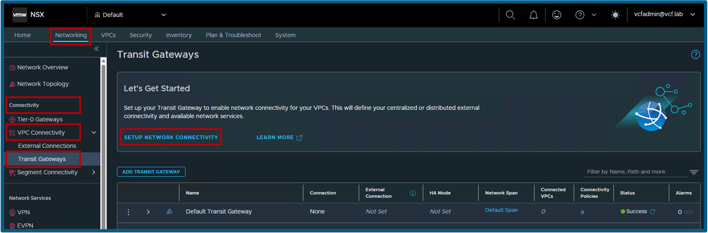
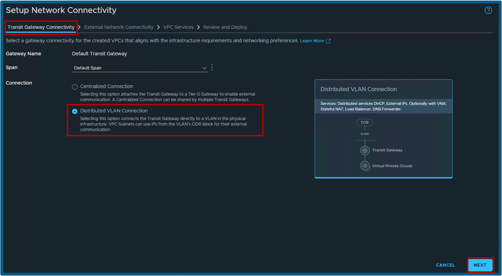
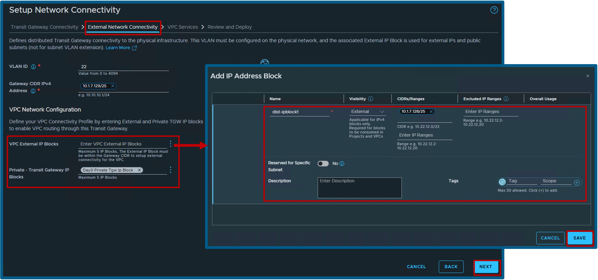
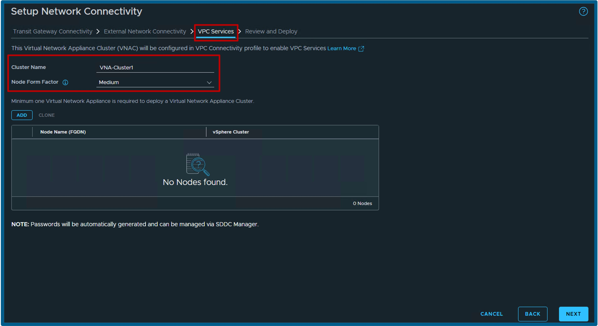
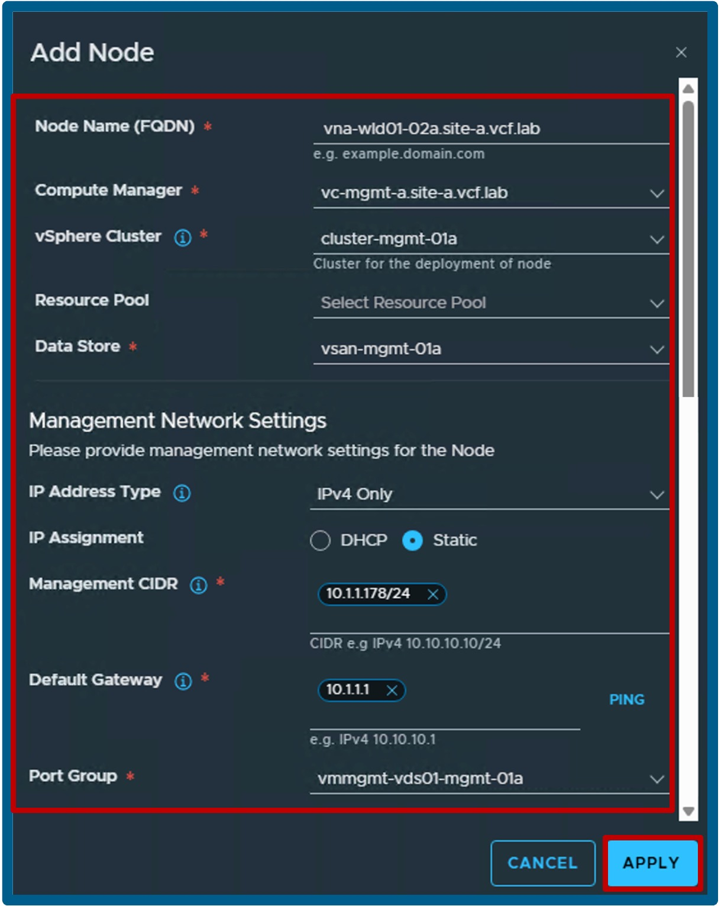
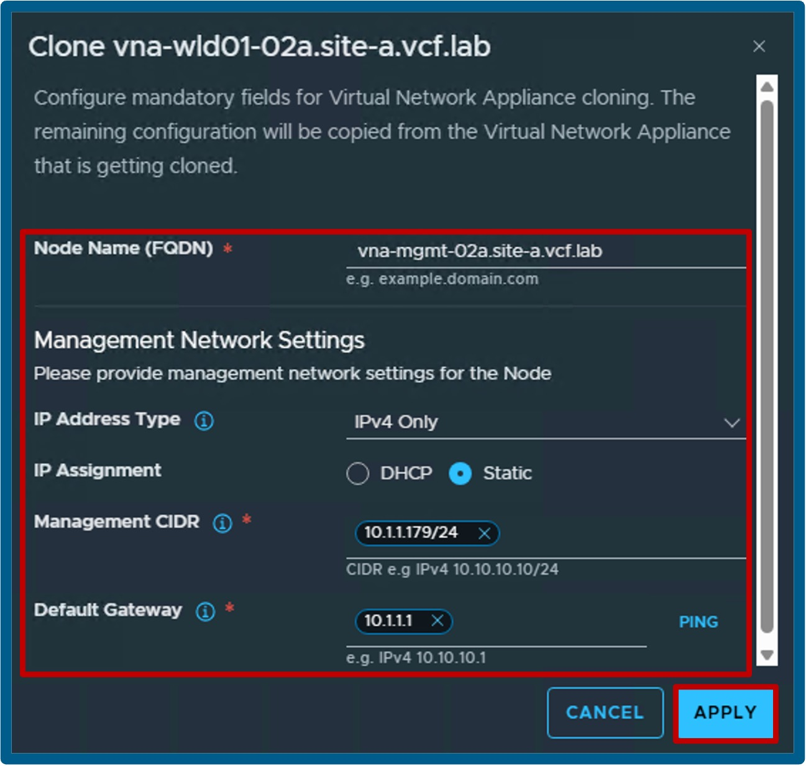
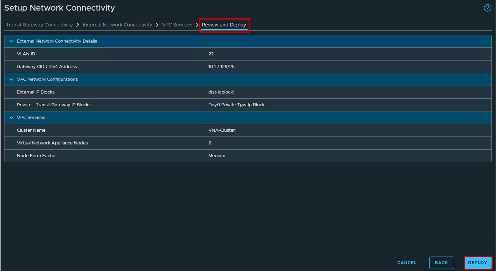

<h1>
   Deploy "NSX + DTGW/VNA"
</h1>

This section describes the requirements for  **deploying the Supervisor utilizing an "NSX + DTGW/VNA" architecture** inside a vSphere environment.

* [Requirements](2a-requirements.md)
* **Install Requirements**
    * [NSX Overlay](2b1-deploy-NSXOverlay.md)
    * [**DTGW + VNA**](#installation)

{ width="100%" }

---

## Install Requirements - DTGW + VNA {: #installation }

When no Transit Gateway has been deployed, NSX offers a simple wizard to deploy the DTGW + VNA.

{ width="80%" style="display: block; margin: 0 auto;" }

### Launch "Setup Network Connectivity"
Navigate to **NSX** > **Networking** > **VPC Connectivity** > **Transit Gateways**.  
{ width="95%" style="display: block; margin: 0 auto;" }

1. **Transit Gateway Connectivity**  
    * Select **Distributed VLAN Connections**, and click **Next**.  
    * Validate all Networking Prerequisites (not shown).
    { width="95%" style="display: block; margin: 0 auto;" }  

1. **External Network Connectivity**  
     * Enter the **VLAN ID** and **Gateway CIDR IPv4 Address**.  
     * Configure the **VPC Network** with the following:  
         * Create a new **VPC External IP Block** with **Visibility = External**, and **CIDR/Range = [your physical VLAN subnet]**.
         * Select **Private - Transit Gateway IP Blocks** (if none exist, create a new one with **Visibility = Private**, and **CIDR/Range = 172.31.0.0/16** (not shown)).
     { width="95%" style="display: block; margin: 0 auto;" }  

1. **VPC Services**  
     * Enter the **Cluster Name** and **Node Form Factor**.  
       *(Note: With 2 Medium VNA Nodes, you can deploy up to 10 VPCs; Large supports up to 40; X-Large supports up to 80. See [VMware ConfigMax](https://configmax.broadcom.com/guest?vmwareproduct=NSX&release=9.1.0&categories=20-0){: target="_blank" } and look for "Load Balancer Instances" per "Form Factor Edge Node").* 
       { width="95%" style="display: block; margin: 0 auto;" }  
     * Add **VNA Node 1** with its **Node Name (FQDN)**, its vCenter location (**Compute Manager**, **vSphere Cluster**, **Datastore**), and its Network Settings (**IP Address Type**, **IP Assignment**, **Management CIDR**, and **Default Gateway**).
       { width="50%" style="display: block; margin: 0 auto;" }  
     * Clone **VNA Node 2** with its **Node Name (FQDN)** and its Network Settings (**IP Address Type**, **IP Assignment**, **Management CIDR**, and **Default Gateway**).
       { width="50%" style="display: block; margin: 0 auto;" }  

1. **Review and Deploy**  
     * Review the final configuration and click **Deploy**.
       { width="95%" style="display: block; margin: 0 auto;" }  

---

### Validate Deployment
Once the wizard completes, verify the deployment was successful using the steps outlined in the prerequisites:  
**[Validate "DTGW + VNA" Deployment](2a-requirements.md#dtgw-vna-ready)**