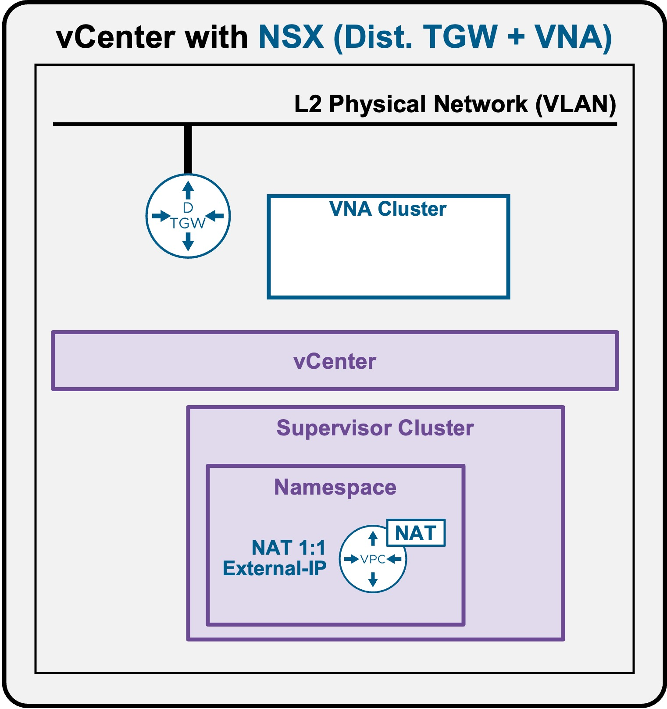
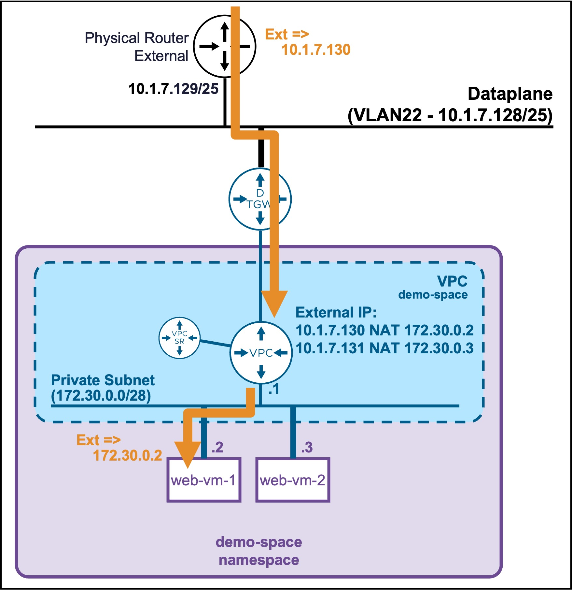

<h1>
   Supervisor with "NSX + DTGW/VNA"
</h1>

This section describes the procedures for **provisioning and managing Network Services within a VKS Namespace utilizing an "NSX + DTGW/VNA"** architecture inside a vSphere environment.

* **Network Services**
    * [Subnets](2h1-network-subnet.md)
    * [SubnetSets](2h2-network-subnetset.md)
    * [Static Routes](2h3-network-staticroute.md)
    * [**External IPs**](#networkservices)
    * [VM Load Balancers](2h5-network-lb.md)

{ width="100%" }

---

## Network Services - External IPs {: #networkservices }

The primary use case for configuring an **External IP** is to provide 1:1 Network Address Translation (NAT) for VMs residing on Private Subnets, enabling direct inbound and outbound connectivity with the physical upstream network.

{ width="55%" style="display: block; margin: 0 auto;" }

??? warning "vCenter Namespace External IPs currently Unsupported"
    Due to a current limitation within vCenter Namespaces, the provisioning of External IPs is **not presently supported** in this architecture.  
    This section will be updated once the capability becomes officially available.