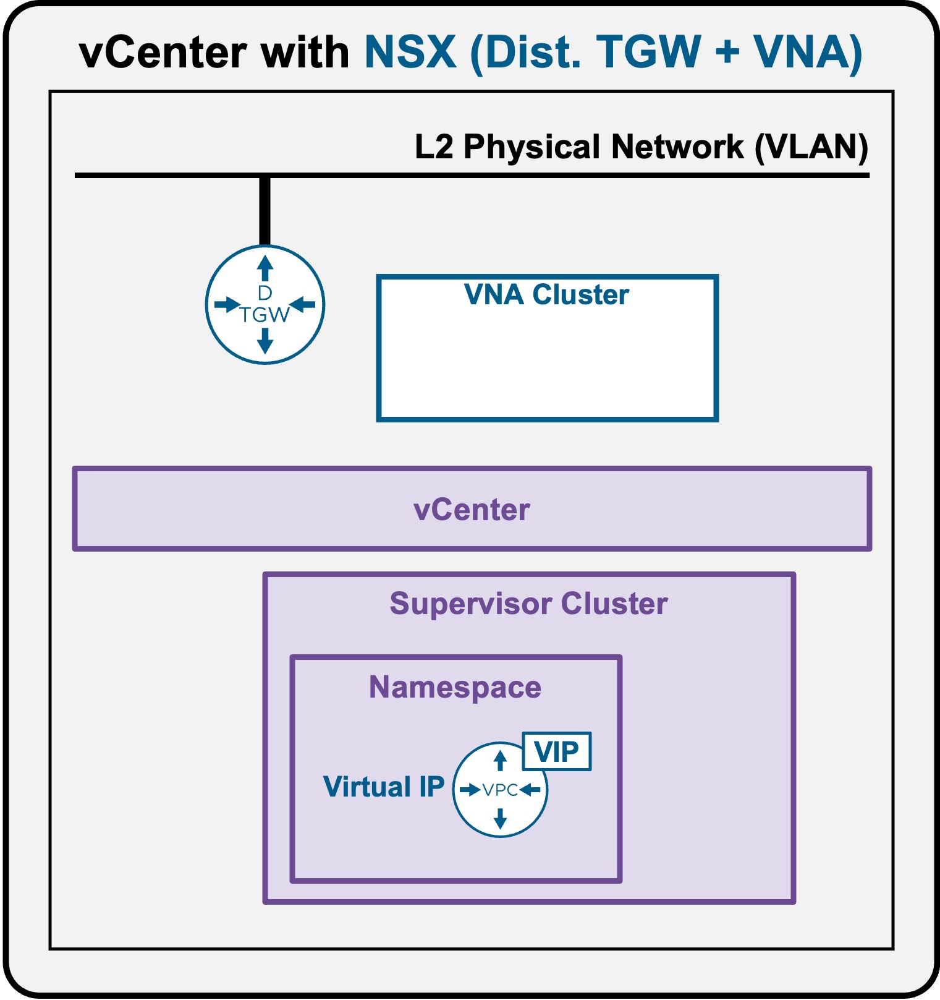
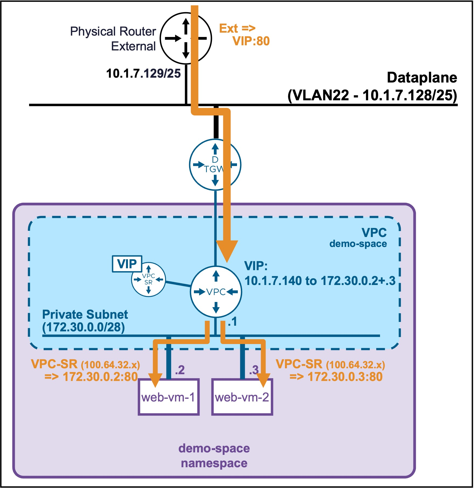
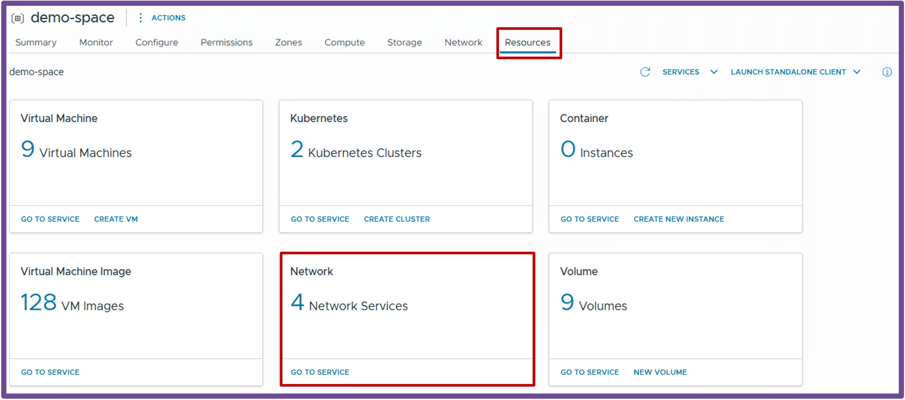
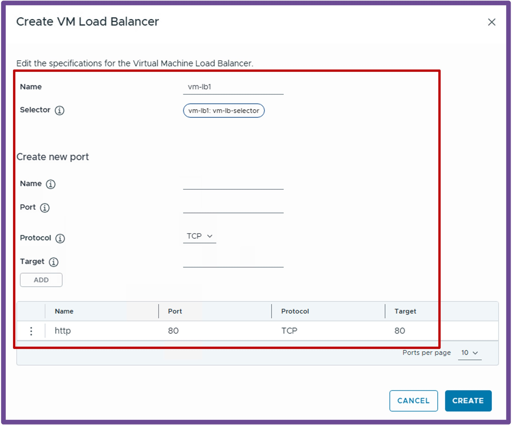
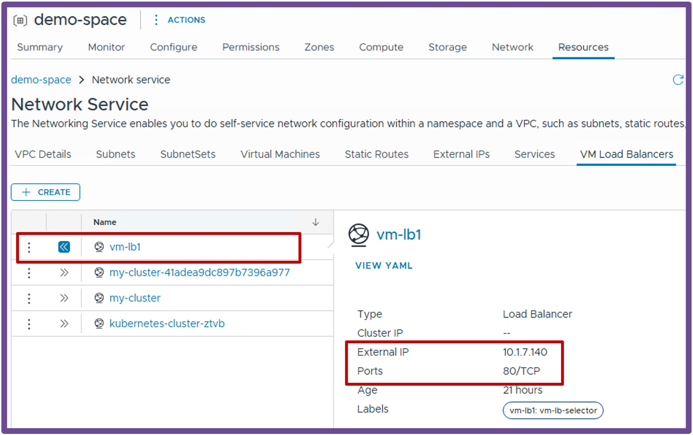

<h1>
   Supervisor with "NSX + DTGW/VNA"
</h1>

<div class="grid" markdown style="grid-template-columns: 60% 40%">

<div markdown>

This section describes the procedures for **provisioning and managing Network Services within a VKS Namespace utilizing an "NSX + DTGW/VNA"** architecture inside a vSphere environment.

* **Network Services**
    * [Subnets](2h1-network-subnet.md)
    * [SubnetSets](2h2-network-subnetset.md)
    * [Static Routes](2h3-network-staticroute.md)
    * [External IPs](2h4-network-externalip.md)
    * [**VM Load Balancers**](#networkservices)
</div>

<div markdown>
{ width="100%" }
</div>
</div>

---

## Network Services: VM Load Balancers {: #networkservices }

The primary use case for configuring a **VM Load Balancer** is to efficiently distribute inbound network traffic across a designated pool of backend Virtual Machines.

{ width="55%" style="display: block; margin: 0 auto;" }

!!! warning "Current Limitation: No Application Health Checks"
    Currently, the vCenter Namespace VM Load Balancer does not perform application-level health checks on backend VMs.  
    If a backend VM goes down, the load balancer VIP will continue forwarding traffic to it.  
    This section will be updated once active health monitoring becomes officially available.

### Create a VM Load Balancer

Navigate to **vCenter** > **Supervisor Management** > **Supervisors**, select your target Supervisor, click the **Namespaces** tab, and select your specific Namespace.  
Under the **Resources** card, click **Network - Go to Service**.  
{ width="95%" style="display: block; margin: 0 auto;" }

**1. Create New VM Load Balancer**  
Navigate to the **VM Load Balancers** tab, and click **Create**.  
{ width="50%" style="display: block; margin: 0 auto;" }  

**2. Apply Selectors (Labels) to the Backend VMs**  
The load balancer identifies which VMs to send traffic to based on Kubernetes labels.  If you deploy a new VM from the vCenter UI, you can apply this label during creation.  If the VM is already deployed, you can apply the label using `kubectl`:  

??? info ":material-label-multiple: How to label an existing VM via kubectl"
    **Step A: Connect to Supervisor Namespace**  
    ```text
    vcf context use <supervisor>:<namespace>
    ```
    
    ??? abstract "Output example"
        <pre><code>PS C:\Users\Administrator\Documents> <b>vcf context use supervisor-mgt:demo-space</b>
        Logged in successfully.
        </code></pre>

    **Step B: Add the label to the VM**  
    ```text
    kubectl label virtualmachine <vm> <label_key>=<label_value> -n <namespace>
    ```

    ??? abstract "Output example"
        <pre><code>PS C:\Users\Administrator\Documents> <b>kubectl label virtualmachine web-vm-1 vm-lb1=vm-lb-selector -n demo-space</b>
        virtualmachine.vmoperator.vmware.com/web-vm-1 labeled
        </code></pre>


---

### Validate VM Load Balancer

1. **Locate the Load Balancer VIP**  
Navigate back to **vCenter** > **Supervisor Management** > **Supervisors** > target Supervisor > **Namespaces** > specific Namespace > **Resources** > **Network - Go to Service**.  
Go to the **VM Load Balancers** tab and expand the newly created VM Load Balancer to view its assigned IP address.  
{ width="50%" style="display: block; margin: 0 auto;" }  

1. **Test Connectivity**  
To verify connectivity, connect to a VM within the VPC and use `curl` to directly access the Load Balancer's Virtual IP (VIP).
```text
root@vm-public:~# curl [http://10.1.7.140](http://10.1.7.140)
<h1>It works - web-vm-1</h1>
```


