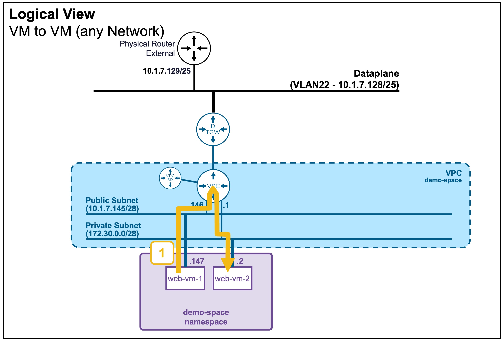
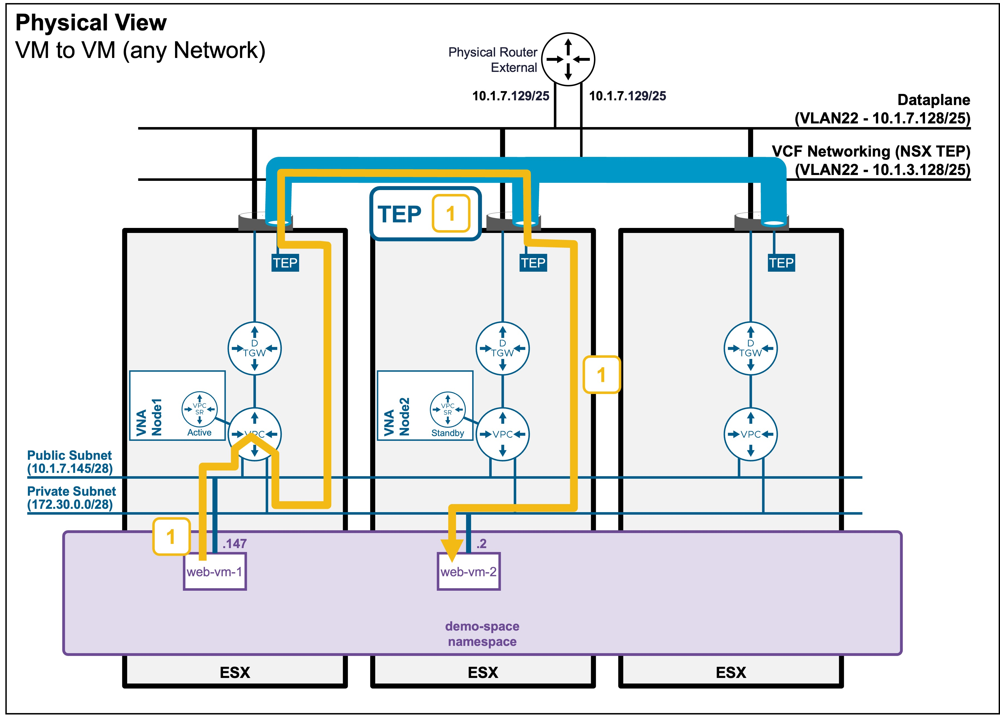

<h1>
   Supervisor with "NSX + DTGW/VNA"
</h1>

This section describes the procedures for **Troubleshooting Network Services into the VKS Namespace utilizing an "NSX + DTGW/VNA" architecture** inside a vSphere environment.

* **Packet Walk**  
    * [N/S External to VIP](2i1-packetwalk-ext_vip.md)  
    * [N/S External to VM](2i2-packetwalk-ext_vm.md)  
    * [E/W Pod to Pod](2i3-packetwalk-pod_pod.md)  
    * [**E/W VM to VM**](#packetwalk)  
* App Access broken  
    * [VIP access down](2j1-troubleshooting-vip.md)  
    * [VM access down](2j2-troubleshooting-vm.md)  
    * [Pod access down](2j3-troubleshooting-pod.md)  

{ width="100%" }

---

## Packet Walk - E/W VM to VM {: #packetwalk }

Multiple VMs have been deployed (see [Application Deployment > App Deployment (VMs) > via vCenter UI](2f1-deployment-vms.md#deployment_vms) or [Application Deployment > App Deployment (VMs) > via vCenter UI | via CLI](2f2-deployment-vms.md#deployment_vms)).

### View

The VMs can be connected to the same or different subnets.  
In the example below, the VMs are connected to different subnets.

#### Logical View
{ width="75%" style="display: block; margin: 0 auto;" }

#### Physical View
{ width="95%" style="display: block; margin: 0 auto;" }

---

### Packet Walk

* **Step1: External Client accesses the VM**  
`VM1 (10.1.7.147) => VM (172.30.0.2)`  

    If the VMs are on different subnets, the traffic is first routed by the local distributed VPC gateway.  
    Then if the VMs reside on a different ESX, the cross-ESX traffic is encapsulated using the ESX TEP IPs.  

