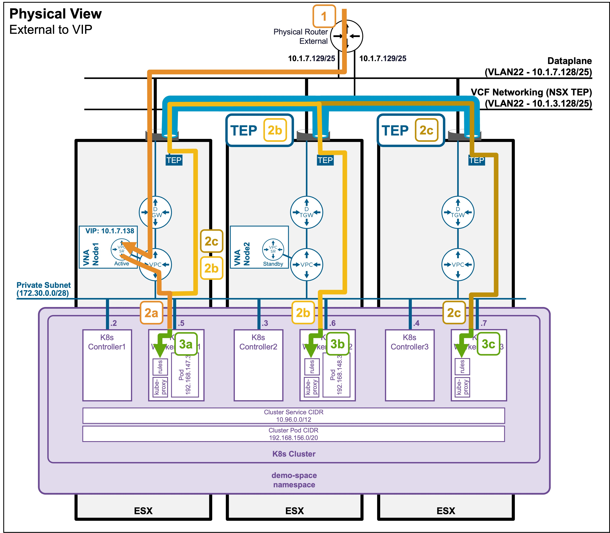

<h1>
   Supervisor with "NSX + DTGW/VNA"
</h1>

<div class="grid" markdown style="grid-template-columns: 60% 40%">

<div markdown>

This section describes the procedures for **Troubleshooting Network Services into the VKS Namespace utilizing an "NSX + DTGW/VNA" architecture** inside a vSphere environment.

* Packet Walk  
    * [N/S External to VIP](2i1-packetwalk-ext_vip.md)  
    * [N/S External to VM](2i2-packetwalk-ext_vm.md)  
    * [E/W pod to pod](2i3-packetwalk-pod_pod.md)  
    * [E/W VM to VM](2i4-packetwalk-vm_vm.md)  
* **App Access broken**  
    * [**VIP access down**](#troubleshooting)  
    * [VM access down](2j2-troubleshooting-vm.md)  
    * [Pod access down](2j3-troubleshooting-pod.md)  

</div>

<div markdown>
{ width="100%" }
</div>
</div>

---

## Troubleshooting - VIP access down {: #troubleshooting }

As described in the [Packet Walk: N/S External to VIP](2i1-packetwalk-ext_vip.md) section, clients accessing a VIP traverse the following path:

#### Logical View

{ width="75%" style="display: block; margin: 0 auto;" }

#### Physical View
{ width="95%" style="display: block; margin: 0 auto;" }

### Step1: Physical fabric to the VNA Node hosting the VIP
* **Validate communication to the VIP**  
Validate IP reachability to the VIP with `ping`.  

    ??? info "Status Validation"
        <pre><code>PS C:\Users\Administrator\Documents> <b>ping 10.1.7.138</b>
        Pinging 10.1.7.138 with 32 bytes of data:
        Reply from 10.1.7.138: bytes=32 time=6ms TTL=61
        Reply from 10.1.7.138: bytes=32 time=1ms TTL=61
        </code></pre>

    In case of failure, check the routing breaking point with `traceroute`.  
    
    ??? info "Status Validation"
        <pre><code>PS C:\Users\Administrator\Documents> <b>tracert 10.1.7.138</b>
        1    &lt;1 ms    &lt;1 ms    &lt;1 ms  router.site-a.vcf.lab [10.1.10.129]
        2     2 ms     1 ms    &lt;1 ms  10.1.7.138
        </code></pre>
        
        > **Note:** Depending on your Operating System, the exact command may vary (e.g., `traceroute`, `tracert`, `tracepath`).  

        Consult with your Network Team to determine why routing does not reach the destination. The issue is typically related to routing misconfigurations or firewall blockages.

### Step2: VNA Node hosting the VIP to the ESX hosting the K8s Node (Overlay)  
* **Validate the ESXi host tunnels are UP**

??? info "Status Validation"
    Navigate to **vCenter** > **Host and Clusters** > **[your vCenter Cluster]** > **Configure** > **Networking** > **Network Configuration**.  
    Ensure "Cluster Status" and "Host Status" are "Green", and ESX have at least 1 TEP IP Address:  
    > **Note:** If no workloads have been deployed on logical networks yet, it is normal to have zero tunnels established on the ESXi hosts.  

    { width="95%" style="display: block; margin: 0 auto;" }

* **Validate the ESXi host tunnels accept large packets (MTU)**   

??? info "Status Validation"
    ```text
    vmkping ++netstack=vxlan <remote-TEP-IP> -d -s 8900
    ```

    ??? abstract "Output example"
        <pre><code>[root@esxi-01a:~] <b>vmkping ++netstack=vxlan 10.1.3.207 -d -s 8900</b>
            PING 10.1.3.207 (10.1.3.207): 8900 data bytes
            8908 bytes from 10.1.3.207: icmp_seq=0 ttl=64 time=1.234 ms
            8908 bytes from 10.1.3.207: icmp_seq=1 ttl=64 time=1.102 ms
            8908 bytes from 10.1.3.207: icmp_seq=2 ttl=64 time=1.098 ms
            --- 10.1.3.207 ping statistics ---
            3 packets transmitted, 3 packets received, 0% packet loss
            round-trip min/avg/max = 1.098/1.144/1.234 ms
        </code></pre>
        Consult with your Network Team to determine why routing does not reach the destination.  
        
        * If standard "small" pings fail, the issue is typically related to routing misconfigurations or firewall blockages.  
        * If "large" pings fail, the issue is typically related to Jumbo Frames (MTU) not being enabled across the physical fabric.

### Step3+4(not represented): K8s Node load balances traffic to the different Pods
See [Troubleshooting - Pod access down](2j3-troubleshooting-pod.md).


