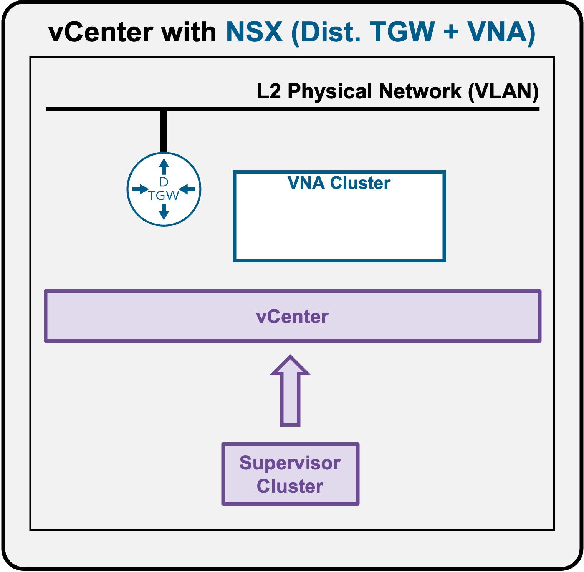

<h1>
   VKS Network Services
</h1>

This section describes the procedures for **deploying the Supervisor** within a vSphere environment.

---

## Different network options for Supervisor deployment  
Explore the specific network architectures available for your Supervisor cluster:

| 
Architecture Option
 | 
Description & Use Case
 |
| :--- | :--- |
| **[1. VDS + FLB](1a-requirements.md)** | { width="90%" style="display: block; margin: 0 auto; max-width: 300px;" }    <ul><li>**Architecture:** Uses **VDS port groups** for the Supervisor Cluster and deploys **FLB virtual appliances** to handle load balancing traffic.</li><li>**Best for:** VMware vSphere Foundation (VVF), lab environments, Proof of Concepts (PoC), or smaller environments.</li><li>**Limitation:** Limited Network Services (only LB) and limited VCF Automation support (such as namespace create/delete/update from VCFA).</li></ul> |
| **[2. NSX + DTGW/VNA](2a-requirements.md)** | { width="90%" style="display: block; margin: 0 auto; max-width: 300px;" }    <ul><li>**Architecture:** Uses **NSX Distributed Transit Gateways + VNA** for the Supervisor Cluster.</li><li>**Best for:** Fully integrated VCF architecture for better scale and security.</li><li>**Consideration:** Requires fully deployed NSX overlay infrastructure.</li></ul> |

??? info "Detailed Architecture Pros & Cons"
    **[1. Supervisor with "VDS + FLB"](1a-requirements.md)**
    
    * **Pros:**
        * **Footprint:** Slightly smaller overall footprint (the FLB appliance is slightly smaller than a VNA)
        * **VMware Editions:** Available in VMware vSphere Foundation (VVF) and VMware Cloud Foundation (VCF)
    * **Cons:**
        * **Network Services Limitations:** Lacks full support of Network Services such as Subnets, Static Routes, NAT)
        * **VCF Integration Limitations:** Lacks full support for other VCF components, specifically VCF Automation (VCF-A)
        * **Scale:** All VIPs are managed by a single FLB's Active/Standby (A/S)

    ---

    **[2. Supervisor with "NSX + DTGW/VNA"](2a-requirements.md)**

    * **Pros:**
        * **Security:**  
            * No possible external access directly to K8s Nodes
            * Option to control application communication including:
                * Cross-Container via Antrea CNI (DFW)
                * Cross-VPC VIP communication (VPC Connectivity Policies)
        * **Scale:**
            * Uses fewer public IPs (K8s nodes use private IPs)
            * VIPs are highly scalable, distributed across up to 10 VNA Nodes in an Active/Active (A/A) configuration
    * **Cons:**
        * **VMware Editions:** Only available in VMware Cloud Foundation (VCF) (not VMware vSphere Foundation (VVF))
        * **Operations:** Requires NSX (though installation and management remain very simple)
        * **Footprint:** Slightly larger footprint (the VNA is slightly larger than the FLB)

??? note "Upcoming Architectures"
    The following architectures will be covered in future updates:  

    * NSX + CTGW/Edge  
    * Avi Load Balancer  

---

!!! info "Document Versioning"
    This guide is updated for **VCF 9.1+**.  
    If you are running an older version, some options may not be available.

---