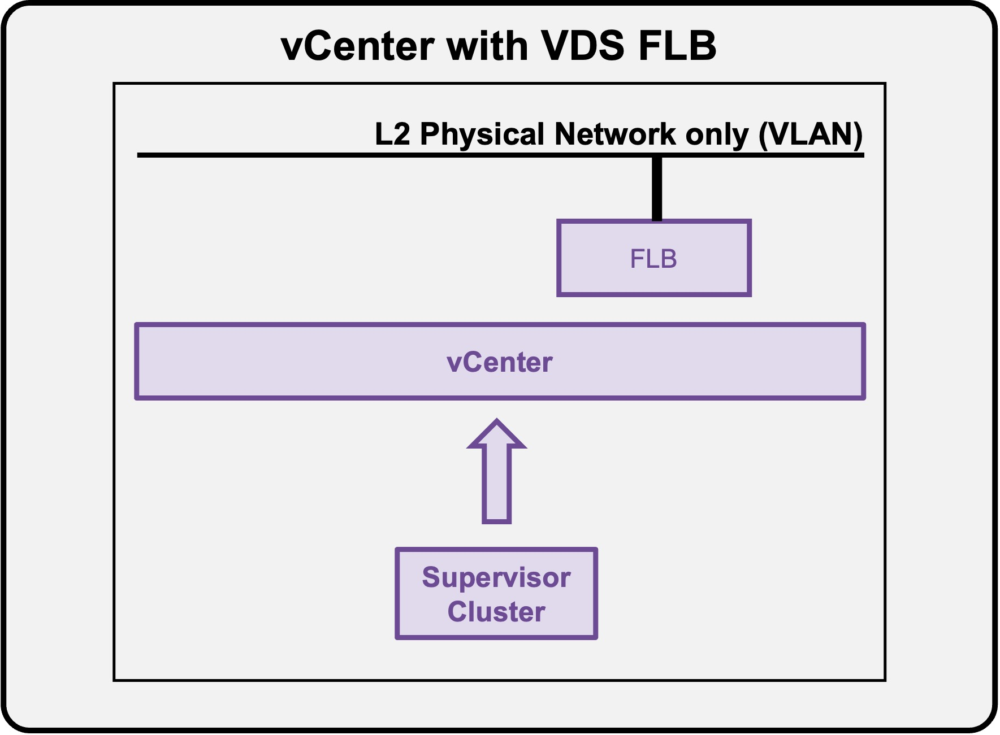
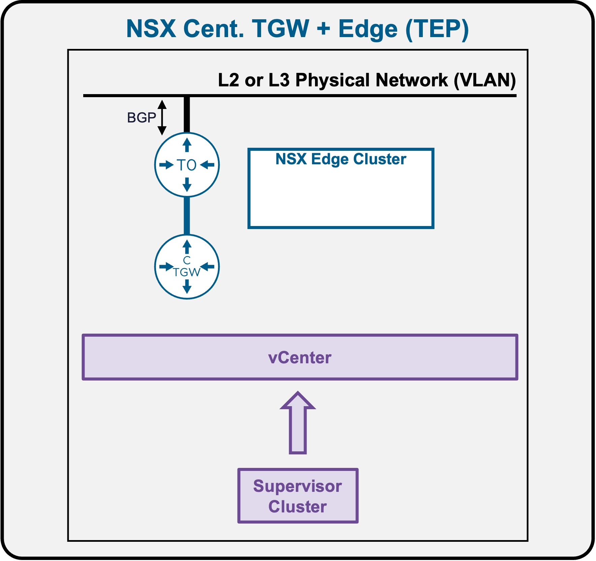
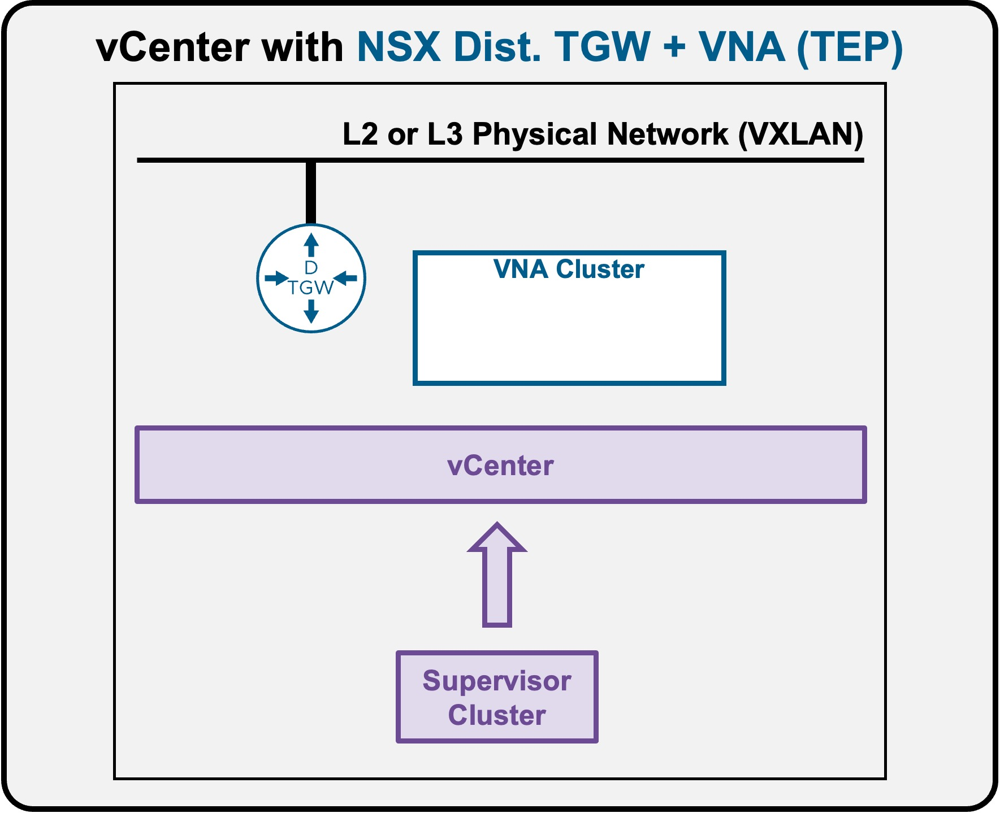
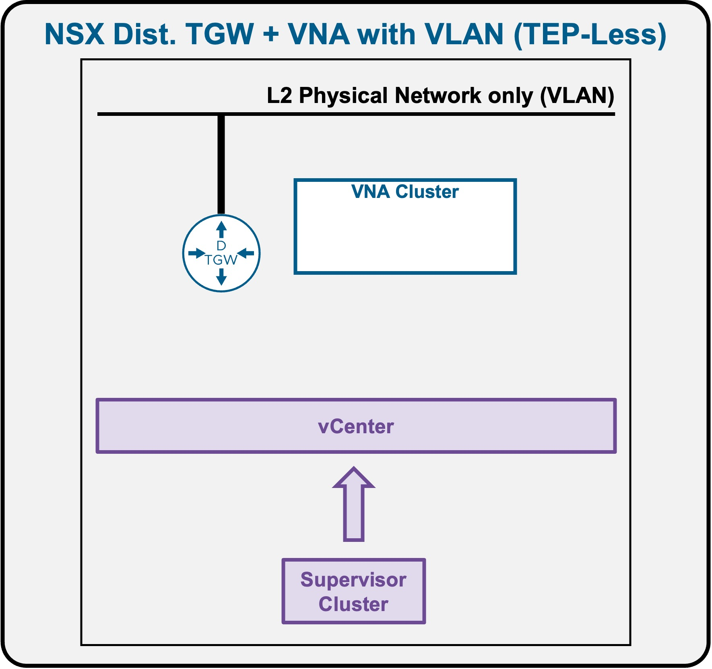

<h1>
   Supervisor Network Services
</h1>

This section describes the procedures for **deploying the Supervisor** within a vSphere environment.

---

## Different network options for Supervisor deployment

### 1. Without NSX

**Architecture:** Uses VDS port groups and deploys or consume load balancers to handle load balancing traffic.  
**Best for:** VMware vSphere Foundation (VVF), lab environments, Proof of Concepts (PoC), or smaller environments.  
**Limitation:** Limited Network Services (only LB) and limited VCF Automation support (no namespace create/delete/update from VCFA).

* **1a. VDS + FLB**  

| 
Metric /Feature
 | 
**1a. VDS + FLB** { width="100%" style="max-width: 200px;"  }|
| :--- | :--- |
| **Physical Fabric** | MTU ≥ 1500,  L2 Physical |
| **VCF-A Support** | 🔴 No |
| **Network Services** | 🔴 Limited  (No Subnets, No NAT, No VPN) |
| **Scale** | 🔴 Limited  (All VMs and K8s consume a Public IP,  all VIPs are managed by a single FLB A/S) |
| **Security** | 🔴 Direct Access  (K8s Nodes reachable from external) |
| **High Availability** | 🔴 Limited  (Supervisor VMs cross Clusters requires shared-VDS) |

---

### 2. With NSX

**Architecture:** Uses NSX Distributed or Centralized Transit Gateways and VNA or Edge Cluster to handle load balancing traffic.  
**Best for:** Fully integrated VCF architecture for better scale and security.  
**Consideration:** Requires fully deployed NSX overlay infrastructure with DTGW+VNA or CTGW+Edge+T0.

| 
Metric /Feature
 | 
**2a. NSX + CTGW(TEP)** { width="100%" style="max-width: 200px;"  }
 | 
**2b. NSX + DTGW VLAN(TEP)** { width="100%" style="max-width: 200px;"  }
 | 
**2c. NSX + DTGW VXLAN(TEP)** { width="100%" style="max-width: 200px;"  }
 | 
**2d. NSX + DTGW VLAN(TEP-Less)** { width="100%" style="max-width: 200px;"  }
 |
| :--- | :--- | :--- | :--- | :--- |
| **Physical Fabric** | MTU ≥ 1700,  BGP | MTU ≥ 1700,  L2 Physical | MTU ≥ 1700,  EVPN + BGP | MTU ≥ 1500,  L2 Physical |
| **VCF-A Support** | 🟢 Yes | 🟢 Yes | 🟢 Yes | 🟢 Yes |
| **Network Services** | 🟢 All | 🟢 Most  (All but VPN) | 🟢 Most  (All but VPN) | 🔴 Limited  (No Subnets private, No NAT, No VPN, no Multicast/VRRP/HSRP/etc) |
| **Scale** | 🟢 Large | 🟢 Large | 🟢 Large | 🔴 Limited  (All VMs and K8s consume a Public IP)|
| **Security** | 🟢 Isolated | 🟢 Isolated | 🟢 Isolated | 🔴 Direct Access  (K8s Nodes reachable from external) |
| **High Availability** | 🟢 Yes | 🟢 Yes | 🟢 Yes | 🟢 Yes |

---

??? note "Upcoming Architectures"
    The following architectures will be covered in future updates:  

    * Avi Load Balancer  

---

!!! info "Document Versioning"
    This guide is updated for **VCF 9.1+**.  
    If you are running an older version, some options may not be available.

---