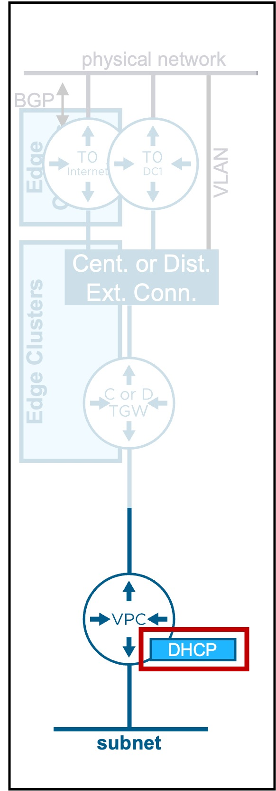
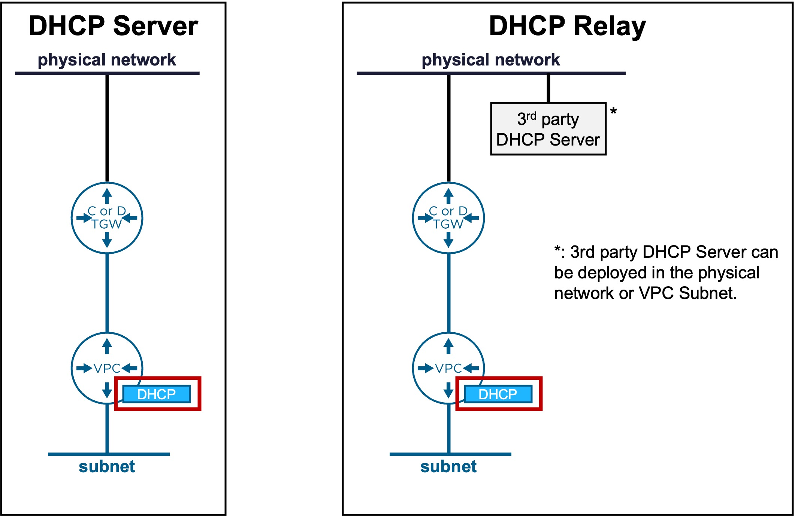
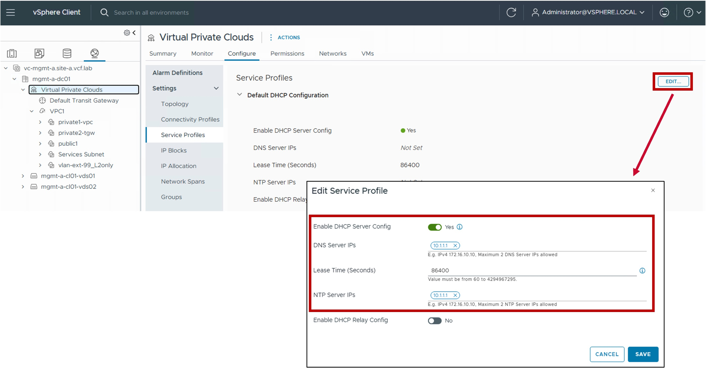
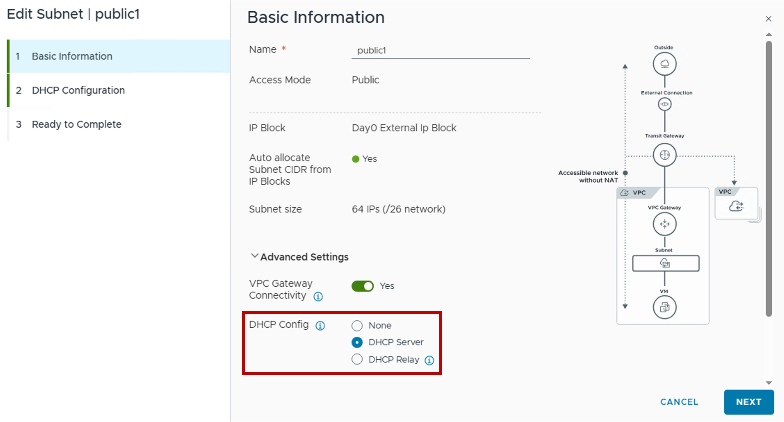
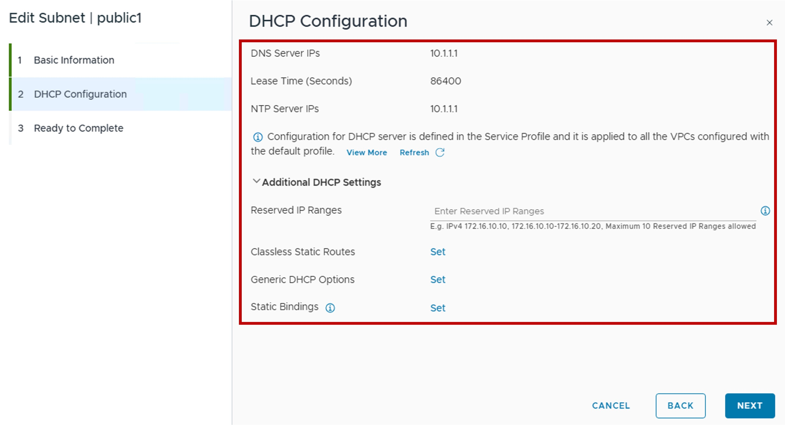
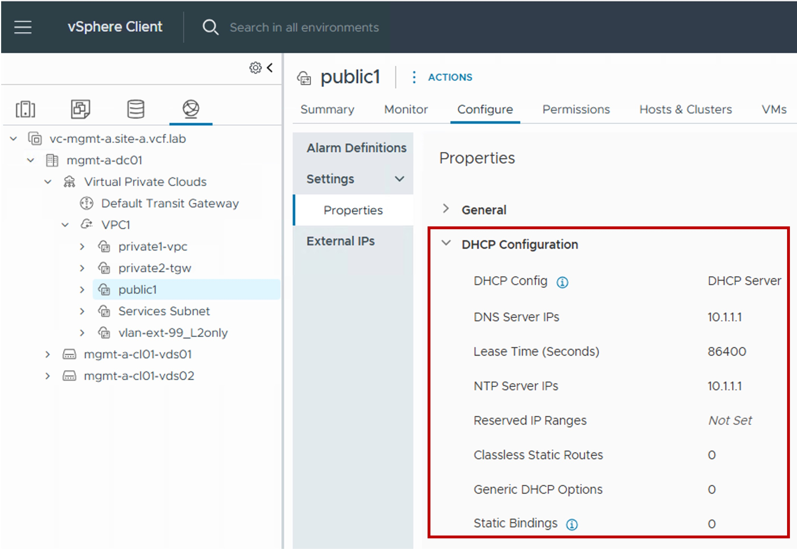
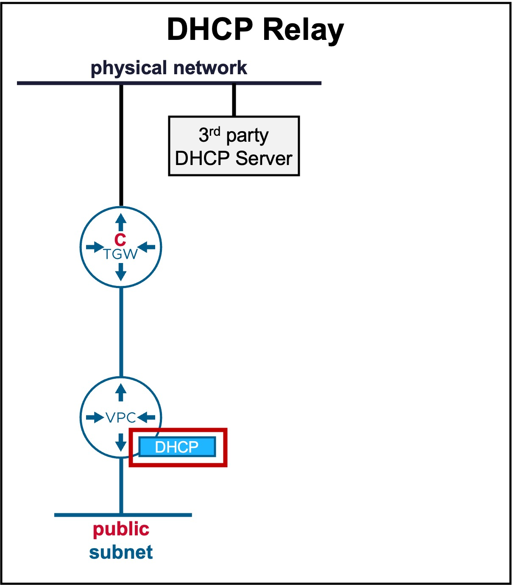
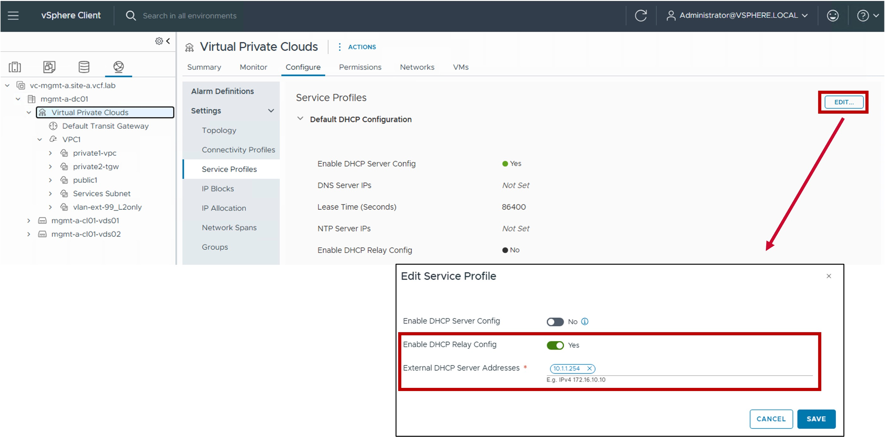
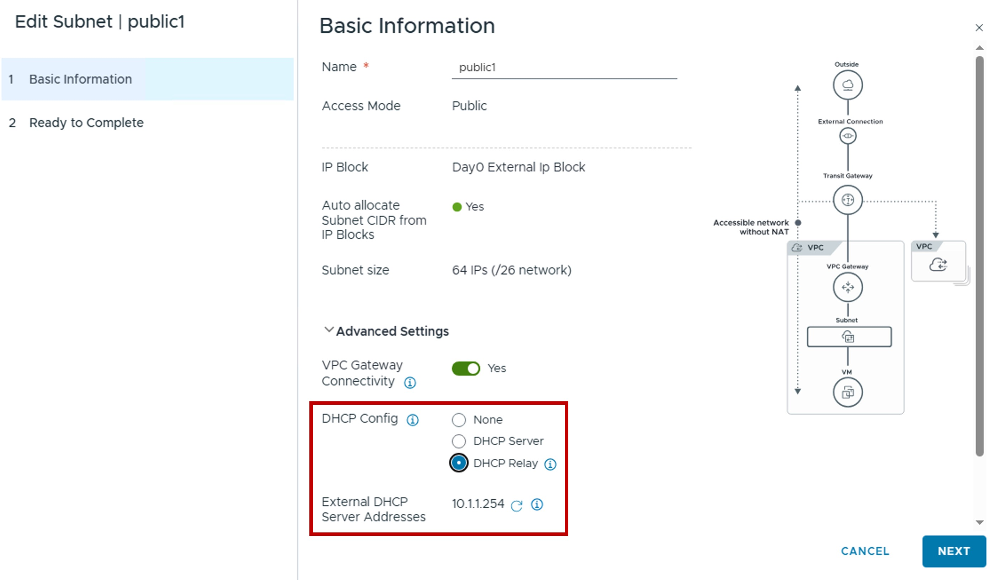
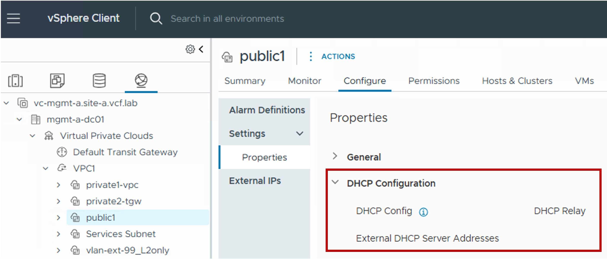

<h1>
   VPC DHCP Configuration in vCenter
</h1>

This section describes the procedures for configuring Dynamic Host Configuration Protocol (DHCP) for your VPC workloads in VPC subnets.
  
**DHCP** is used to dynamically assign IP addresses to workloads.  

{ width="100%" }

---

## Overview of DHCP Types
Different DHCP types are available:

| Type | Use Case | Routing Logic |
| :--- | :--- | :--- |
| [**DHCP Server**](#dhcp-server) | DHCP services provided natively by the VPC Gateway. | Workload IP addressing is managed directly within the VCF networking stack. |
| [**DHCP Relay**](#dhcp-relay)| DHCP requests are forwarded to an external IPAM solution (e.g., Infoblox). | Workload IP addressing is managed by an external third-party service provider. |

{: .center style="width:60%" }

---

## DHCP Server {: #dhcp-server }

### Configuration

#### Step0. Edit Global DHCP Server Configuration
{ width="90%" style="display: block; margin: 0 auto;" }

* **Enable DHCP Server Config**  
  "Yes" to enable native DHCP services across all subnets within the VPC.

* **DNS Server IPs**  
  Specifies the IP addresses of the DNS servers to be assigned to the DHCP clients for name resolution.

* **Lease Time (Seconds)**  
  Defines the duration for which an IP address remains valid for a DHCP client before renewal is required.  
  (default = 86400 seconds / 1 day).

* **NTP Server IPs**  
  Specifies the IP addresses of the NTP servers to be provided to the DHCP clients for time synchronization.

#### Step1. Enable DHCP Server in the VPC subnet
{ width="80%" style="display: block; margin: 0 auto;" }

#### Step2. (Optional) Configure Advanced DHCP Server Settings
{ width="80%" style="display: block; margin: 0 auto;" }

* **DNS Server IPs / Lease Time (Seconds) / NTP Server IPs**  
  These values are pulled from the Global Configuration (see Step O) and cannot be modified at the VPC subnet level.

* **Reserved IP Ranges**  
  Specific IP ranges excluded from the DHCP pool to prevent address conflicts with statically assigned workloads.

* **Classless Static Routes**  
  Defines additional static routes to be pushed to clients (supplementing the default gateway provided by the VPC Gateway).

* **Generic DHCP Options**  
  Allows configuration of specialized DHCP options, such as TFTP (66/67) or PXE boot parameters (209/210).

* **Static Bindings**  
  Creates fixed MAC-to-IP address mappings to ensure specific workloads always receive the same IP address.

### Monitoring
#### Configuration
{ width="60%" style="display: block; margin: 0 auto;" }

!!! info "DHCP Lease Monitoring"
    Active DHCP lease information is unavailable in vCenter (only NSX).

---

## DHCP Relay Configuration {: #dhcp-relay }

!!! warning "External DHCP Server Connectivity"
    {: .center style="width:40%" }

    When a 3rd-party DHCP server is located on the physical network (outside the VPC subnet), DHCP Relay is supported exclusively on:

    * [**VPC Public Subnets**](1b-vpc_subnet.md#overlay)
    * [**Centralized Transit Gateways**](3b-transit_gateway.md)
   

### Configuration

#### Step0. Edit Global DHCP Server Configuration
{ width="90%" style="display: block; margin: 0 auto;" }

* **Enable DHCP Replay Config**  
  "Yes" to enable DHCP Relay service across all subnets within the VPC.

* **External DHCP Server Addresses**  
  Specifies the external IP addresses of the 3rd party DNS servers.

#### Step1. Enable DHCP Relay in the VPC subnet
{ width="70%" style="display: block; margin: 0 auto;" }

* **External DHCP Server Addresses**  
  This value is pulled from the Global Configuration (see Step O) and cannot be modified at the VPC subnet level.

### Monitoring
#### Configuration
{ width="60%" style="display: block; margin: 0 auto;" }

---

