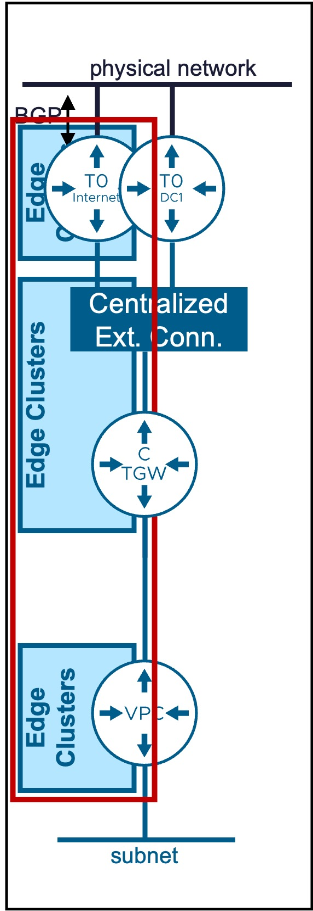
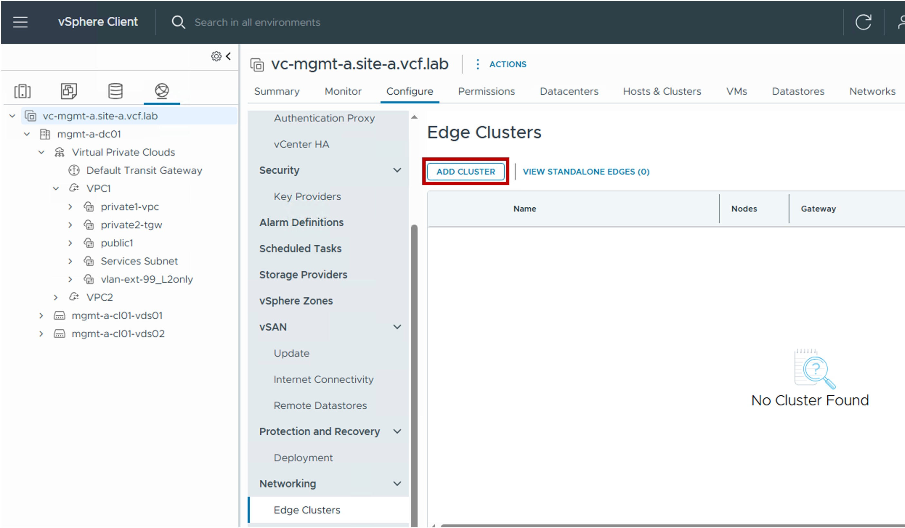
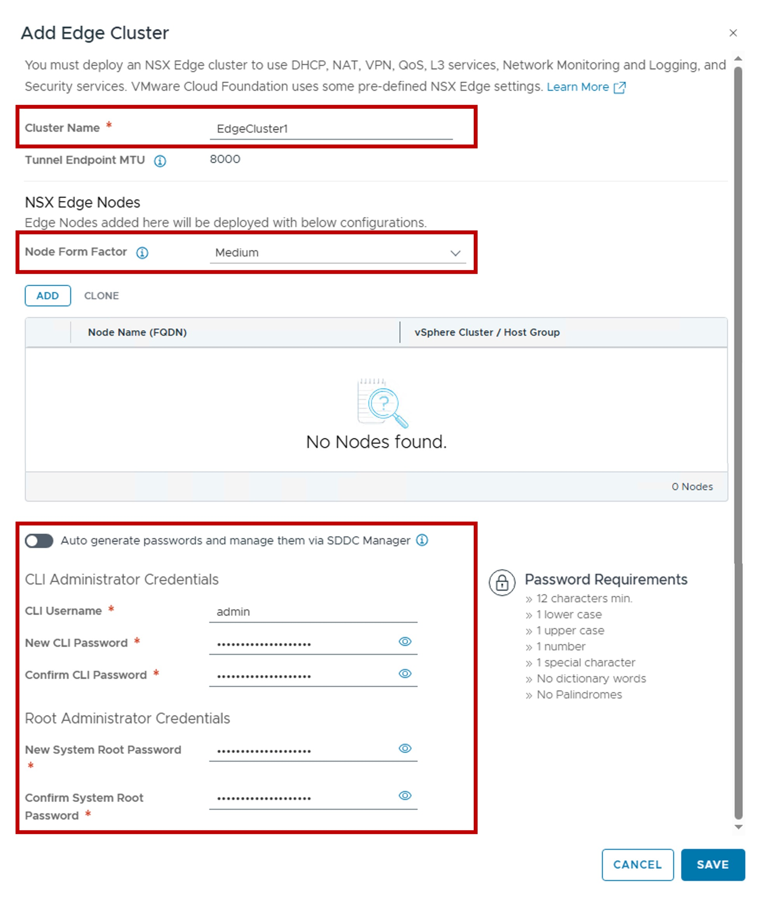
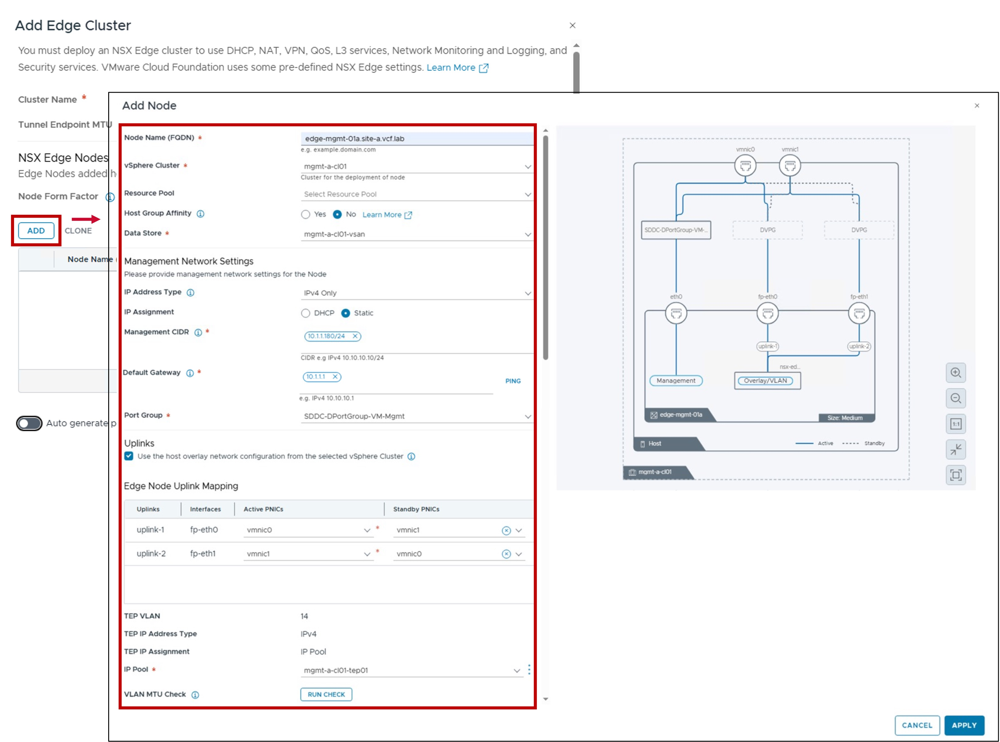
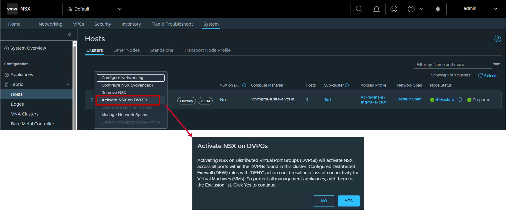
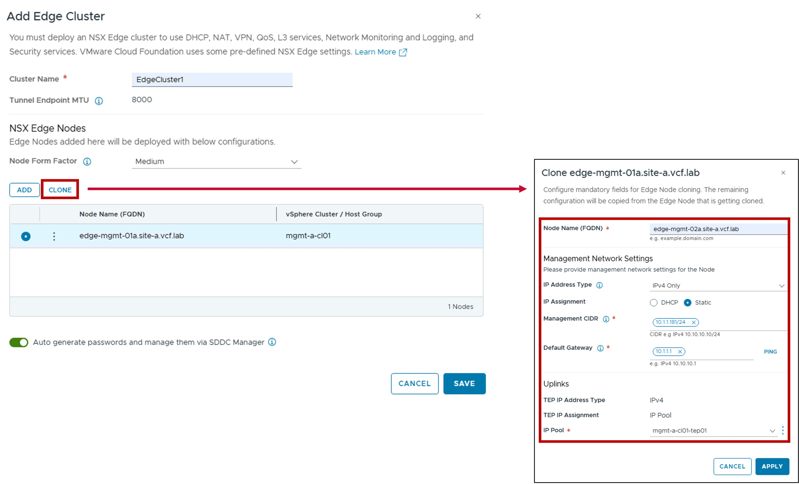
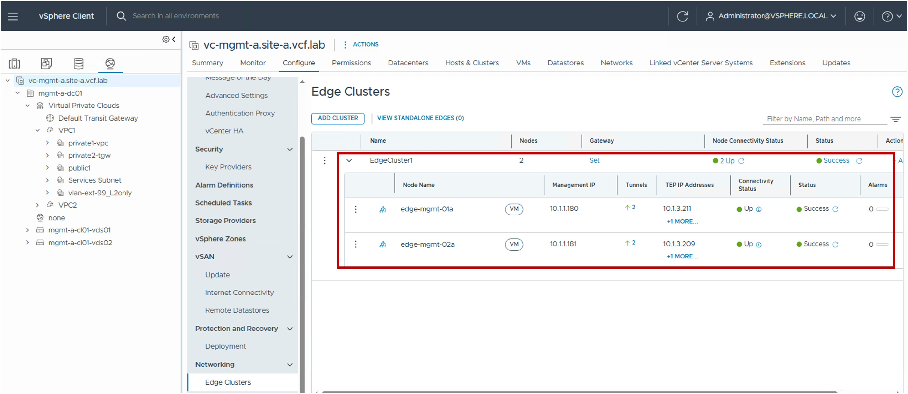

<h1>
   Edge Configuration in vCenter
</h1>

This section describes the procedures for configuring NSX Edge Clusters and Nodes using the vSphere Client.
  
**NSX Edge Nodes** provide the centralized network services required **for Centralized Transit Gateway (CTGW)** designs within the VPC architecture.

{ width="100%" }

---

## Edge Cluster / Edge Nodes

### Configuration

??? info ":material-information-outline: Deep Dive: Blogs & Video Demonstrations"
    * **Video Walkthrough:** Watch the step-by-step Edge Cluster & Edge Node deployment guide [:fontawesome-brands-youtube: on YouTube](https://www.youtube.com/watch?v=ruoprGnf_v8){ target="_blank" }.
    * **Technical Blog:** Read the detailed architectural breakdown on the [:material-newspaper-variant-outline: VMware Cloud Foundation Blog](https://blogs.vmware.com/cloud-foundation/2025/06/25/vpc-centralized-network-connectivity-with-guided-edge-deployment/){ target="_blank" }.

#### Step1. Create new Edge Cluster / Edge Nodes
{ width="80%" style="display: block; margin: 0 auto;" }

#### Step2. Configure Edge Cluster
{ width="70%" style="display: block; margin: 0 auto;" }

* **Node Form Factor**:  
  Select the appliance size (vCPU / Memory) of the Edge Nodes.  
  This determines the scale and performance limits for the logical routers (Tier-0, CTGW, and VPC) hosted on the node.  
  More information on [VMware NSX Configmax](https://configmax.broadcom.com/guest?vmwareproduct=NSX).

* **Auto generate passwords and manage them via SDDC Manager**  
  Enabling this option automates password generation and allows SDDC Manager to handle credential lifecycle management.

#### Step3. Configure Edge Nodes Placement and Networking
{ width="90%" style="display: block; margin: 0 auto;" }

* **vSphere Cluster / Resource Pool / Host Group Affinity / Data Store**:  
  Defines the physical placement of the Edge Node VM.  
  You can optionally specify Resource Pools and Host Group Affinity to control where the VM resides within the cluster.  

* **Management Network Settings (IP Address Type / IP Assignment / Port Group)**  
  Configures the IP assignment and Port Group for the Edge Node management interface.

* **Uplinks (Edge Node Uplink Mapping / TEP VLAN)**  
  Defines vNIC connectivity and Overlay TEP configuration.  
  Note: To share the same VLAN for both ESXi TEPs and Edge Node TEPs, you must enable "Use the host overlay network configuration from the selected vSphere Cluster."  

    

    ??? info "In case "Use the host overlay network configuration from the selected vSphere Cluster" is greyed out"
        If this option is greyed out, follow these steps:  
        1. Go to **NSX Manager**.  
        2. Navigate to **System** > **Fabric** > **Nodes** > **Settings**.  
        3. Enable the **NSX on DVPG** toggle.  

        !!! warning "Security Consideration: Microsegmentation / DFW"
            Enabling "NSX on DVPG" activates the **Distributed Firewall (DFW)** for all VMs connected to VDS Port Groups. 
            **Critical:** Ensure no "Deny All" rules are active in your DFW policy before enabling this, as it may immediately block traffic to existing workloads on those Port Groups.
            
        { width="90%" style="display: block; margin: 0 auto;" }
    

* **VLAN MTU Check**  
  (Optional) Validates the MTU settings on the selected VLAN to ensure overlay traffic is not fragmented.

**Repeat these steps for the remaining Edge Nodes (2+ nodes recommended).**

??? info "Cloning option"
    In case other Edge Nodes have the vSphere Cluster and Uplink settings, use the cloning option.
    { width="50%" style="display: block; margin: 0 auto;" }

### Monitoring
#### Status
The status reflects the successful application of the configuration.
{ width="90%" style="display: block; margin: 0 auto;" }

---
