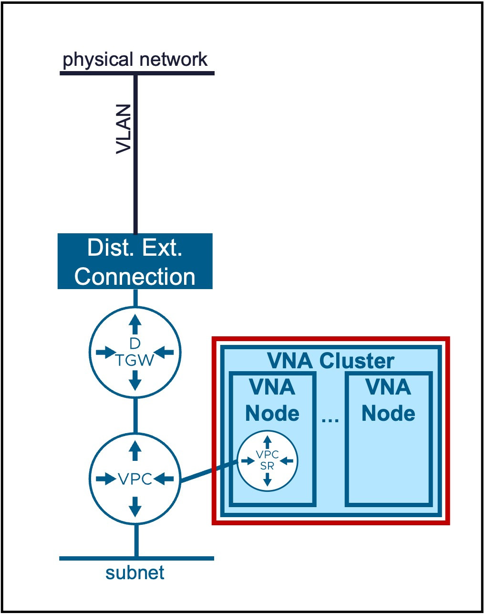
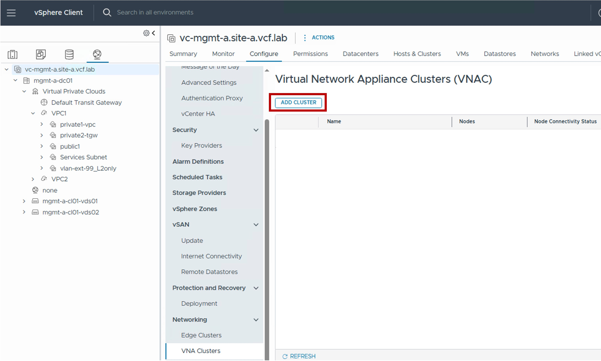
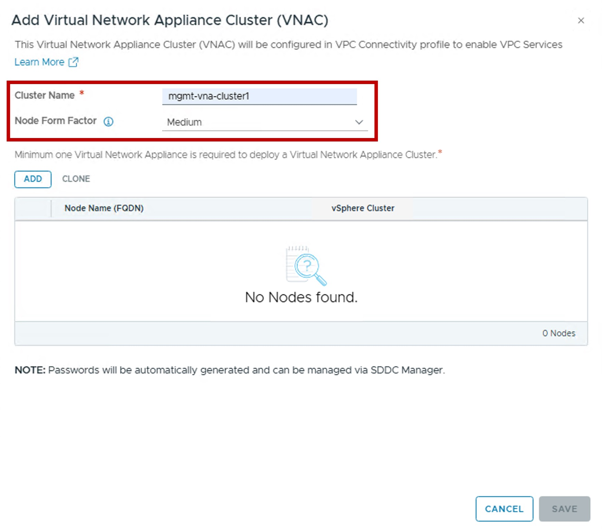
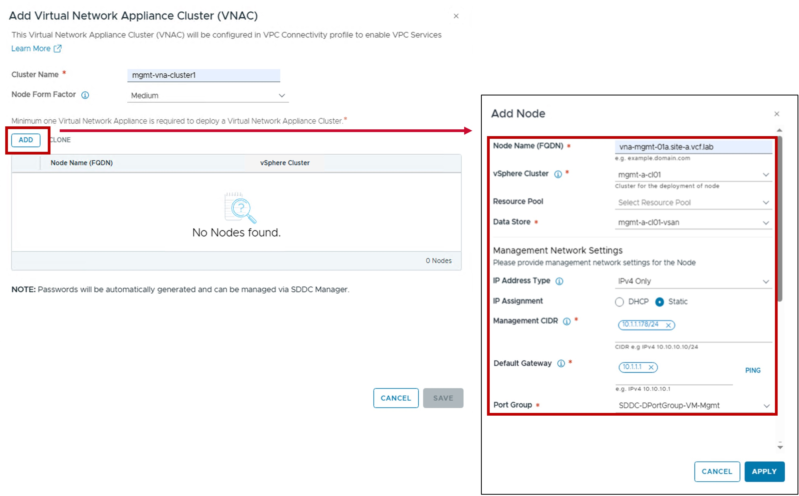
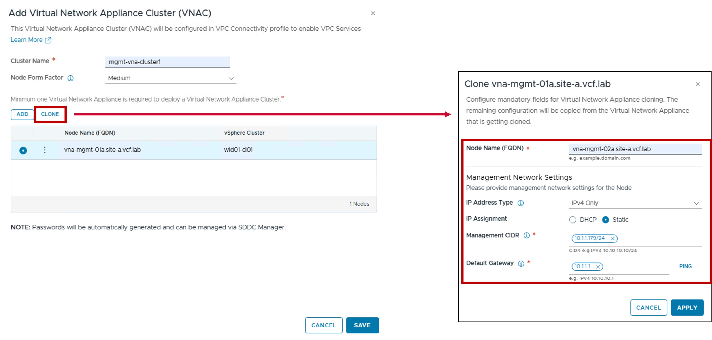
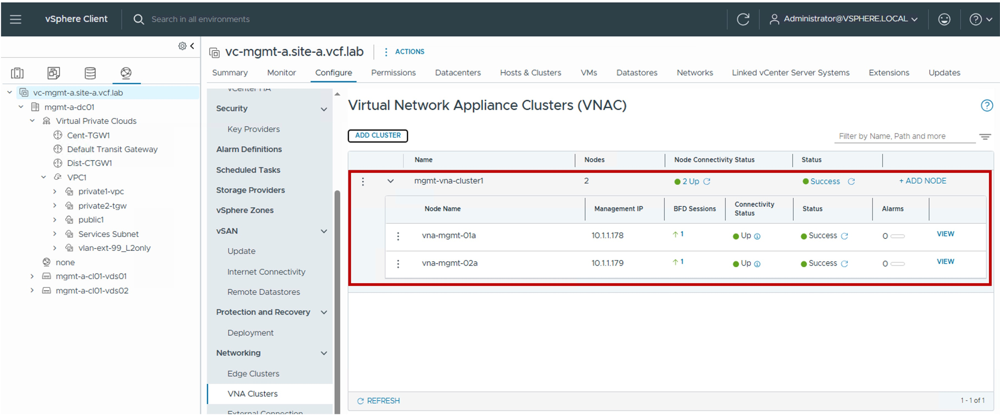

<h1>
   VNA Configuration in vCenter
</h1>

This section describes the procedures for configuring NSX Virtual Network Appliances (VNA) using the vSphere Client.
  
**NSX Virtual Network Appliances (VNA Nodes)** provide the centralized network services required **for Distributed Transit Gateway (DTGW)** designs within the VPC architecture.

{ width="100%" }

---

## VNA Cluster / VNA Nodes

### Configuration

#### Step1. Create new VNA Cluster / VNA Nodes
{ width="80%" style="display: block; margin: 0 auto;" }

#### Step2. Configure VNA Cluster
{ width="50%" style="display: block; margin: 0 auto;" }

* **Node Form Factor**:  
  Select the appliance size (vCPU / Memory) of the VNA Nodes.  
  This determines the scale and performance limits for the logical routers (VPC-SR Gateways) hosted on the node.

#### Step3. Configure VNA Nodes Placement and Networking
{ width="80%" style="display: block; margin: 0 auto;" }

* **vSphere Cluster / Resource Pool / Host Group Affinity / Data Store**:  
  Defines the physical placement of the Edge Node VM.  
  You can optionally specify Resource Pools and Host Group Affinity to control where the VM resides within the cluster.  

* **Management Network Settings (IP Address Type / IP Assignment / Port Group)**  
  Configures the IP assignment and Port Group for the VNA Node management interface.

**Repeat these steps for the remaining VNA Nodes (2+ nodes recommended).**

??? info "Cloning option"
    In case other Edge Nodes have the vSphere Cluster and Uplink settings, use the cloning option.
    { width="50%" style="display: block; margin: 0 auto;" }

### Monitoring
#### Status
The status reflects the successful application of the configuration.
{ width="90%" style="display: block; margin: 0 auto;" }

---
