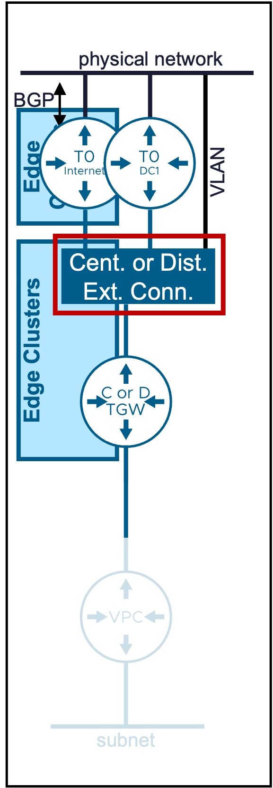
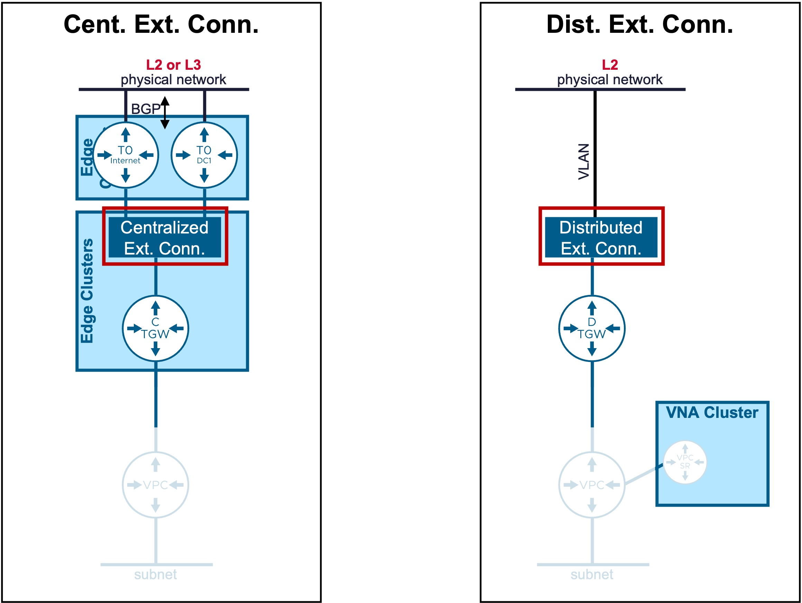
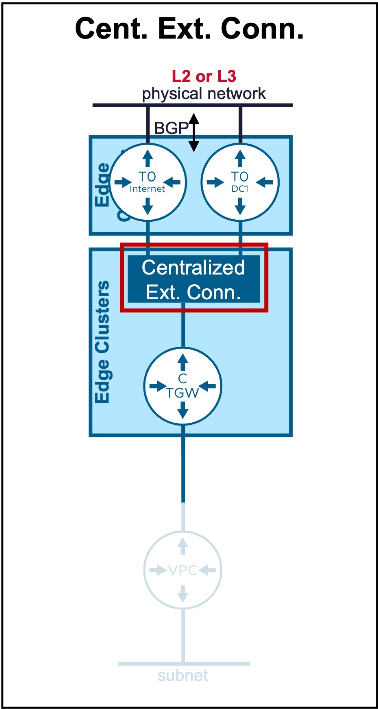
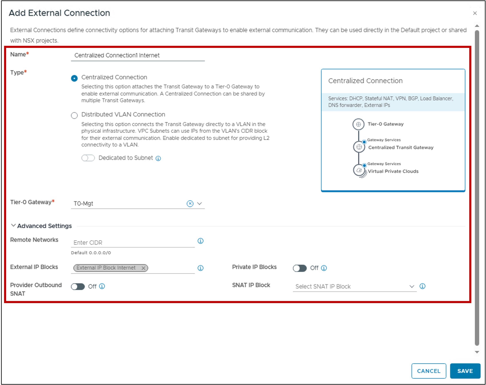
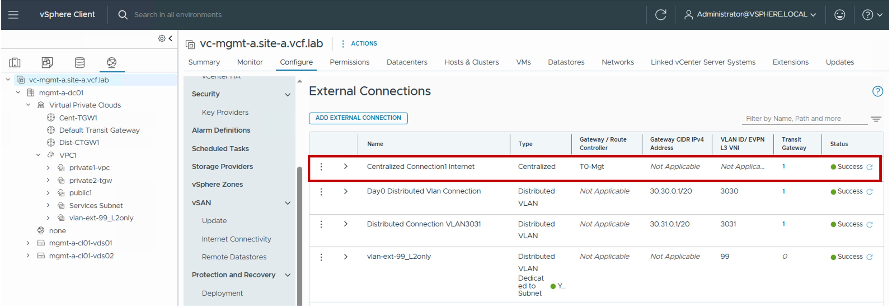
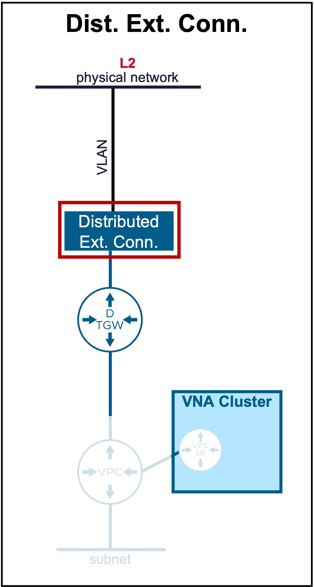
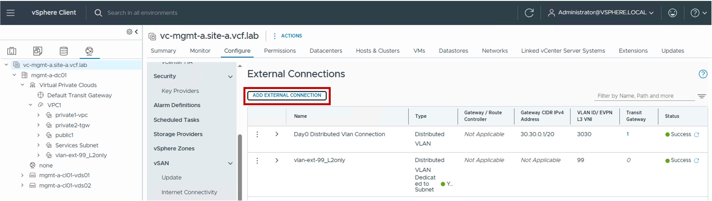
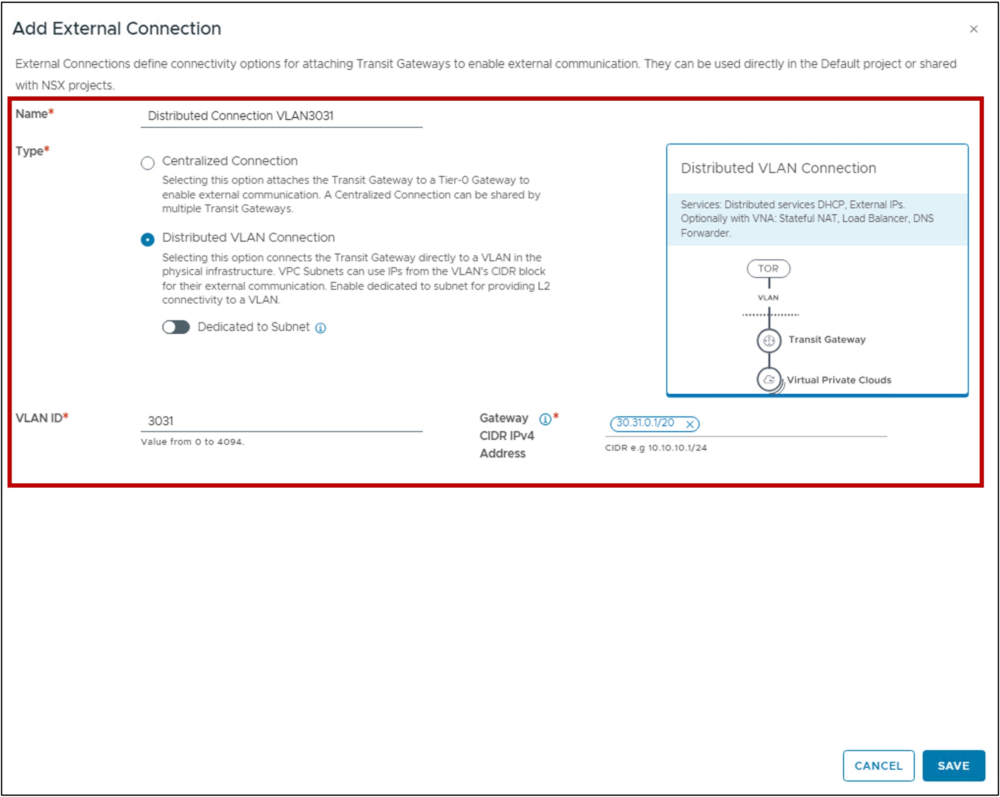
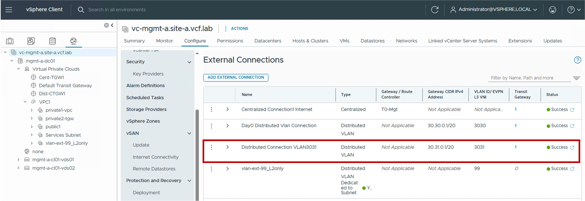

<h1>
   External Connection Configuration in vCenter
</h1>

This section describes the procedures for configuring External Connections using the vSphere Client.
  
**External Connections** provide the connection from the Transit Gateway (Centralized or Distributed) to the physical network.

{ width="100%" }

---

## Overview of External Connection Types

Different Transit Gateway types are available:

| Type | Use Case | Routing Logic |
| :--- | :--- | :--- |
| [**Centralized Connection**](#cent-conn) | Supports L2 and L3 Fabric.  External connectivity for Centralized Transit Gateways via Edge Clusters. | Routes traffic through a centralized Tier-0/VRF Gateway for external access. |
| [**Distributed VLAN Connection**](#dist-conn)| Supports only L2 Fabric.   External connectivity for Distributed Transit Gateways (optionally utilizing VNA Nodes). | Provides a direct handoff to a specific VLAN. |

{: .center style="width:60%" }

---

## Centralized External Connection {: #cent-conn }

{: .center style="width:30%" }

### Configuration 

!!! warning "Requirement"
    A **Tier-0 Gateway** must be pre-provisioned in the environment.  
    Note: This resource cannot be created via vCenter; it must be configured within the NSX Manager.

#### Step1. Create new Centralized External Connection
{ width="90%" style="display: block; margin: 0 auto;" }

#### Step2. Configure new Centralized External Connection
{ width="70%" style="display: block; margin: 0 auto;" }

* **Tier-0 Gateway**:  
  Select the pre-provisioned Tier-0 Gateway that serves as the exit point for this connection.

* **Remote Networks**:  
  Specifies the remote networks reachable via this connection.  
  Leaving this blank is equivalent to 0.0.0.0/0: routing all external/Internet traffic through this path.

* **External IP Blocks**:  
 Select the External IP Block(s) permitted to be advertised to the physical network via the selected Tier-0.

* **Private IP Blocks**:  
  Enables the advertisement of TGW Private IP Blocks via the Tier-0 for the Centralized Transit Gateway also enabling this.  
  This option is typically used for connectivity to remote data centers/private MPLS rather than the public Internet.  
  By default it is disabled so only External IP Blkocks are advertised.

* **Provider Outbound SNAT**:  
  Enables communication for VPC subnets using External IP Blocks other than those explicitly listed in the "External IP Blocks" field.  
  Traffic from these subnets will be Source NATed (SNAT) using an IP from the SNAT IP Block defined below.

* **SNAT IP Block**:  
  Select the specific External IP Block to be used for the Provider Outbound SNAT.

### Monitoring
#### Status
The status reflects the successful application of the configuration.

??? info "Note about the Status"
    Because this represents a logical configuration mapping rather than an active link-state protocol, the status will typically remain Green (Healthy) once the settings are validated by the NSX Manager.

{ width="90%" style="display: block; margin: 0 auto;" }

---

## Distributed External Connection {: #dist-conn }

{: .center style="width:30%" }

### Configuration

#### Step1. Create new Distributed External Connection
{ width="90%" style="display: block; margin: 0 auto;" }

#### Step2. Configure new Distributed External Connection
{ width="70%" style="display: block; margin: 0 auto;" }

* **VLAN ID**:  
  Specifies the VLAN ID used for the Layer 2 handoff to the physical network.

* **Gateway CIDR IPv4 Address**:  
  Specifies the IP address of the upstream physical router or firewall (the Next Hop) that acts as the default gateway for this connection.

### Monitoring
#### Status
The status reflects the successful application of the configuration.

??? info "Note about the Status"
    Because this represents a logical configuration mapping rather than an active link-state protocol, the status will typically remain Green (Healthy) once the settings are validated by the NSX Manager.

{ width="90%" style="display: block; margin: 0 auto;" }

---
