<h1>
   Transit Gateway Configuration in vCenter
</h1>

This section describes the procedures for configuring Transit Gateways using the vSphere Client.
  
**Transit Gateways** (Centralized or Distributed) provide the routing between VPC Gateways and physical networks.

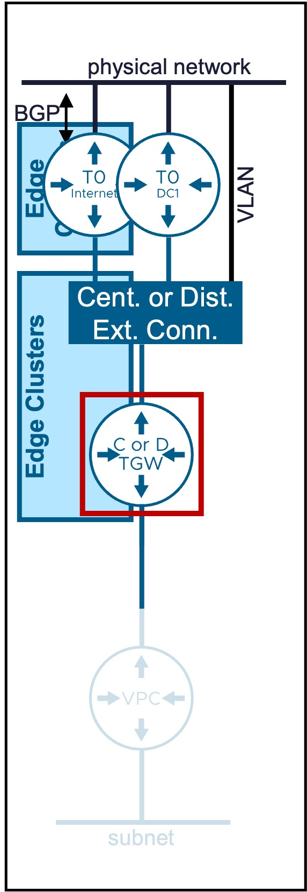{ width="100%" }

---

## Overview of Transit Gateway Types

Different Transit Gateway types are available:

| Type | Use Case | Routing Logic |
| :--- | :--- | :--- |
| [**Centralized TGW**](#cent-tgw) | Supports L2 and L3 Fabric.  Offers Stateful Network Services (Outbound-NAT and NAT). VPN can also be configured but from NSX. | Egress traffic is hairpinned through a centralized Tier-0/VRF gateway hosted on an Edge Cluster. |
| [**Distributed TGW**](#dist-tgw)| Supports only L2 Fabric.   Offers Stateful Network Services (Outbound-NAT and NAT) with VNA Nodes. VPN can also be configured but from NSX. | Routing occurs locally at the ESXi host level (distributed dataplane). Stateful Network Services traffic is redirected through a VPC-SR Gateway in a VNA Cluster. |

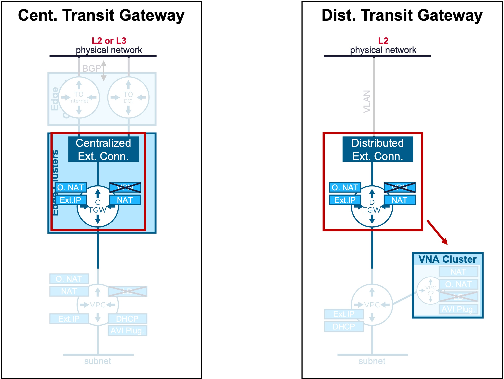{: .center style="width:70%" }

---

## Centralized Transit Gateway {: #cent-tgw }

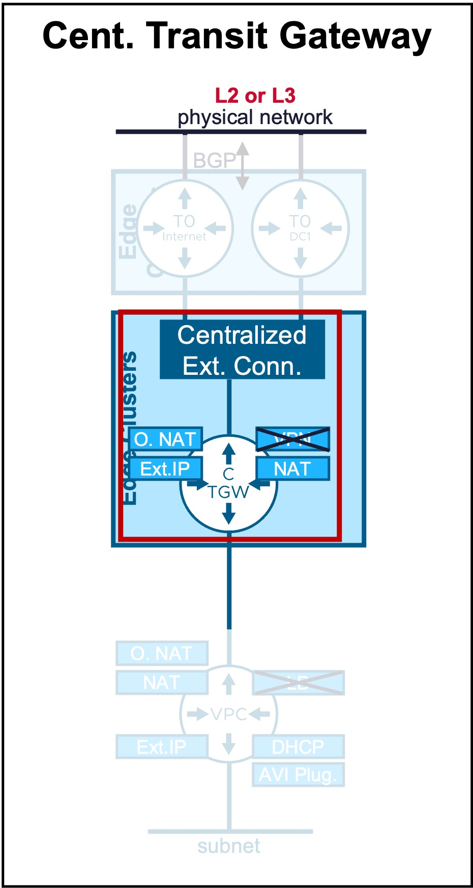{: .center style="width:30%" }

### Configuration

!!! warning "Requirement"
    An [**Edge Cluster**](2a-edge.md) must be pre-provisioned in the environment.  

#### Step1. Create new Centralized Transit Gateway 
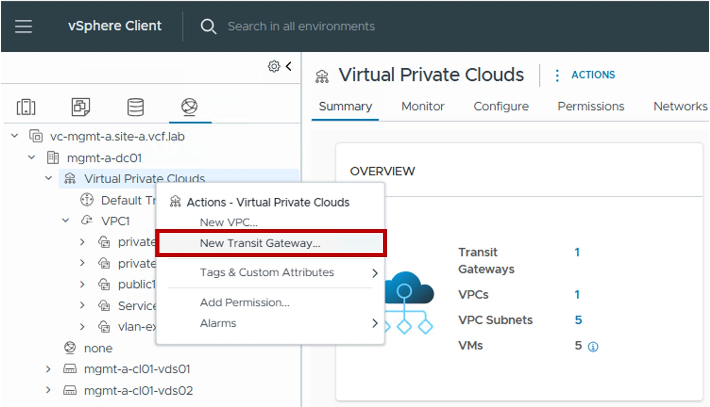{ width="60%" style="display: block; margin: 0 auto;" }

#### Step2. Configure Centralized Transit Gateway Connectivity
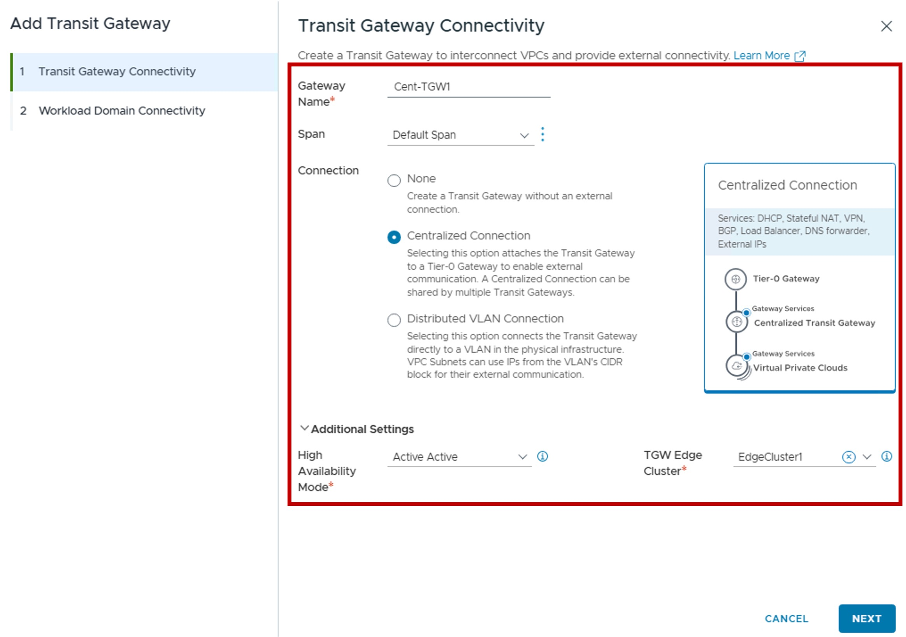{ width="80%" style="display: block; margin: 0 auto;" }

* **Span**:  
  Determines how VPC subnets below this Transit Gateway will extend across vCenter clusters.  
  For more information on Network Span, refer to the [Network Span](3d-network_span.md) page.

* **Connection**:  
  Select "Centralized Connection".  
  
* **High Availability Mode**:  
  Select the operational redundancy and service support:  
  . Active/Active: Maximizes throughput and scalability by distributing the Transit Gateway load across multiple Edge Nodes simultaneously.  
  Active/Standby: Required for stateful network services (NAT and VPN). In this mode, this Transit Gateway North/South traffic is processed by a single "Active" Edge Node to maintain session state.

* **TGW Edge Cluster**:  
  Select the specific Edge Cluster that will host this Centralized Transit Gateway.

#### Step3. Configure Workload Domain Connectivity
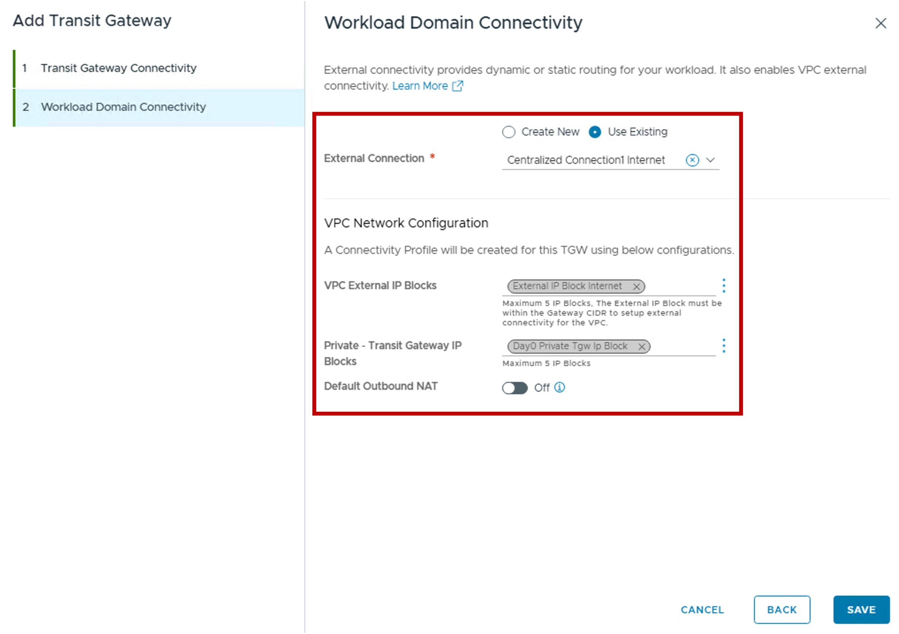{ width="80%" style="display: block; margin: 0 auto;" }

* **External Connection**:  
  You can create a new or use an existing Centralized External Connection.  
  Limited configuration settings are available if creating a new Centralized External Connection from here (only Tier-0 information).  
  For more information on External Connection, refer to the [External Connection](3a-external_connection.md) page.

* **VPC Network Configuration**  
  (Optional) Create a new Connectivity Profile for future VPC.  
  For more information on Connectivity Profile, refer to the [Connectivity Profile](3e-connectivity_profile.md page.  
  The Connectivity Profile will be associated with this Transit Gateway and with:
    * **VPC External IP Blocks:** Select or create a new External IP Block for future VPC Public subnets, NAT, LB VIP (AVI configuration), and VPN (NSX configuration).
    * **Private - Transit Gateway IP Blocks:** Select or create a new Private TGW IP Block used for future VPC Private-TGW subnets.
    * **Default Outbound NAT:** Enable the automatic Source NAT (N:1 SNAT) for future VPC Private-TGW and Private-VPC subnets.

### Monitoring

#### Status
The status reflects the successful application of the configuration.

??? info "Note about the Status"
    Because this represents a logical configuration mapping rather than an active link-state protocol, the status will typically remain Green (Healthy) once the settings are validated by the NSX Manager.

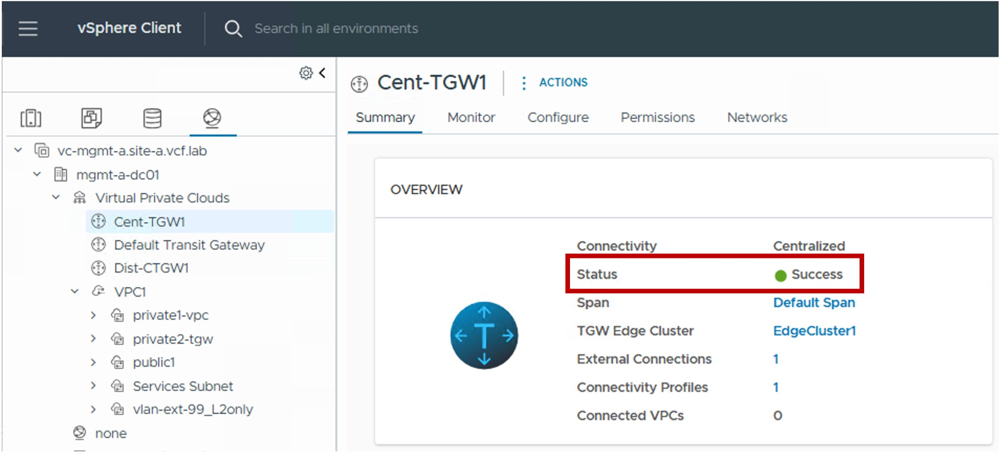{ width="80%" style="display: block; margin: 0 auto;" }

---

## Distributed Transit Gateway  {: #dist-tgw }

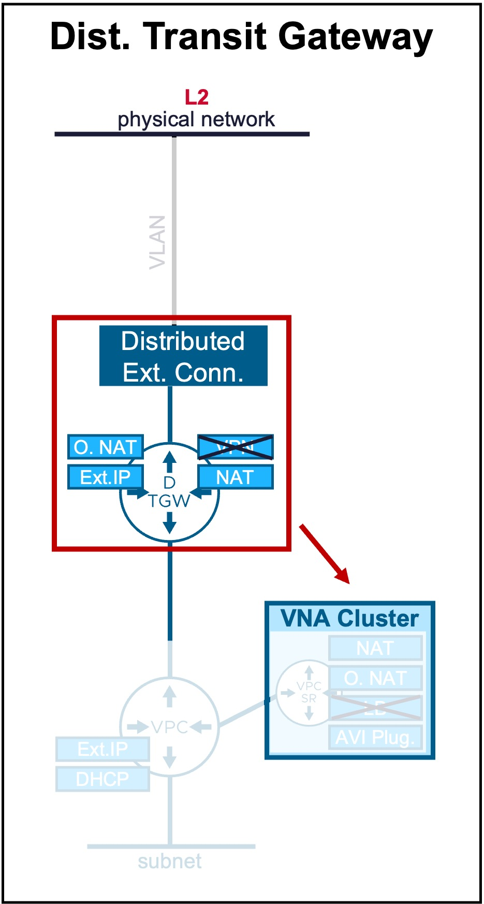{: .center style="width:30%" }

### Configuration

#### Step1. Create new Distributed Transit Gateway 
{ width="60%" style="display: block; margin: 0 auto;" }

#### Step2. Configure Distributed Transit Gateway Connectivity
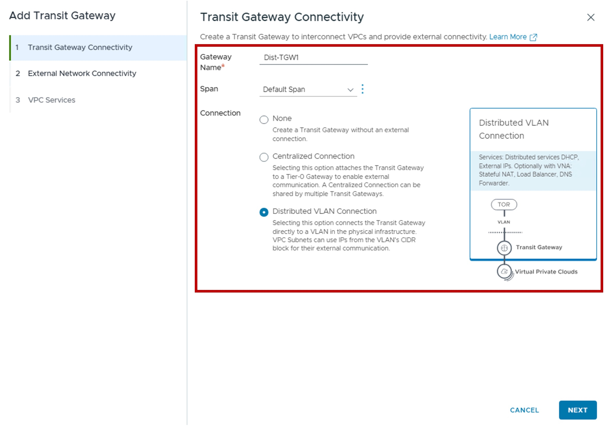{ width="80%" style="display: block; margin: 0 auto;" }

#### Step3. Configure External Network Connectivity
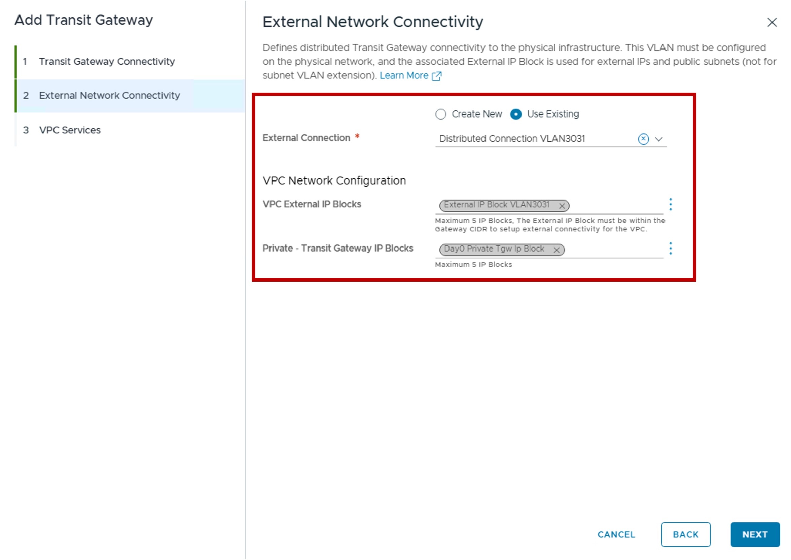{ width="80%" style="display: block; margin: 0 auto;" }

* **External Connection**:  
  You can create a new or use an existing Distributed External Connection.  
  For more information on External Connection, refer to the [External Connection](3a-external_connection.md) page.

* **VPC Network Configuration**  
  (Optional) Create a new Connectivity Profile for future VPC.  
  For more information on Connectivity Profile, refer to the [Connectivity Profile](3e-connectivity_profile.md) page.  
  The Connectivity Profile will be associated with this Transit Gateway and with:
    * **VPC External IP Blocks:** Select or create a new External IP Block for future VPC Public subnets, NAT, LB VIP (AVI configuration), and VPN (NSX configuration).
    * **Private - Transit Gateway IP Blocks:** Select or create a new Private TGW IP Block used for future VPC Private-TGW subnets.
    * **Default Outbound NAT:** Enable the automatic Source NAT (N:1 SNAT) for future VPC Private-TGW and Private-VPC subnets.

#### Step4. Configure VPC Service
Option to offer Network Services NAT, AVI Plugin.
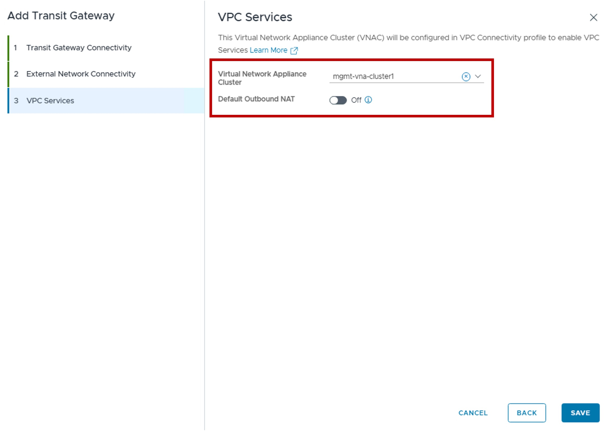{ width="70%" style="display: block; margin: 0 auto;" }

* **Virtual Network Appliance Cluster**:  
  Select the VNA Cluster to host the future VPC-SR Gateways.  
  For more information on VNA, refer to the [VNA](2b-vna.md) page.

* **Default Outbound NAT**  
  Enable the automatic Source NAT (N:1 SNAT) for future VPC Private-TGW and Private-VPC subnets.  
  For more information on Outbound NAT, refer to the [Outbound NAT](1c-vpc_nat.md#outbound-nat) page.

### Monitoring

#### Status
The status reflects the successful application of the configuration.

??? info "Note about the Status"
    Because this represents a logical configuration mapping rather than an active link-state protocol, the status will typically remain Green (Healthy) once the settings are validated by the NSX Manager.

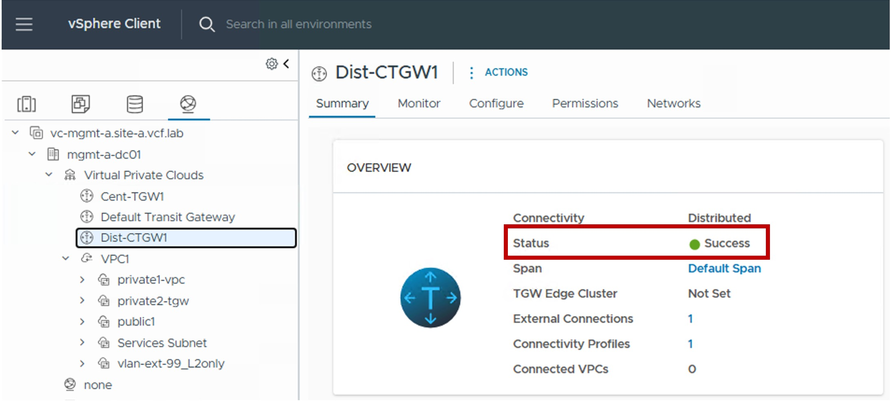{ width="80%" style="display: block; margin: 0 auto;" }
---
