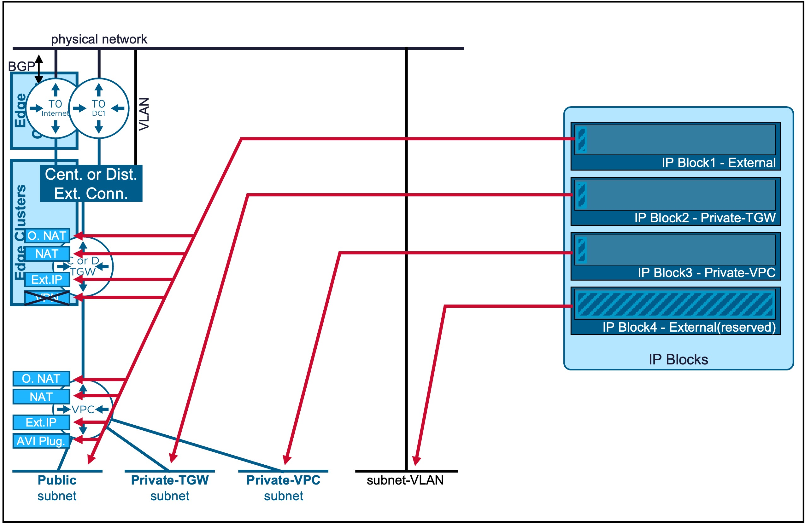
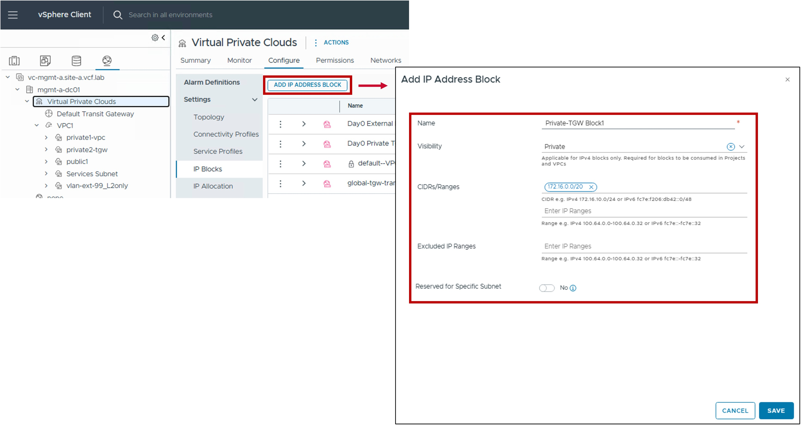
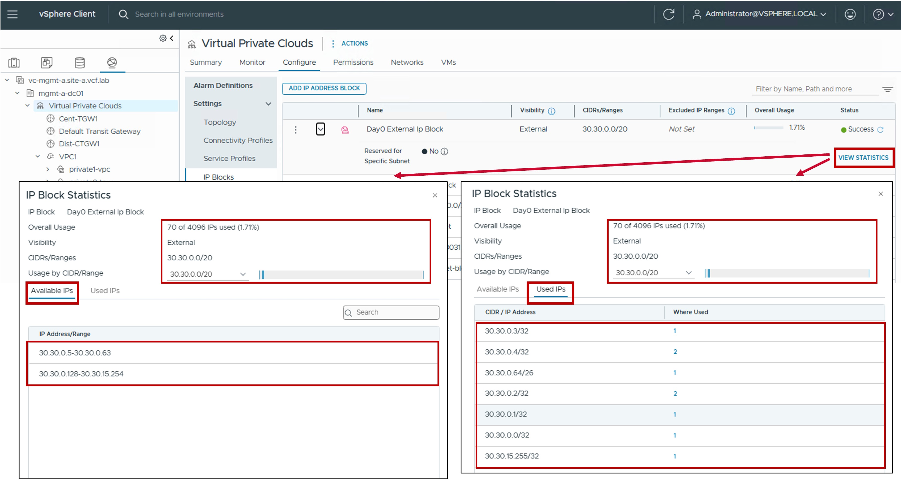

<h1>
   IP Blocks in vCenter
</h1>

This section describes the procedures for configuring IP Blocks using the vSphere Client.
  
**IP Blocks** are used for VPC IP allocation.

{ width="100%" }

---

## Overview of IP Block Types

Different IP Block types are available:

| Type | Use Case | Routing Logic |
| :--- | :--- | :--- |
| [**External**](#ext-ipblock) | Used for [**VPC Subnets Public**](1b-vpc_subnet.md#overlay) and [**different NAT**](1c-vpc_nat.md).   Also used by **LB VIP** (AVI configuration) and **VPN** (NSX configuration). | External visibility is high; direct ingress/egress. |
| [**Private-TGW**](#privatetgw-ipblock)| Used for [**VPC Subnets Private-TGW**](1b-vpc_subnet.md#overlay) and [**specific NAT (SNAT/DNAT)**](1c-vpc_nat.md#full-nat)| Best for shared internal services across the enterprise. |
| [**Private-VPC**](#privatevpc-ipblock)| Used for [**VPC Subnets Private-VPC**](1b-vpc_subnet.md#overlay).   Note: Configuration is within the [VPC Gateway](1a-vpc_gateway.md). | Maximum isolation; workloads are "hidden" even from other VPCs. |

{: .center style="width:75%" }

For more information on VPC Subnets, refer to the [VPC Subnet](1b-vpc_subnet.md) page.

---
## IP Block External {: #ext-ipblock }

This IP Block type is used for **Public VPC Subnets** (and also NAT, LB VIP (AVI configuration), and VPN (NSX configuration)).  
Also used for VLAN-backed Subnets.

* **Public VPC Subnets**: These IP Blocks must be manually defined in this section (see configuration steps below).
* **VLAN-backed Subnets**: These IP Blocks are not created here; they are configured directly within the [VPC Subnet VLAN Extension](1b-vpc_subnet.md#vlan)

### Configuration

#### Step1. Create new IP Block External
{ width="95%" style="display: block; margin: 0 auto;" }

* **Visibility**:  
  Set to External.

* **CIDRs/Ranges**:  
  Enter the specific CIDR(s) and/or IP Range(s) to be managed by this block.  
  . CIDR: Required for [VPC-Subnet Publics](1b-vpc_subnet.md#overlay), [Specific NAT](1c-vpc_nat.md#full-nat), Load Balancer VIPs (AVI configuration), and VPN (NSX configuration)  
  . Range: Supported for [All NAT](1c-vpc_nat.md), Load Balancer VIPs (AVI configuration), and VPN (NSX configuration). It cannot be used for for [VPC-Subnet Publics](1b-vpc_subnet.md#overlay); these require CIDRs.
  
* **Excluded IP Ranges**:  
  (Optional) Specify any IP Range(s) within the CIDRs above that should be withheld from automatic allocation (e.g. IP Range used by the physical network).
  
* **Reserved for Specific Subnet**:  
  This setting is used exclusively for VLAN-backed Subnets.  
  For the creation of VPC-Subnet Public this option must be left Disabled.  
  Note: IP Blocks for VLAN-backed Subnets are created directly within the [VPC Subnet VLAN Extension](1b-vpc_subnet.md#vlan).  
  

### Monitoring
The status reflects the successful application of the configuration.

??? info "Note about the Status"
    Because this represents a logical configuration mapping rather than an active link-state protocol, the status will typically remain Green (Healthy) once the settings are validated by the NSX Manager.

{ width="90%" style="display: block; margin: 0 auto;" }

---

## IP Block Private-TGW {: #privatetgw-ipblock }

### Configuration

This is the IP Block used for future VPC Subnets Private-TGW.

#### Step1. Create new IP Block Private-TGW
{ width="95%" style="display: block; margin: 0 auto;" }

* **Visibility**:  
  Set to Private.

* **CIDRs/Ranges**:  
  Enter the specific CIDR(s) and/or IP Range(s) to be managed by this block.  
  . CIDR: Required for [VPC-Subnet Private-TGW](1b-vpc_subnet.md#overlay) and [Specific NAT](1c-vpc_nat.md#full-nat)  
  . Range: Supported for [specific NAT (SNAT/DNAT)](1c-vpc_nat.md#full-nat), Load Balancer VIPs (AVI configuration), and VPN (NSX configuration). It cannot be used for for [VPC-Subnet Private-TGW](1b-vpc_subnet.md#overlay); these require CIDRs.
  
* **Excluded IP Ranges**:  
  (Optional) Specify any IP Range(s) within the CIDRs above that should be withheld from automatic allocation.
  
* **Reserved for Specific Subnet**:  
  Not Applicable.

### Monitoring

#### Status
The status reflects the successful application of the configuration.

??? info "Note about the Status"
    Because this represents a logical configuration mapping rather than an active link-state protocol, the status will typically remain Green (Healthy) once the settings are validated by the NSX Manager.

{ width="90%" style="display: block; margin: 0 auto;" }

---

## IP Block Private-VPC {: #privatevpc-ipblock }

### Configuration

This is the IP Block used for future VPC Subnets Private-VPC.  
It's configuration is managed directly within the [VPC Gateway](1a-vpc_gateway.md) settings.

---

## Monitoring IP Blocks

#### Utilization
Real-time utilization metrics for IP Blocks can be monitored via the following indicators:

* **Available IPs**: The remaining number of addresses in the pool ready for allocation.

* **Used IPs**: The number of addresses currently assigned to active VPC subnets. For External IP Blocks, this also includes addresses consumed by NAT and Load Balancer Virtual VIPs.

{ width="95%" style="display: block; margin: 0 auto;" }

---
