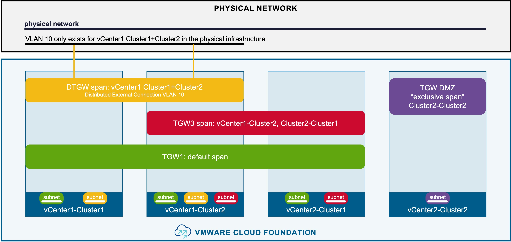
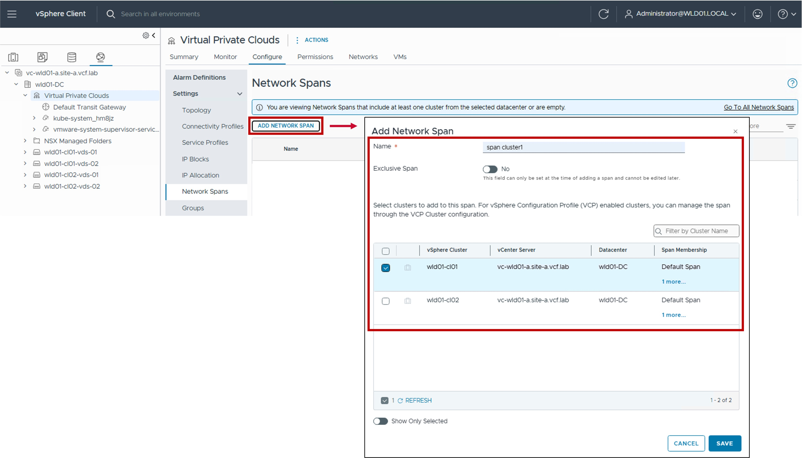
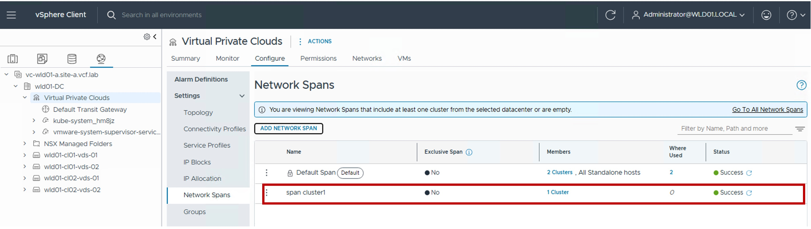

<h1>
   Network Span in vCenter
</h1>

This section describes the procedures for configuring Network Span using the vSphere Client.  
  
**Network Span**  defines how VPC subnets span across vCenter clusters.

{ width="100%" }

---

## Network Span

### Configuration

??? info ":material-information-outline: Deep Dive: Blogs & Video Demonstrations"
    * **Video Walkthrough:** Watch the step-by-step Network Span configuration [:fontawesome-brands-youtube: on YouTube](https://youtu.be/uEe5-lLIVdg){ target="_blank" }.
    * **Technical Blog:** Read the detailed Network Span blog on the [:material-newspaper-variant-outline: VMware Cloud Foundation Blog](https://blogs.vmware.com/cloud-foundation/2026/06/09/vcf-9-1-networking-precision-workload-placement-with-vpc-network-span/){ target="_blank" }.

#### Step1. Create Network Span
{ width="95%" style="display: block; margin: 0 auto;" }

### Monitoring

#### Status
The status reflects the successful application of the configuration.

??? info "Note about the Status"
    Because this represents a logical configuration mapping rather than an active link-state protocol, the status will typically remain Green (Healthy) once the settings are validated by the NSX Manager.

{ width="95%" style="display: block; margin: 0 auto;" }

---
