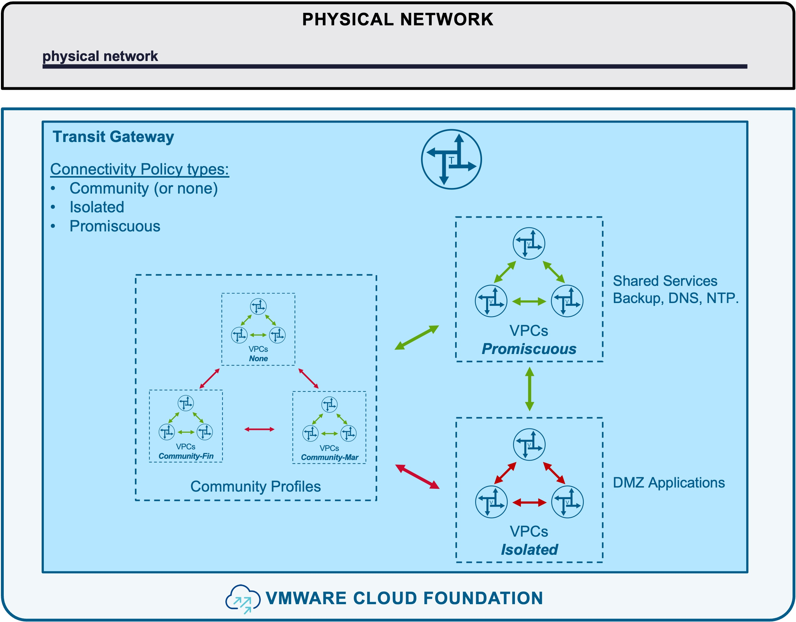
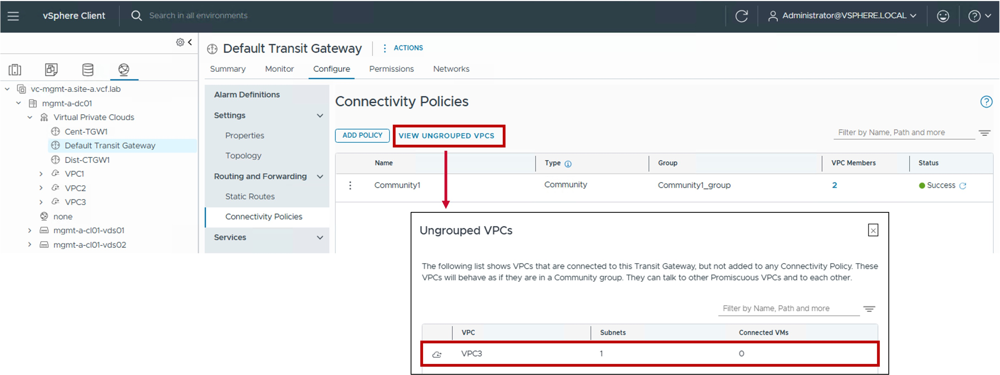

<h1>
   Connectivity Policy in vCenter
</h1>

This section describes the procedures for configuring Connectivity Policy using the vSphere Client.
  
**Connectivity Policy** defines cross-VPC communication rules.

{ width="100%" }

---

## Overview of Connectivity Policy Types

Different Connectivity Policy types are available:

| Type | Use Case | Routing Logic |
| :--- | :--- | :--- |
| [**Community**](#community) | Permits communication between VPCs within the same defined group. Ideal for application-tier connectivity within a specific division. | VPCs can communicate with other **Community** peers in their group and all **Promiscuous** VPCs. |
| [**Isolated**](#isolated)| Strictly blocks communication to all other VPCs. Best for highly sensitive or standalone application workloads. | VPCs are restricted to communicating only with **Promiscuous** VPCs (Shared Services). |
| [**Promiscuous**](#promiscuous)| Provides universal connectivity across the environment. Ideal for shared  services (e.g., Backup, DNS, NTP). | VPCs have unrestricted communication with **all** other VPCs in the environment. |

{: .center style="width:80%" }

---

## Connectivity Policy

### Configuration

??? info ":material-information-outline: Deep Dive: Blogs & Video Demonstrations"
    * **Video Walkthrough:** Watch the step-by-step Connectivity Policy configuration [:fontawesome-brands-youtube: on YouTube](https://youtu.be/_pdVqTBho98){ target="_blank" }.
    * **Technical Blog:** Read the detailed Connectivity Policy blog on the [:material-newspaper-variant-outline: VMware Cloud Foundation Blog](https://blogs.vmware.com/cloud-foundation/2026/05/15/vcf-networking-9-1-simpler-vpc-connectivity-control/){ target="_blank" }.

#### Step1. Create Connectivity Policy
{ width="95%" style="display: block; margin: 0 auto;" }

* **Visibility**:  
  Set to External.

* **CIDRs/Ranges**:  
  Enter the specific CIDR blocks or IP ranges to be managed by this block.  

  
* **Excluded IP Ranges**:  
  (Optional) Specify any IP Range(s) within the CIDRs above that should be withheld from automatic allocation (e.g. IP Range used by the physical network).
  
* **Reserved for Specific Subnet**:  
  Enable for the Subnet-VLAN use case, otherwise disabled.

### Monitoring

#### Show other VPCs within your community

{ width="80%" style="display: block; margin: 0 auto;" }

#### Show VPCs who don't belog to any Community

{ width="80%" style="display: block; margin: 0 auto;" }

#### Show all VPCs with connectivity to yours

xxx to do
---
