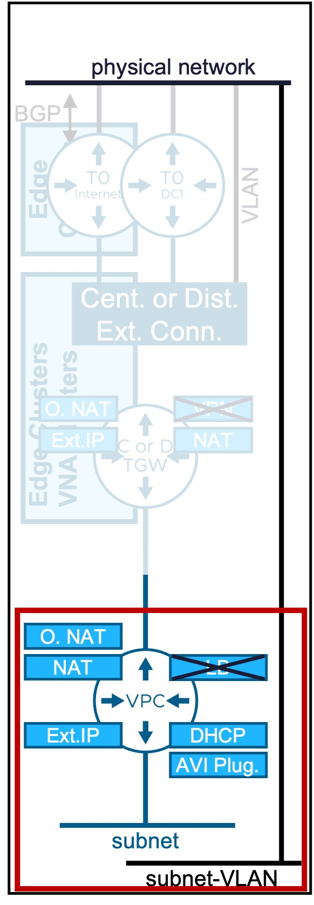
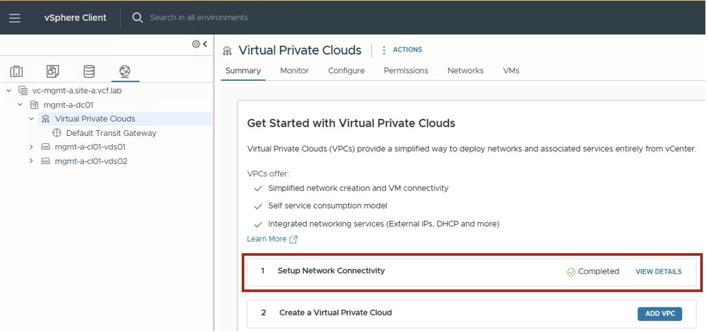

<h1>
   vCenter Network Services
</h1>

This section describes the procedures for configuring network services via the **vSphere Client**.

---

## VPC Network Services
Explore the configuration guides for each VPC network service:

{ width="100%" }

* :material-router: [**VPC Gateway**](1a-vpc_gateway.md)  
  Logical router for VPC networking.
* :material-lan: [**VPC Subnet**](1b-vpc_subnet.md)  
  Logical Subnet (to connect VMs/K8s workloads).  
  Optionally, a Subnet-VLAN can also be created.
* :material-swap-horizontal: [**NAT**](1c-vpc_nat.md)  
  Supports multiple NAT configurations:  
  . External-IP (1:1 NAT)  
  . Outbound-NAT (N:1 SNAT)  
  . NAT (SNAT/DNAT)
* :material-ip-network-outline: [**DHCP**](1d-vpc_DHCP.md)  
  DHCP services can be configured as:  
  . DHCP Server (managed by VCF)  
  . DHCP Relay (using an external DHCP server such as Infoblox)
* :material-arrow-split-vertical: ~~**Load Balancer**~~  
  Configuration not available from vCenter (available through VMware AVI Load Balancer).
* :octicons-lock-16: ~~**VPN**~~  
  Configuration not available from vCenter (available through NSX).

!!! warning "Prerequisite: vCenter must be VPC-ready"
    Before configuring VPC network services, the VPC Network Connectivity (Centralized or Distributed) must be configured.  
    { width="80%" style="display: block; margin: 0 auto;" }

---

## VPC Northbound Architecture

Explore the configuration guides for each VCF Network Infrastructure and External Connectivity & Service:

{ width="100%" }

### VCF Network Infrastructure
* :material-layers-outline: [__Edge Cluster / Edge Node__](2a-edge.md)  
  NSX Edge appliances providing centralized network services for Central Transit Gateway Designs.
* :material-layers-outline: [__VNA Cluster / VNA Node__](2b-vna.md)  
  NSX Virtual Network appliances providing centralized network services for Distributed Transit Gateway Designs.
* :material-router: ~~__Tier-0 / BGP__~~  
  Tier-0 logical router providing connectivity between Centralized Transit Gateways and the physical network.  
  Configuration not available from vCenter (available from NSX).  

### External Connectivity & Services
* :fontawesome-solid-external-link: [__External Connection__](3a-external_connection.md)  
  Connection between the VPC environment and the physical network.
* :material-transit-connection: [__Transit Gateway__](3b-transit_gateway.md)  
  Logical router connecting VPC Gateways to physical networks.
* :material-code-block-brackets: [__IP Blocks External (Infoblox) + TGW Priv.__](3c-ip_block.md)  
  IP blocks used for VPC IP allocation.  
  Not represented in the diagram.
* :material-table-split-cell: [__Network Span__](3d-network_span.md)  
  Defines how VPC subnets span across vCenter clusters.  
  Not represented in the diagram.
* :material-group: [__Connectivity Profile__](3e-connectivity_profile.md)  
  Defines the VPC's connection to the Transit Gateway, specifies the assigned External and Private-TGW IP blocks, and determines which VPC Services are enabled.  
  Not represented in the diagram.
* :material-camera-control: [__Connectivity Policy__](3f-connectivity_policy.md)  
  Defines cross-VPC communication rules.  
  Not represented in the diagram.

??? info "Personal Node on what could be added later"
    * section to talk about "Design" to help customers choose between all those options (Centralized / Dist) and what needs to be configured for each  
    * corner use case "Internet/DC1" External Connections  
    * Infoblox  

---

!!! info "Document Versioning"
    This guide is updated for **VCF 9.1+**.  
    If you are running an older version, some options may not be available.

---