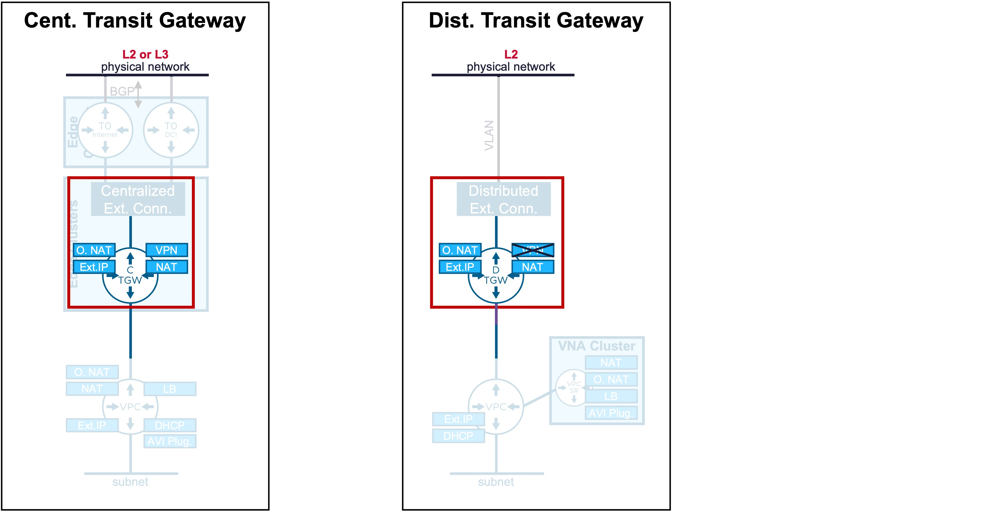
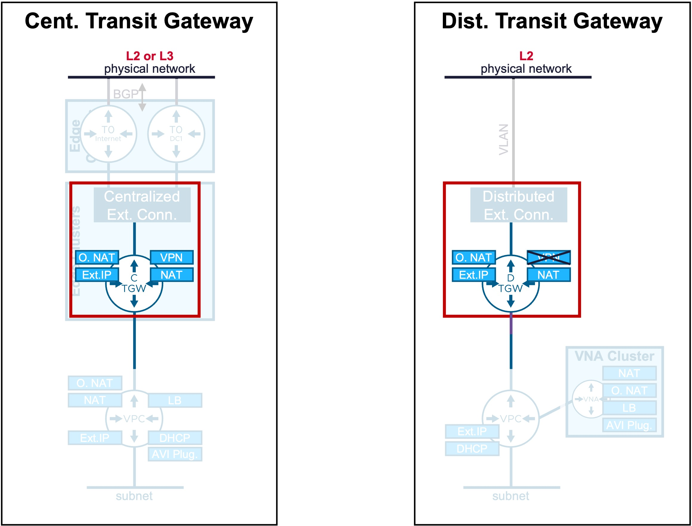
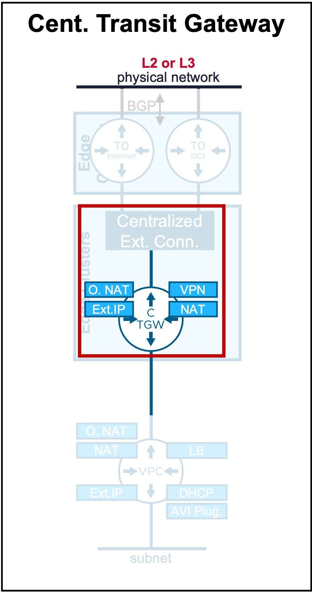
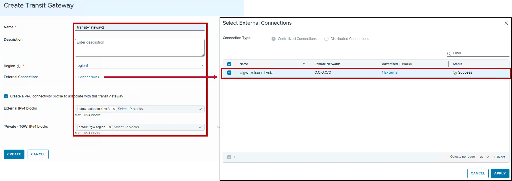
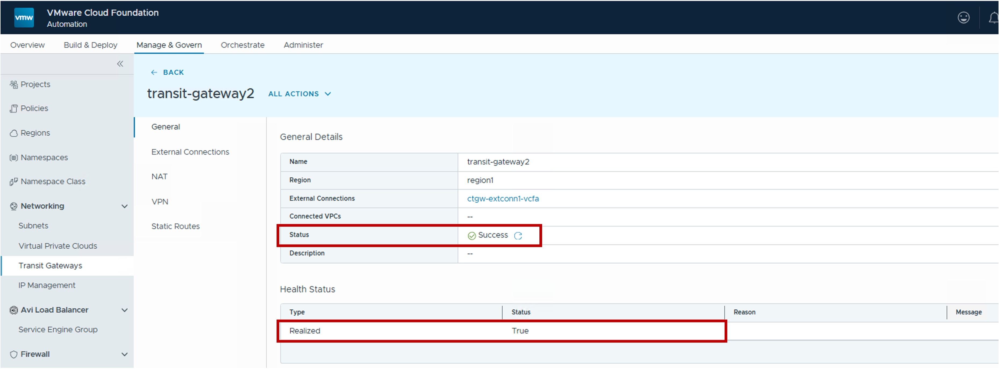
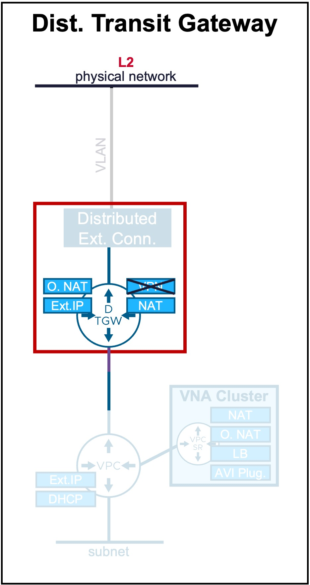
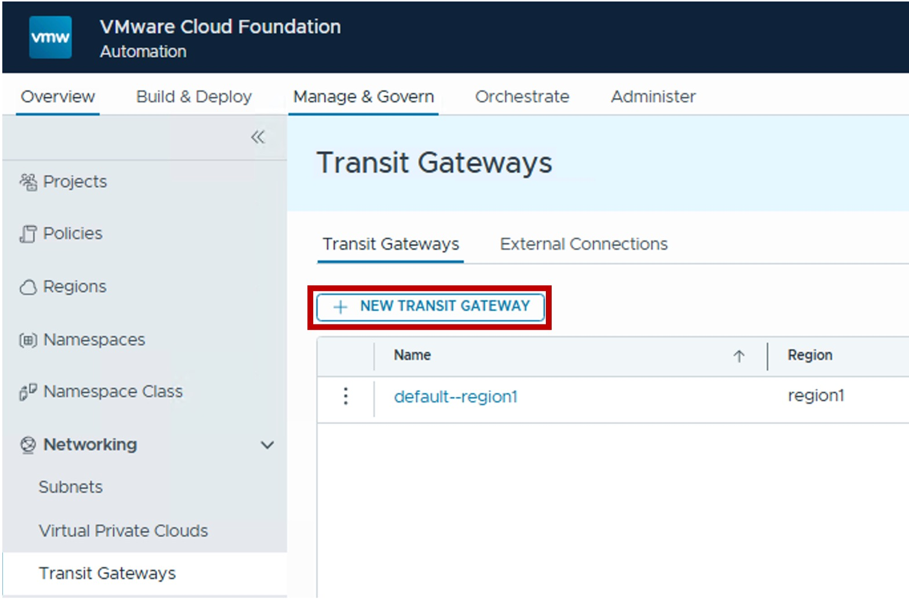
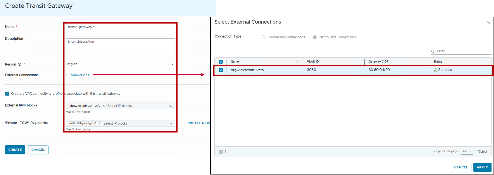

<h1>
   Transit Gateway Configuration in VCF-A Tenant
</h1>

This section describes the procedures for configuring Transit Gateways by the VCF-A Tenant.
  
**Transit Gateways** (Centralized or Distributed) provide the routing between VPC Gateways and physical networks.

{ width="100%" }

---

??? info "Default Transit Gateway"
    Each new VCF-A Organization has a default Transit Gateway created at the creation of the Organization by the VCF-A Provider.  
    The steps below are for the VCF-A Tenant to create another VPC Gateway in its Organization.

## Overview of Transit Gateway Types

Different Transit Gateway types are available:

**Transit Gateways** (Centralized or Distributed) provide the routing between VPC Gateways and physical networks.

| Type | Use Case | Routing Logic |
| :--- | :--- | :--- |
| [**Centralized TGW**](#cent-tgw) | Supports L2 and L3 Fabric.   Offers all Stateful Network Services (Outbound-NAT, NAT, LB, and VPN). | Egress traffic is hairpinned through a centralized Tier-0/VRF gateway hosted on an Edge Cluster. |
| [**Distributed TGW**](#dist-tgw)| Supports only L2 Fabric.   Offers Stateful Network Services (Outbound-NAT, NAT, and LB) with VNA Nodes. | Routing occurs locally at the ESXi host level (distributed dataplane). Stateful Network Services traffic is redirected through a VPC-SR Gateway in a VNA Cluster. |

{: .center style="width:70%" }

---

## Centralized Transit Gateway {: #cent-tgw }

{: .center style="width:30%" }

### Configuration

!!! warning "Prerequisites"
    * **Organization Networking**: The VCF-A Provider configured the Tenant Organization with a Networking Connection Centralized.
    * **[**Edge Cluster**](3b-edge.md) Provisioning**: An Edge Cluster must be pre-provisioned within the environment. This task is performed by the VCF-A Provider directly in NSX Manager or vCenter.

#### Step1. Create new Centralized Transit Gateway 
{ width="60%" style="display: block; margin: 0 auto;" }

#### Step2. Configure Centralized Transit Gateway
{ width="90%" style="display: block; margin: 0 auto;" }

* **Region**:  
  Select the [Region](3a-region_zone.md#region) for the Transit Gateway.  
  Note: Region represents the vCenter Supervisor(s) associated with a specific NSX instance.

* **External Connection**:  
  Select the External Connection(s) Centralized for that Transit Gateway.  
  For more information on Centralized External Connection, refer to the [External Connection](4a-external_connection.md#cent-conn) page.
  
* **Create a VPC connectivity profile to associate with this transit gateway**:  
  (Optional) Create Connectivity Profile for future VPC.  
  For more information on Connectivity Profile, refer to the [Connectivity Profile](1b-connectivity_profile.md) page.  
  The Connectivity Profile will be associated with this Transit Gateway and with:  
    * **External IPv4 Blocks**: Select External IP Block(s) for future VPC Public subnets, NAT, LB VIP, and VPN.
    * **'Private - TGW' IPv4 blocks**: Used for VPC Subnets Private-TGW.  
  (no option to disable Default Outbound SNAT from that wizard. Edit the created Connectivity Profile to update).  

### Monitoring

#### Status
The status reflects the successful application of the configuration.

??? info "Note about the Status"
    Because this represents a logical configuration mapping rather than an active link-state protocol, the status will typically remain Green (Healthy) once the settings are validated by the NSX Manager.

{ width="90%" style="display: block; margin: 0 auto;" }

---

## Distributed Transit Gateway  {: #dist-tgw }

{: .center style="width:30%" }

### Configuration

!!! warning "Prerequisites"
    * **Organization Networking**: The VCF-A Provider configured the Tenant Organization with a Networking Connection Distributed.
    * **[**VNA Cluster**](3b-edge.md) Provisioning**: A VNA Cluster must be pre-provisioned within the environment for VKS and Network Services NAT, LB, AVI Plugin. This task is performed by the VCF-A Provider directly in NSX Manager or vCenter.  

#### Step1. Create new Distributed Transit Gateway 
{ width="60%" style="display: block; margin: 0 auto;" }

#### Step2. Configure Distributed Transit Gateway
{ width="90%" style="display: block; margin: 0 auto;" }

* **Region**:  
  Select the [Region](3a-region_zone.md#region) for the Transit Gateway.  
  Note: Region represents the vCenter Supervisor(s) associated with a specific NSX instance.

* **External Connection**:  
  Select the External Connection(s) Distributed for that Transit Gateway.  
  For more information on Distributed External Connection, refer to the [External Connection](4a-external_connection.md#dist-conn) page.
  
* **Create a VPC connectivity profile to associate with this transit gateway**:  
  (Optional) Create Connectivity Profile for future VPC.  
  For more information on Connectivity Profile, refer to the [Connectivity Profile](1b-connectivity_profile.md) page.  
  The Connectivity Profile will be associated with this Transit Gateway and with:  
    * **External IPv4 Blocks**: Select External IP Block(s) for future VPC Public subnets, NAT, and LB VIP.
    * **'Private - TGW' IPv4 blocks**: Used for VPC Subnets Private-TGW.  
  (no option to disable Default Outbound SNAT from that wizard. Edit the created Connectivity Profile to update).  

### Monitoring

#### Status
The status reflects the successful application of the configuration.

??? info "Note about the Status"
    Because this represents a logical configuration mapping rather than an active link-state protocol, the status will typically remain Green (Healthy) once the settings are validated by the NSX Manager.

{ width="90%" style="display: block; margin: 0 auto;" }

---

