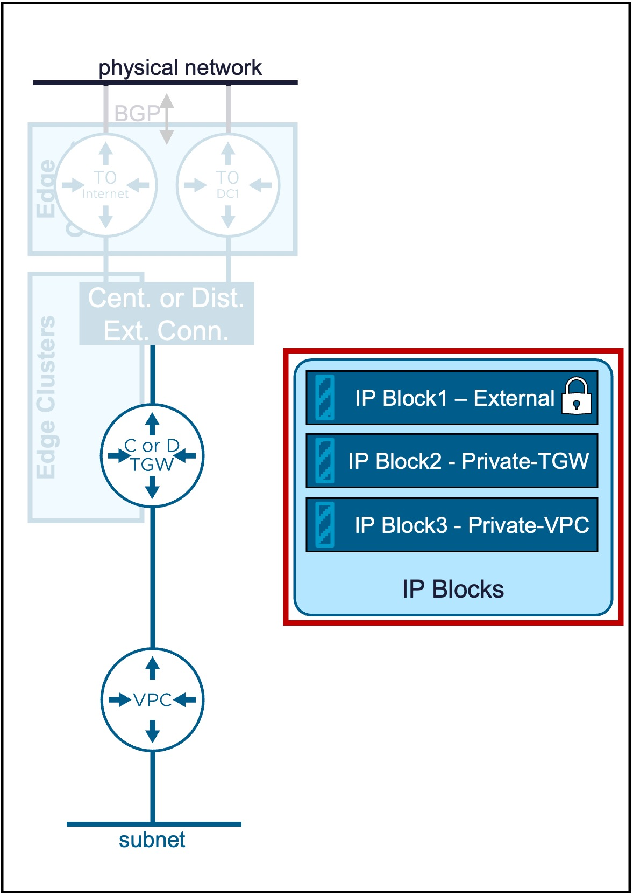
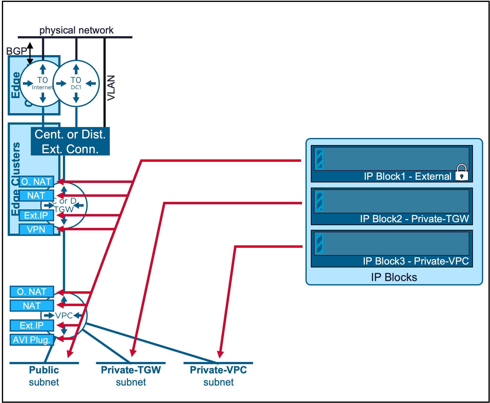
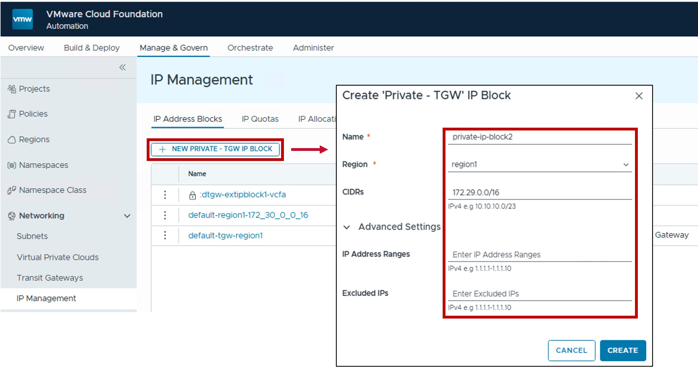
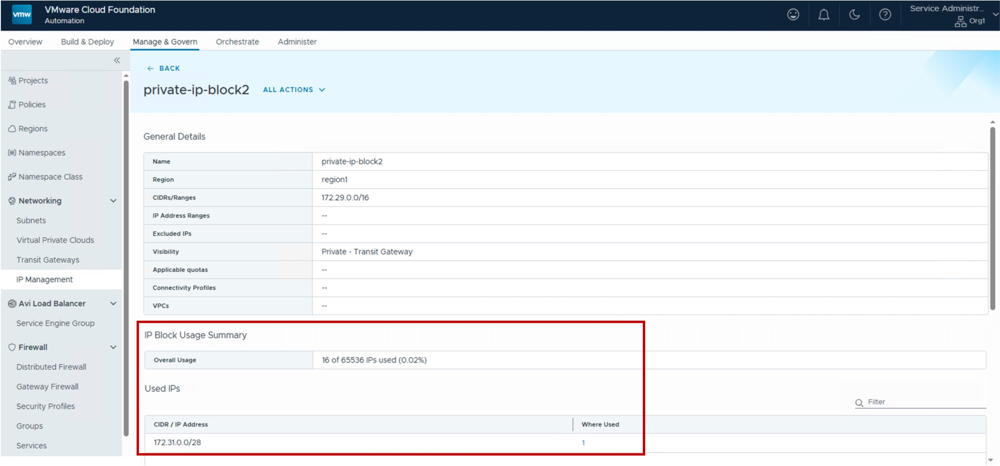

<h1>
   IP Blocks in VCF-A Tenant
</h1>

This section describes the procedures for configuring IP Blocks by the VCF-A Tenant.
  
**IP Blocks** are used for VPC IP allocation.

{ width="100%" }

---

## Overview of IP Block Types

Only IP Blocks type Private are configurable to the VCF-A Tenant:

| Type | Use Case | Routing Logic |
| :--- | :--- | :--- |
| [**Private-TGW**](#privatetgw-ipblock)| Used for [**VPC Subnets Private-TGW**](2c-vpc_subnet.md#overlay) and [**specific NAT (SNAT/DNAT)**](2d-vpc_nat.md#full-nat) | Best for shared internal services across the enterprise. |
| [**Private-VPC**](#privatevpc-ipblock)| Used for [**VPC Subnets Private-VPC**](2c-vpc_subnet.md#overlay).   Note: Configuration in within the [VPC Gateway](2a-vpc_gateway.md). | Maximum isolation; workloads are "hidden" even from other VPCs. |

{: .center style="width:60%" }

For more information on VPC Subnets, refer to the [VPC Subnet](2c-vpc_subnet.md) page.

??? info "Note about the External IP Blocks"
    IP Blocks External are used for **VPC Subnets Public** and **NAT**. Also used by **LB VIP**, and **VPN**.  
    IP Blocks type External are configured by the VCF-A Provider and offered to the Organization (VCF-A Tenant).

---

## IP Block Private-TGW {: #privatetgw-ipblock }

### Configuration

This is the IP Block used for future VPC Subnets Private-TGW.

#### Step1. Create new IP Block Private-TGW
{ width="80%" style="display: block; margin: 0 auto;" }

* **Region**:  
  Select the [Region](3a-region_zone.md#region) for the IP Block.  
  Only [Connectivity Profiles](1b-connectivity_profile.md) associated that Region will be able to use that IP Block.  
  Note: Region represents the vCenter Supervisor(s) associated with a specific NSX instance.

* **CIDRs**:  
  (Optional / Combinable with IP Ranges)  
  Enter the specific CIDR block(s) to be managed by this block.  
  Required for: [VPC-Subnet Private-TGW](2c-vpc_subnet.md#overlay) and [specific NAT (SNAT/DNAT)](2d-vpc_nat.md#full-nat).

* **IP Address Ranges**:  
  (Optional / Combinable with CIDRs)  
  Enter the specific IP Address Range(s) to be managed by this block.  
  Supported for: [All NAT](2d-vpc_nat.md), [Load Balancer VIPs](2f-vpc_lb.md), and [VPN](2g-vpc_vpn.md) services.  
  Note: IP Ranges cannot be used for [VPC-Subnet Private-TGW](2c-vpc_subnet.md#overlay) allocations; these require CIDRs.
  
* **Excluded IPs**:  
  (Optional) Specify any IP Range(s) within the CIDRs above that should be withheld from automatic allocation.
  

### Monitoring

#### Utilization
Real-time utilization metrics for IP Blocks can be monitored via the following indicators:

{ width="95%" style="display: block; margin: 0 auto;" }

* **IP Block Usage Summary**: Overall Usage.

* **Used IPs**: The number of addresses currently assigned to active VPC subnets. For External IP Blocks, this also includes addresses consumed by NAT and Load Balancer Virtual VIPs.

---

## IP Block Private-VPC {: #privatevpc-ipblock }

### Configuration

This is the IP Block used for future VPC Subnets Private-VPC.  
Its configuration is managed directly within the [VPC Gateway](2a-vpc_gateway.md) settings.

---
