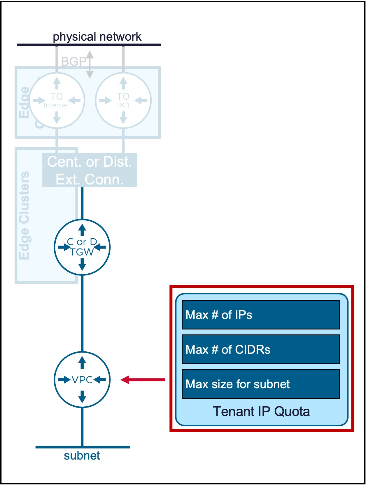
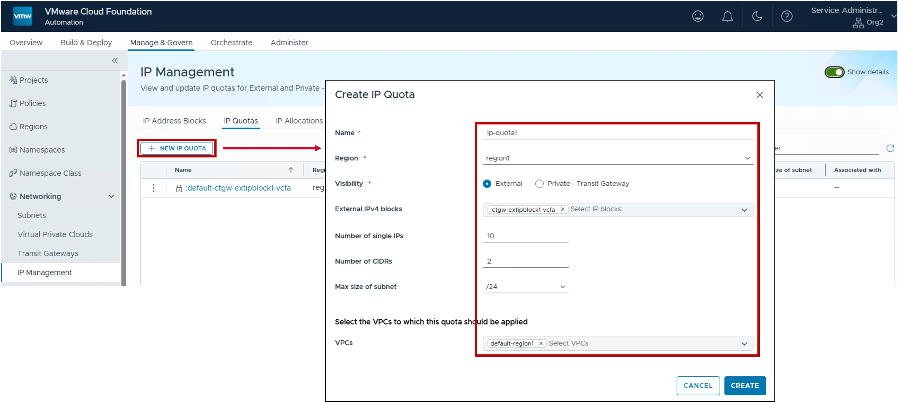
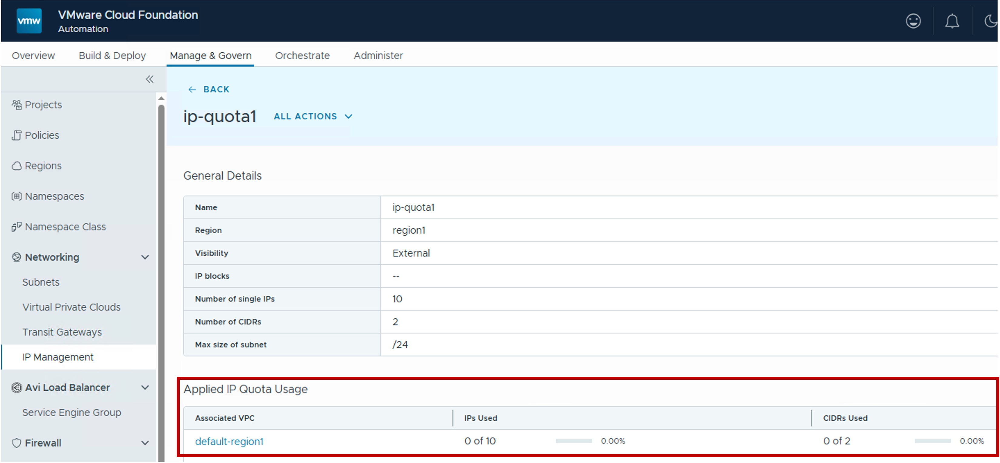

<h1>
   IP Quota in VCF-A Tenant
</h1>

This section describes the procedures for configuring IP Quota by the VCF-A Tenant.
  
**IP Quotas** are used to limit the usage of External/Public and/or Private-TGW IP addresses by the Tenant's VPCs.

{ width="100%" }

---
## IP Quota

### Configuration

This is the IP Quota applied to 1 or more VPCs.

#### Step1. Create new IP Block Private-TGW
{ width="90%" style="display: block; margin: 0 auto;" }

* **Region**:  
  Select the [Region](3a-region_zone.md#region) for the IP Block.  
  Note: Region represents the vCenter Supervisor(s) associated with a specific NSX instance.  

* **Visibility**:  
  Define the scope of the quota:  
  . External: Applies limits to the consumption of [External/Public](2c-vpc_subnet.md) IP addresses  
  . Private - Transit Gateway: Applies limits to the consumption of [Private-TGW](2c-vpc_subnet.md) IP addresses

* **External or 'Private - TGW' IPv4 blocks**:  
  Select the specific IP Block(s) that this quota will govern.
  
* **Number of single IPs**:  
  (Optional) Define the maximum number of individual IP addresses allowed for [All NAT](2d-vpc_nat.md), [Load Balancer VIPs](2f-vpc_lb.md), and [VPN](2g-vpc_vpn.md) within the Tenant's VPCs.

* **Number of CIDRs**:  
  (Optional) Define the maximum number of [VPC Subnets](2c-vpc_subnet.md) that can be created within the Tenant's VPCs

* **Max size of subnet**:  
  (Optional) Define the maximum prefix size (e.g., /24) allowed for any single [VPC Subnets](2c-vpc_subnet.md).

### Monitoring

#### Utilization
Real-time utilization metrics for IP Quotas can be monitored via the following indicators:

{ width="95%" style="display: block; margin: 0 auto;" }

* **IPs Used**: IPs Usage per Tenant's VPC.

* **CIDRs Used**: CIDRs Used per Tenant's VPC.

---
