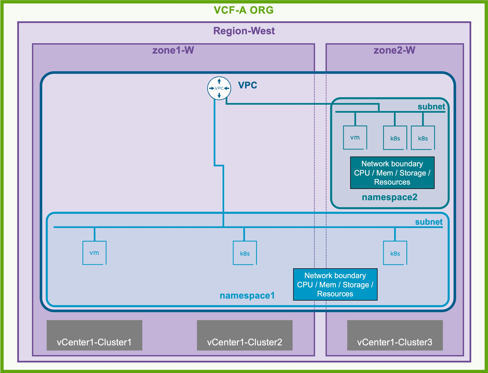
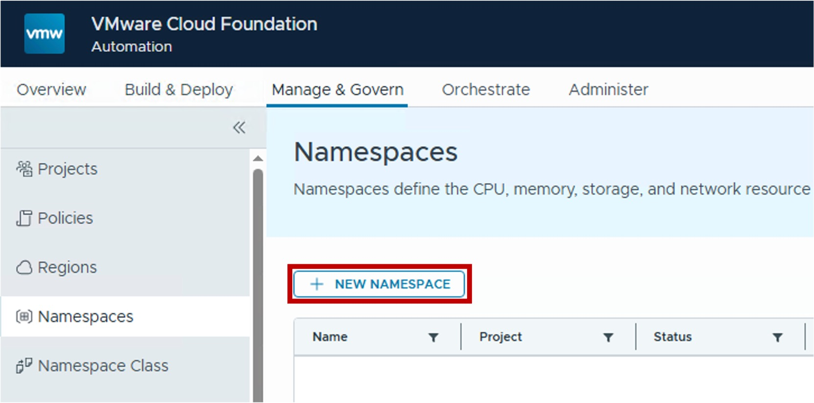
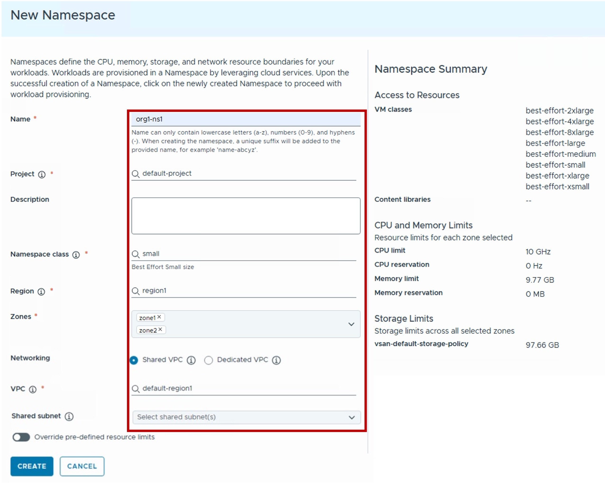
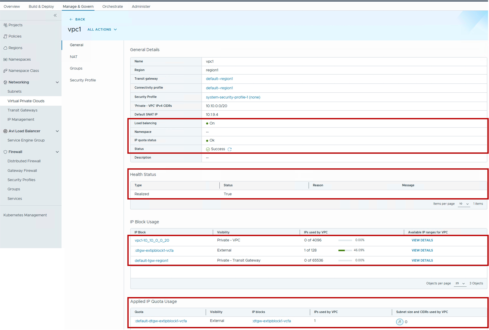

<h1>
   VCF-A Namespace in VCF-A Tenant
</h1>

This section describes the procedures for configuring a VCF-A Namespace by the VCF-A Tenant.
  
**VCF-A Namespaces** are resource boundaries (CPU / RAM / Storage) and placement mapping (Zones / vCenter Clusters) for VM and K8s workloads.

{ width="100%" }

---

## VCF-A Namespaces

Workloads (VMs and Kubernetes Clusters) are deployed in **VCF-A Namespaces**.

Each VCF-A Namespace has:

* **Placement Logic**: associated with specific {Zones within a Region](3a-region_zone.md#zone) and linked to a [VPC Gateway](2a-vpc_gateway.md)
* **Resource Allocation**: CPU, memory, and storage resources boundaries for workloads

### Configuration

#### Step1. Create new VCF-A Namespaces
{ width="50%" style="display: block; margin: 0 auto;" }

#### Step2. Configure new VCF-A Namespaces
{ width="90%" style="display: block; margin: 0 auto;" }

* **Project**  
  Select the Project.  
  Project's users will be granted access to the Namespace.

* **Namespace class**  
  Select the Namespace class.  
   Note: Namespace class is the resource (CPU and Memory) boudaries and Storage Class for the Namespace.
  
* **Region**  
  Select the [Region](3a-region_zone.md#region) for the Namespace.  
  Note: Region represents the vCenter Supervisor(s) associated with a specific NSX instance.

* **Zones**  
  Select the [Zone(s)](3a-region_zone.md#zone) for the Namespace.  
  Note: Zone represents the vCenter Cluster(s) associated with a specific vCenter Supervisor.

* **Networking**  
  Select between:  
  . Shared VPC: The Namespace will be associated to an existing VPC  
  . Dedicated VPC: The Namespace will be associated to a new VPC

* **VPC** in case of Shared VPC  
  Select the existing VPC for that Namespace.

* **Connectivity profile + 'Private - VPC' IPv4 CIDRs** in case of Dedicated VPC  
  Select the pre-defined [Connectivity Profile](1b-connectivity_profile.md).  
  (Optional) Defines the IP address space reserved for internal VPC subnets.

* **Shared subnet**  
  Select [VPC Subnets Overlay](2c-vpc_subnet.md#overlay) or [VPC Subnets VLAN](2c-vpc_subnet.md#vlan) you want shared with the Namespace.

### Monitoring

{ width="90%" style="display: block; margin: 0 auto;" }

#### Status
View the operational state and health status of the VPC Gateway at a glance.

#### IP Block Usage
Monitor the consumption of the IP Blocks (External, Private-TGW, and Private-VPC).

* External & Private-TGW: Displays aggregate usage across this VPC and all other VPCs sharing these global resource pools
* Private-VPC: Displays the local usage of CIDR ranges reserved exclusively for this VPC

#### IP Quota Usage
Track the specific consumption of External IP addresses by this VPC against its assigned IP Quota.

---

