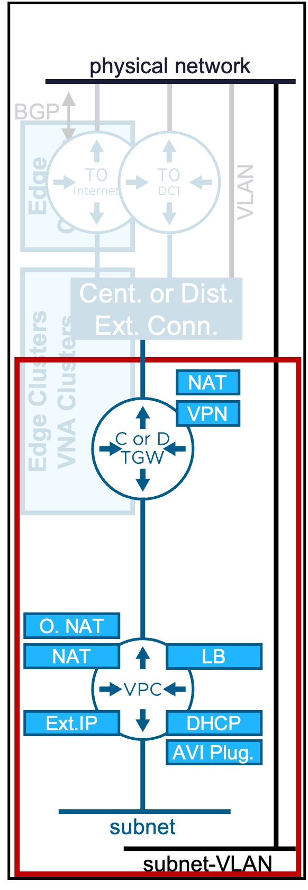
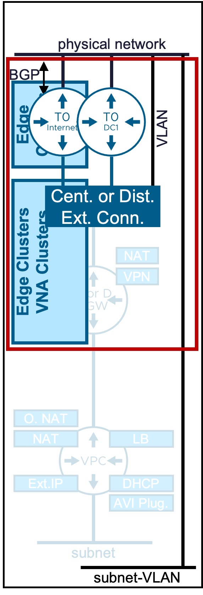

<h1>
  
  VCF Automation Network Services
</h1>

This section provides technical procedures for configuring and managing network services via the **VCF Automation**.  

!!! info "Work in Progress"
    Some pages in this section are still being written. Pages marked as stubs will be completed in a future update.

---

## VCF-A Tenant
Explore the configuration guides for Tenant-Level Networking:

{ width="100%" style="max-width: 250px;" }

### External Connectivity & Services
* :material-transit-connection: [__Transit Gateway__](1a-transit_gateway.md)  
  Logical router connecting VPC Gateways to physical networks.
* :material-group: [__Connectivity Profile__](1b-connectivity_profile.md)  
  Defines the VPC's connection to the Region, Transit Gateway, specifies the assigned External and Private-TGW IP blocks, and determines if Outbound-SNAT is enabled.  
  Not represented in the diagram.
* :material-camera-control: ~~__Connectivity Policy__~~  
  Defines cross-VPC communication rules.  
  Not represented in the diagram.  
  Configuration not available from VCF Automation (available from vCenter or NSX).  
* :material-code-block-brackets: [__IP Blocks External + TGW Priv.__](1d-ip_block_tenant.md)  
  IP blocks used for VPC subnet allocation.  
  Not represented in the diagram.
* :material-chart-donut: [__IP Quota Tenant__](1e-ip_quota_tenant.md)  
  IP Quota to limit the usage of External/Public and/or Private-TGW IP addresses by Tenant's VPCs.  
  Not represented in the diagram.

### Network Services
* :material-router: [**VPC Gateway**](2a-vpc_gateway.md)  
  Logical router for VPC networking.
* :material-layers-plus: [**VCF-A Tenant Namespace**](2b-namespace.md)  
  Resource boundaries (CPU/RAM/Storage) and placement mapping (Zones/vCenter Clusters) for VM and K8s workloads.
* :material-lan: [**VPC Subnet**](2c-vpc_subnet.md)  
  Logical Subnet (for VMs/K8s connection).  
  Option to also create Subnet-VLAN.
* :material-swap-horizontal: [**NAT**](2d-vpc_nat.md)  
  External-IP (1:1 NAT)  
  or Outbound-SNAT (N:1 SNAT)  
  or NAT (SNAT/DNAT)
* :material-ip-network-outline: [**DHCP**](2e-vpc_DHCP.md)  
  DHCP Server (managed by VCF)  
  or DHCP Relay (managed by 3rd party DHCP Server like Infoblox)
* :material-arrow-split-vertical: [**Load Balancer**](2f-vpc_lb.md)  
  Virtual IP load balancing for VPC workloads.
* :octicons-lock-16: [**VPN**](2g-vpc_vpn.md)  
  Secure Site-to-Site connectivity.

---

## VCF-A Provider
Explore the configuration guides for Provider-Level Networking:

{ width="100%" style="max-width: 250px;" }

### Provider Infrastructure
* :material-layers-outline: [__Region / Zone__](3a-region_zone.md)  
  Region: vCenter Supervisor(s) associated with a specific NSX instance.  
  Zone: vCenter Cluster(s) associated with a specific vCenter Supervisor.  
  Not represented in the diagram.  
* :material-layers-outline: [__Edge Cluster / Edge Node__](3b-edge.md)  
  NSX Edge appliances providing centralized network services for Central Transit Gateway Designs.
* :material-layers-outline: [__VNA Cluster / VNA Node__](3c-vna.md)  
  NSX Virtual Network appliances providing centralized network services for Distributed Transit Gateway Designs.
* :material-router: ~~__Tier-0 / BGP__~~  
  Tier-0 logical router providing connectivity between Centralized Transit Gateways and the physical network.  
  Configuration not available from VCF Automation (available from NSX).  

### External Connectivity & Services
* :fontawesome-solid-external-link: [__External Connection__](4a-external_connection.md)  
  Connection between the VPC environment and the physical network.
* :material-lan-connect: [__Subnet-VLAN__](4b-vpc_subnet_vlan.md)  
  VLAN-backed VPC subnets.
* :material-code-block-brackets: [__IP Blocks External (Infoblox) + TGW Priv.__](4c-ip_block_provider.md)  
  IP blocks used for VPC subnet allocation.  
  Not represented in the diagram.
* :material-chart-donut: [__Provider IP Quota__](4d-ip_quota_provider.md)  
  IP Quota to limit the usage of External/Public IP addresses by Tenants.  
  Not represented in the diagram.
* :material-table-split-cell: ~~__Network Span__~~  
  Defines how VPC subnets span across vCenter clusters.  
  Not represented in the diagram.  
  Configuration not available from VCF Automation (available from vCenter or NSX).  
  VCF-Regions and Zones can be used for this use case.

??? info "Personal Note on what could be added later"
    * section to talk about "Design" to help customers choose between all those options (Centralized / Dist) and what needs to be configured for each  
    * :material-vector-polyline-plus: corner use case "Internet/DC1" External Connections  
    * Infoblox  

---

!!! info "Document Versioning"
    This guide is updated for **VCF 9.1+**.  
    If you are running an older version, some options may not be available.

---