<h1>
   Supervisor with "VDS + FLB"
</h1>

This section describes the procedures for **deploying the Supervisor utilizing a "VDS + FLB" architecture** inside a vSphere environment.

* [Requirements](1a-requirements.md)
* [**Supervisor Deployment**](#supervisordeployment)
* [Namespace Deployment](1c-deploy-namespace.md)

{ width="100%" }

---

## Supervisor Deployment {: #supervisordeployment }

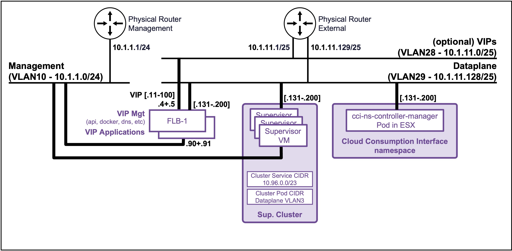{ width="80%" style="display: block; margin: 0 auto;" }

### Create Supervisor
Navigate to **vCenter** > **Supervisor Management**, and click **Get Started**.
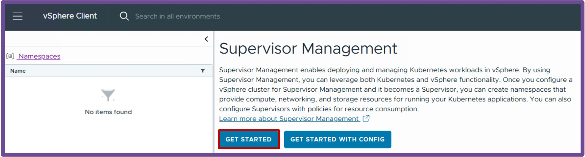{ width="65%" style="display: block; margin: 0 auto;" }

1. **vCenter Server and Network**  
    * Select the network stack **vSphere Distributed Switch (VDS) with Load Balancer Type "Foundation Load Balancer"**, and click **Next**.  
    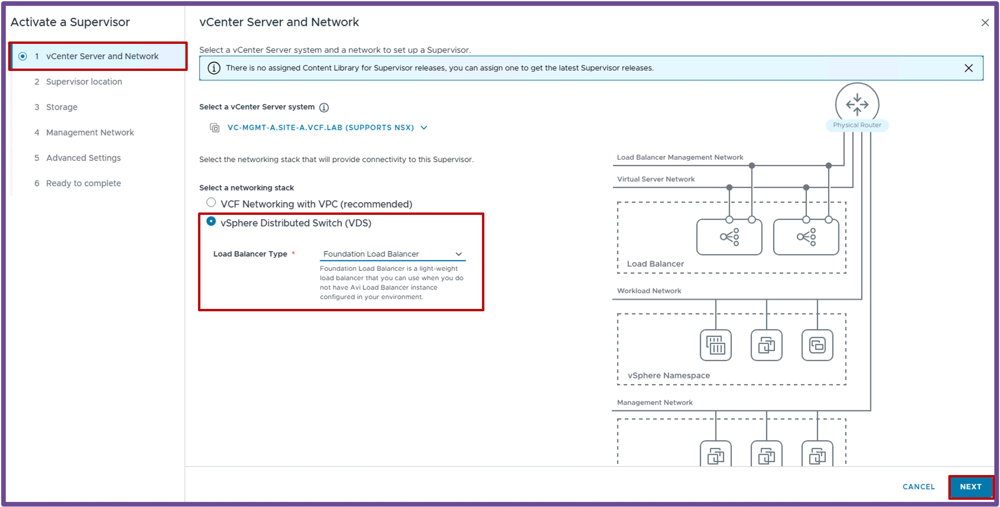{ width="95%" style="display: block; margin: 0 auto;" }  

2. **Supervisor Location**  
    * Select the **Cluster Deployment**, and click **Next**.  
    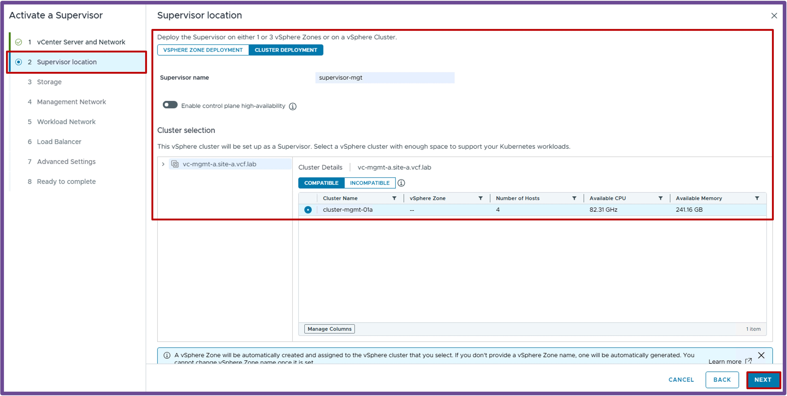{ width="95%" style="display: block; margin: 0 auto;" }  

3. **Storage**  
    * Select the different **Storage Policies**, and click **Next**.  
    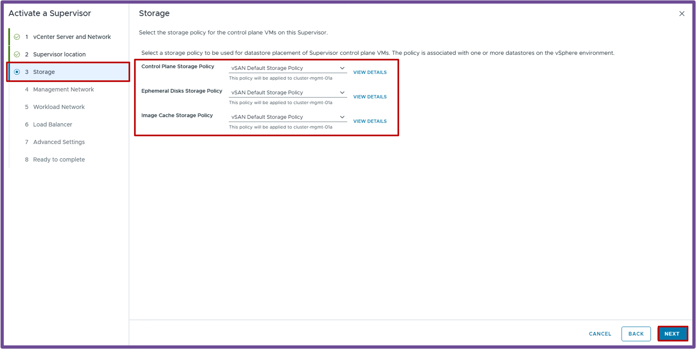{ width="95%" style="display: block; margin: 0 auto;" }  

4. **Management Network**  
    * Configure the **Supervisor Management IP Settings**, and click **Next**.  
    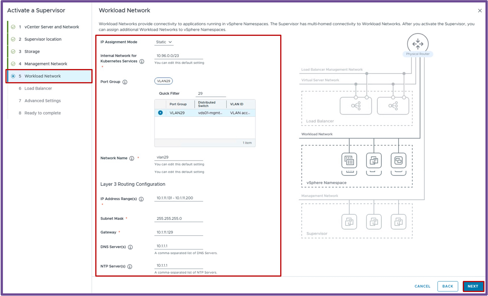{ width="95%" style="display: block; margin: 0 auto;" }  

5. **Workload Network**  
    * Configure the **Workload Network**, and click **Next**.  
    Choose the **Port Group** to host the K8s Nodes and FLB, and specify IP Range for the K8s Nodes.  
    > Note: The Internal Network for Kubernetes Services is pre-populated with the subnet 10.96.0.0.0/23.  
    { width="95%" style="display: block; margin: 0 auto;" }  

        ??? warning "Troubleshooting: Auto SNAT Error"
            If you receive the error *"Auto SNAT must be enabled for VPC Connectivity Profile Default"*, refer back to the **["DTGW + VNA" Requirements](2a-requirements.md#nsx)** page and ensure **Default Outbound NAT** is enabled in the Connectivity Profile.

6. **Load Balancer**  
    * Select the **Supervisor Control Plane Size**, and click **Next**.  
    { width="95%" style="display: block; margin: 0 auto;" }  

7. **Ready to Complete**  
    * Review your configuration and click **Finish**.  
    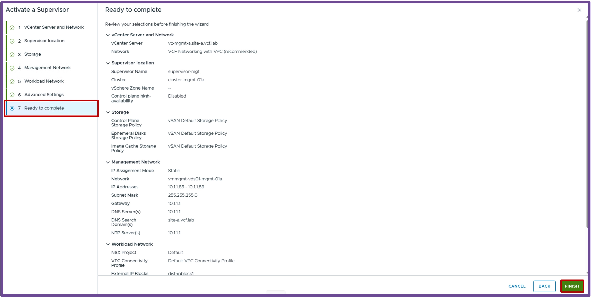{ width="95%" style="display: block; margin: 0 auto;" }  

---

### Finish Supervisor Creation for future Kubernetes Clusters

#### **Create a Content Library for future Kubernetes Clusters**  
If you plan to deploy Kubernetes Clusters, create a Content Library with VKS images.  
Navigate to **vCenter** > **Content Libraries** > and click **Create**.  
    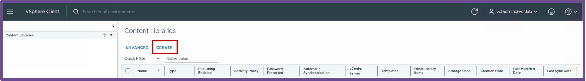{ width="95%" style="display: block; margin: 0 auto;" }  

  1. **Name and Location**  
    Give it a **Name** and select the **vCenter** hosting that Content Library, and click **Next**.  
    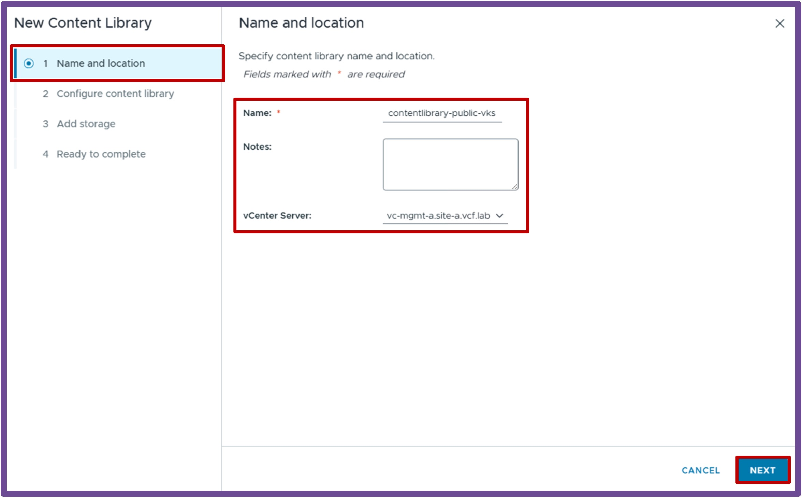{ width="85%" style="display: block; margin: 0 auto;" }  

  1. **Configure Content Library**  
  Choose between **Local content library** (you upload VKS images) and **Subscribed content library** (vCenter downloads VKS images from a repository), and click **Next**.  
  *I'm using here Subscribed content library with:*
    <ul style="margin-top: -10px; margin-bottom: 5px; line-height: 1.3;">
      <li style="margin-bottom: 2px;"><i>the public repository: https://wp-content.vmware.com/v2/latest/lib.json</i></li>
      <li style="margin-bottom: 2px;"><i>the option to download content when needed to save storage space</i></li>
    </ul>
  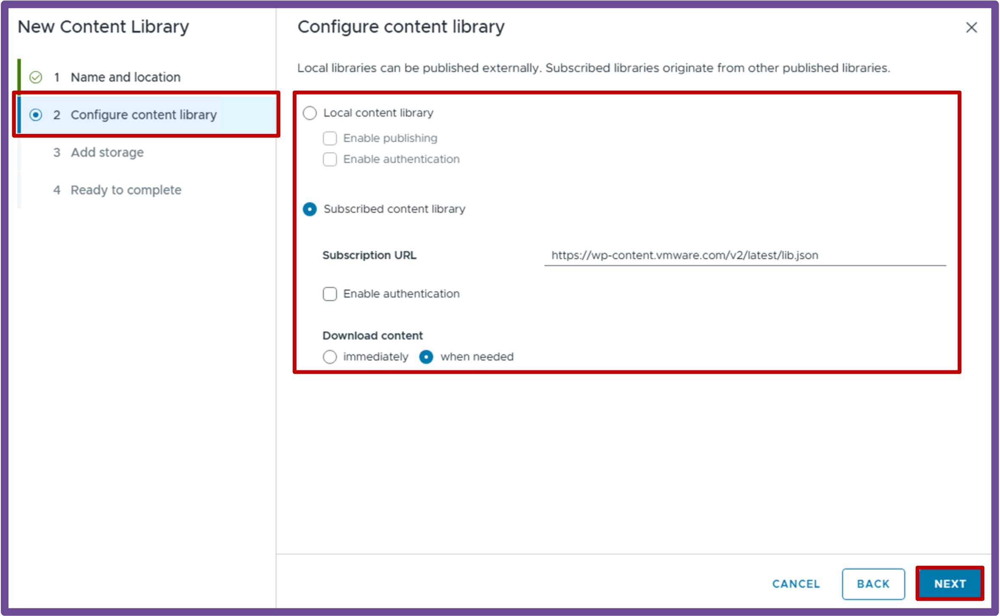{ width="85%" style="display: block; margin: 0 auto;" }  

  1. **Apply Security Policy**  
  Apply **security policy** if you choose to, and click **Next**.  
  *I'm using here no security policy.*  
  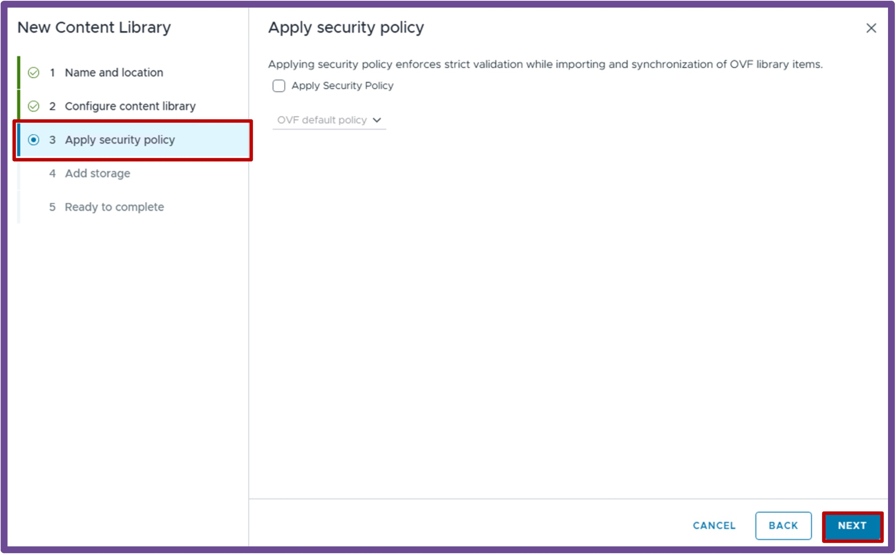{ width="85%" style="display: block; margin: 0 auto;" }  

  1. **Add Storage**  
  Select a **storage** to host the content library images, and click **Next**.  
  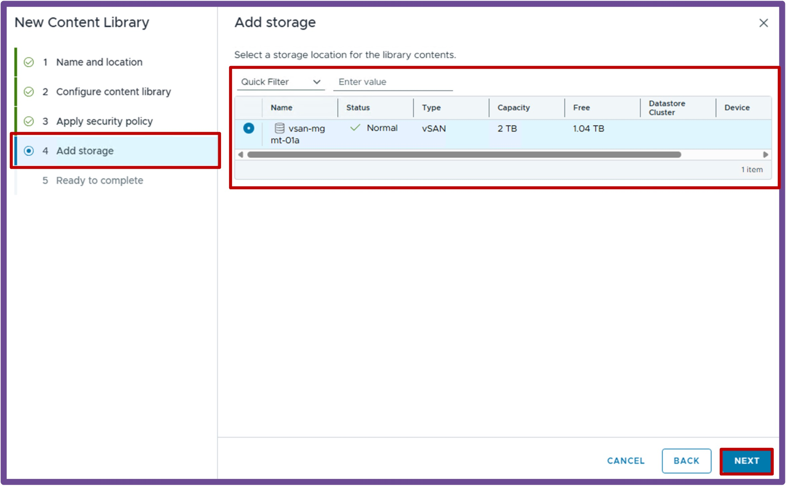{ width="85%" style="display: block; margin: 0 auto;" }  

  1. **Ready to complete**  
  Review the content library, and click **Finish**.  
  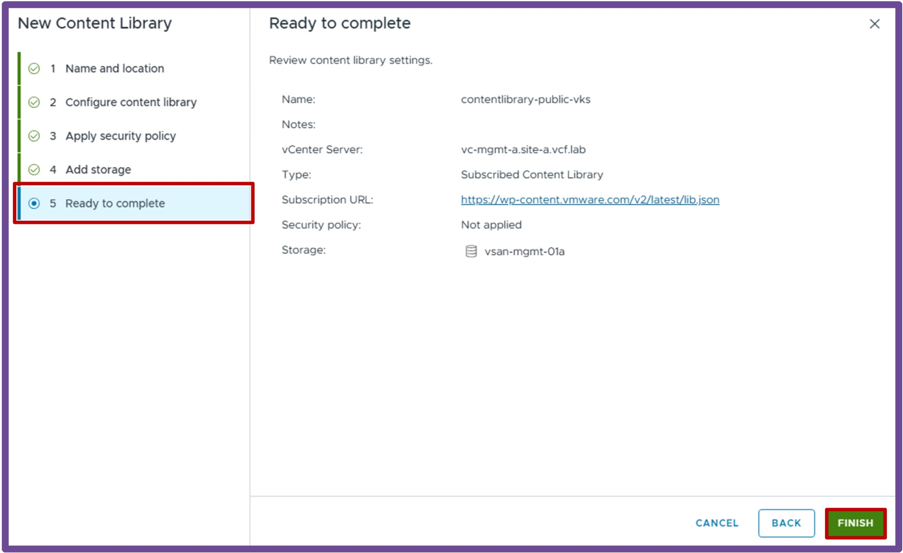{ width="85%" style="display: block; margin: 0 auto;" }  

#### **Associate the Content Library to the Supervisor**  
Navigate to **vCenter** > **Supervisor Management** > **Supervisors**, select **[your supervisor]**, and click on **Kubernetes Service - Manage**.
    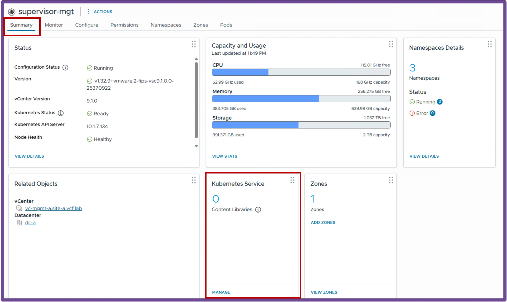{ width="95%" style="display: block; margin: 0 auto;" }  

  1. **Add Content Library**  
    Click **ADD**.  
    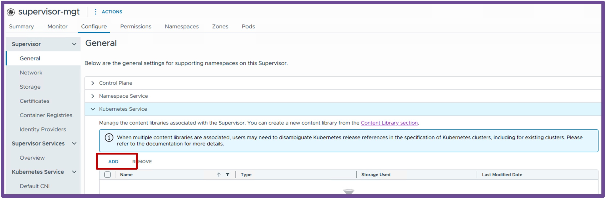{ width="85%" style="display: block; margin: 0 auto;" }  

  1. **Select Content Library**  
    Select **Content Library with VKS images**, and click **ADD**.  
    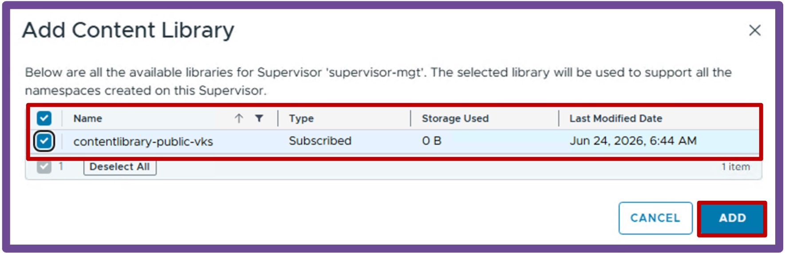{ width="65%" style="display: block; margin: 0 auto;" }  

---

### Validate Deployment

#### **Validate Supervisor Status**  
Once the wizard completes, verify the deployment was successful by navigating to **vCenter** > **Supervisor Management** > **Supervisors**. 

Check the following fields to ensure they reflect a healthy state:
<ul style="margin-top: -10px; margin-bottom: 15px; line-height: 1.3;">
  <li style="margin-bottom: 2px;">Config Status</li>
  <li style="margin-bottom: 2px;">Host Config Status</li>
  <li style="margin-bottom: 2px;">Control Plane Node Address</li>
</ul>
{ width="95%" style="display: block; margin: 0 auto;" }

#### **Validate Supervisor Content Library**  
Validate Supervisor Content Library by navigating to **vCenter** > **Supervisor Management** > **Supervisors**, select **[your supervisor]**
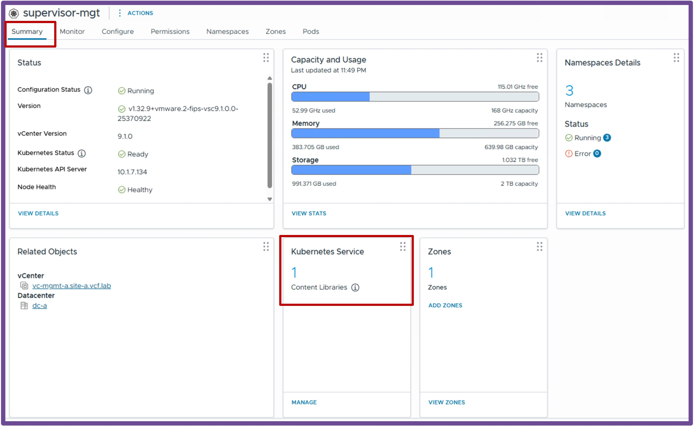{ width="85%" style="display: block; margin: 0 auto;" }

