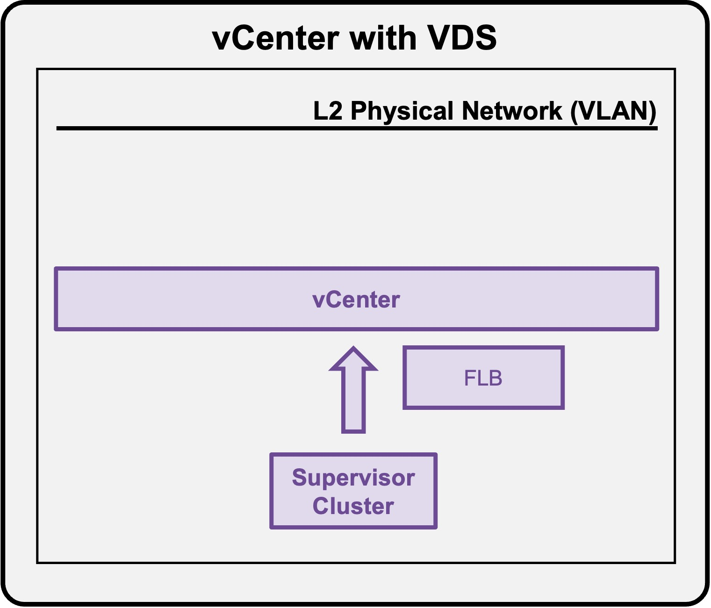

<h1>
   Supervisor with "VDS + FLB"
</h1>

This section describes the procedures for **deploying the VKS Supervisor with "VDS + FLB"** within a vSphere environment.

* [Requirements](1a-requirements.md)
* [Supervisor Deployment](1b-deployment.md)
* [**Deployment App (VMs)**](#deployment_vms)
* [Deployment App (k8s)](1d-deployment-k8s.md)

{ width="100%" }

---

## Deployment App (VMs) {: #deployment_vms }

