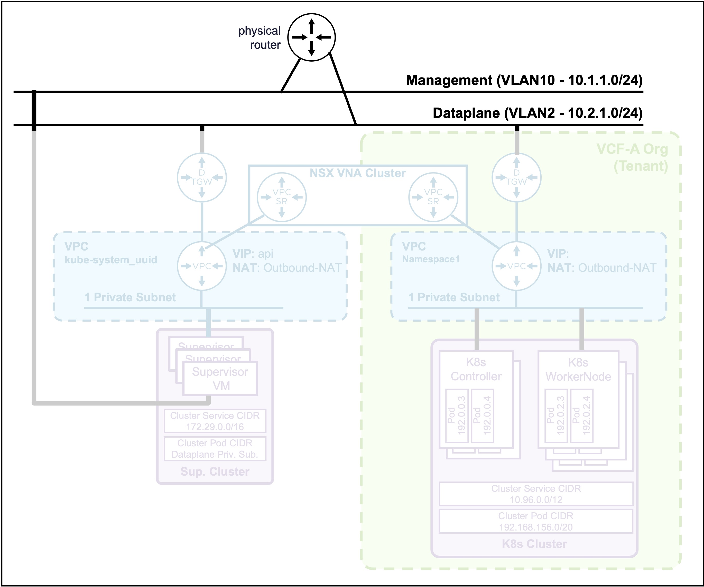
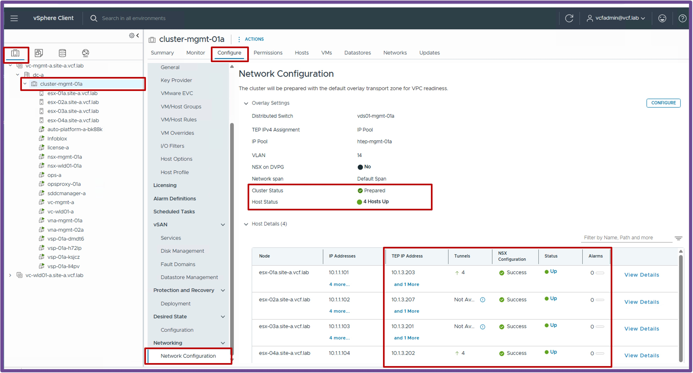
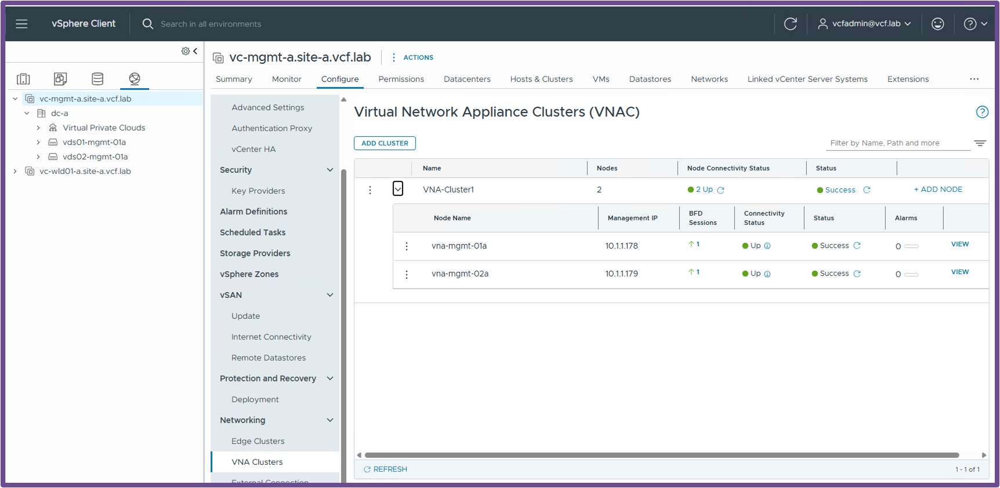
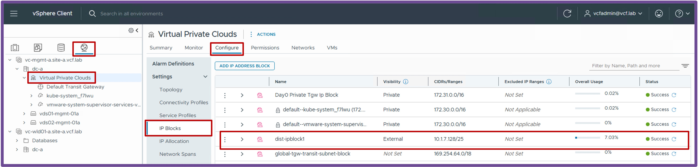
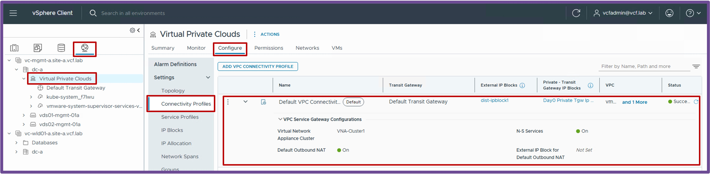
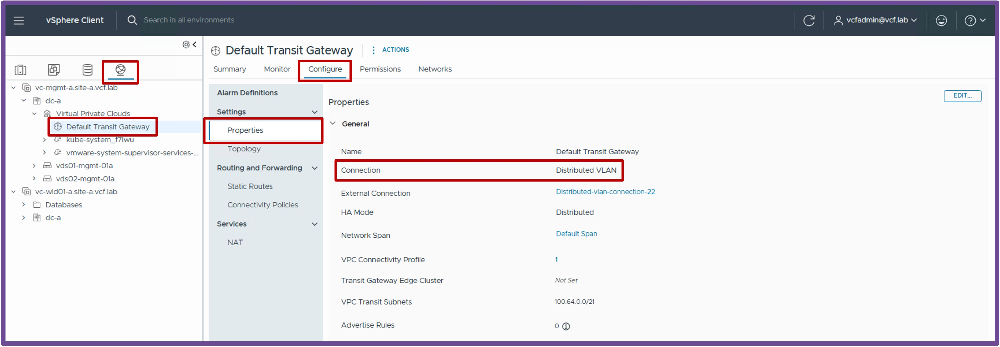

<h1>
   Supervisor with "NSX + DTGW/VNA"
</h1>

This section describes the procedures for **deploying the VKS Supervisor with "NSX + DTGW/VNA"** within a vSphere environment.

* [**Requirements**](#requirements)
* [Supervisor Deployment](2c-deploy-supervisor.md)
* [Namespace Deployment](2d-deploy-namespace.md)

{ width="100%" }

---

## Requirements {: #requirements }

VKS Supervisor with "NSX + DTGW/VNA" has the following networking requirements:  

{ width="80%" style="display: block; margin: 0 auto;" }

### Physical Fabric {: #physical_fabric }

#### **2 Subnets/VLANs**  
* **Management**:  
    Can be an existing Management subnet/VLAN that already hosts other components (such as vCenter).  
    **Requires 5 consecutive IPs** (for the Supervisor Cluster).
* **Dataplane**:  
    Can be an existing subnet/VLAN that already hosts other components (such as Physical Servers).  
    **A large pool of IPs is required** (for future K8s VIPs and VPC Outbound-NAT).

* **Note:** No requirement for dynamic routing (such as BGP).

### vCenter {: #vcenter }

#### **VDS Port Group**  
* **Management**:  
    VDS Port Group VLAN for the Management traffic.  

    ??? info "Status Validation"
        Navigate to **Networking** > **VDS-PortGroup** > **Edit Settings** > **VLAN**.  
        Ensure the VLAN Type is "VLAN" with the right "VLAN ID":
        { width="95%" style="display: block; margin: 0 auto;" }

### NSX {: #nsx }

!!! warning "XXX PERSONAL Drafting Note"
    xxx REDO SCREENSHOTS BEFORE THE DEPLOYMENT OF THE SUPERVISOR xxx  

!!! warning "Missing NSX Requirements?"
    If your environment is not yet configured with the NSX prerequisites below, please refer to:  

    *  [Make vCenter Cluster "VCF Networking ready (NSX Overlay)"](2b1-deploy-NSXOverlay.md) xxx to do
    *  [Make vCenter with "DTGW + VNA ready"](2b2-deploy-DTGW_VNA.md)

#### **vCenter Cluster "VCF Networking ready (NSX Overlay)"**  
* **vCenter Cluster with NSX Prepared**  
    The vCenter Cluster must be prepared for VCF Networking so the future Supervisor Cluster can connect to the VPC.  

    ??? info "Status Validation"
        Navigate to **NSX** > **System** > **Fabric** > **Hosts** > **Clusters**.  
        Ensure all ESX have at least one "TEP IP Address" and a "Green Status".  
        *Note: If no workloads are deployed on logical networks yet, it is expected to have no Tunnels established on the ESXi hosts.*
        { width="95%" style="display: block; margin: 0 auto;" }

#### **vCenter with "DTGW + VNA ready"**  

* **VNA Cluster**  
    The VNA Cluster hosts the Load Balancing and Outbound-NAT services (providing NAT for Supervisor / K8s Clusters communicating with the physical network).  

    ??? info "Status Validation"
        Navigate to **vCenter** > **Networking** > **vCenter** > **Configure** > **VNA Clusters**.  
        Ensure the VNA Cluster with its Nodes is deployed and shows a Green status.
        { width="95%" style="display: block; margin: 0 auto;" }

* **IP Blocks**  
    The External IP Block is for the future K8s VIPs (IPs in the Dataplane subnet).  

    ??? info "Status Validation"
        Navigate to **vCenter** > **Networking** > **Virtual Private Clouds** > **Configure** > **IP Blocks**.  
        Ensure you have at least 1 External IP Block configured:
        { width="95%" style="display: block; margin: 0 auto;" }

* **Connectivity Profile**  
    The Connectivity Profile binds the DTGW configuration (VNA Cluster, Outbound-NAT, and N-S Services for Load Balancing).  

    ??? info "Status Validation"
        Navigate to **vCenter** > **Networking** > **Virtual Private Clouds** > **Configure** > **Connectivity Profiles**.  
        Ensure the Connectivity Profile has the following configured:
        <ul style="margin-top: -5px; margin-bottom: 15px; line-height: 1.3;">
          <li style="margin-bottom: 2px;">External and Private Transit Gateway IP Blocks selected</li>
          <li style="margin-bottom: 2px;">A VNA Cluster selected</li>
          <li style="margin-bottom: 2px;">N-S Services enabled (for the LB service)</li>
          <li style="margin-bottom: 2px;">Default Outbound NAT enabled (for NAT)</li>
        </ul>
        { width="95%" style="display: block; margin: 0 auto;" }

* **Distributed Transit Gateway (DTGW)**  
    The Distributed Transit Gateway is the distributed logical router responsible for routing traffic between the logical and physical networks.  

    ??? info "Status Validation"
        Navigate to **vCenter** > **Networking** > **Default Transit Gateway** > **Configure** > **Properties**.  
        Ensure the DTGW has a Connection Type of "Distributed VLAN". 
        { width="95%" style="display: block; margin: 0 auto;" }