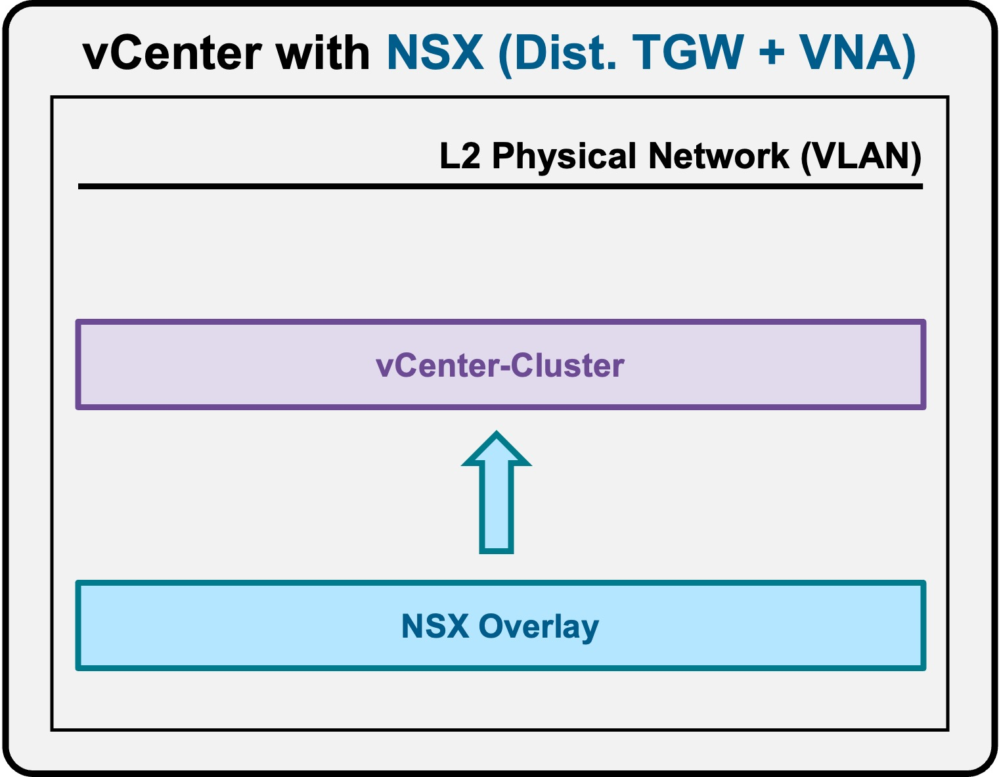

<h1>
   Deploy "NSX Overlay in vCenter Cluster"
</h1>

This section describes the procedures for **deploying the "NSX Overlay** within a vCenter Cluster.

{ width="100%" }

---

## Installation

xxx