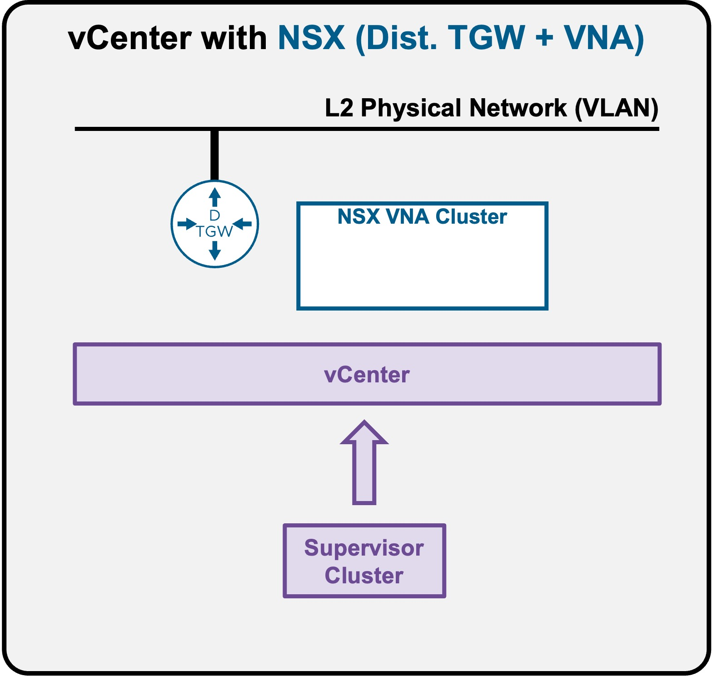
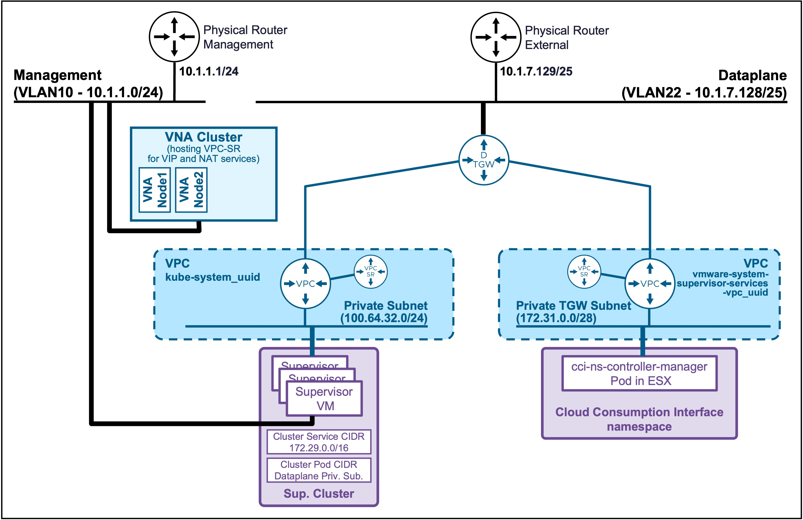
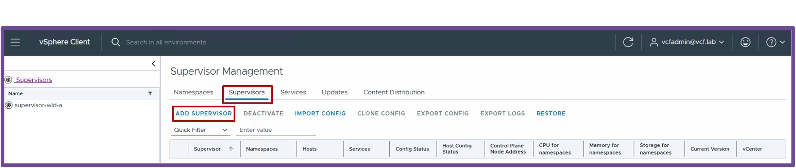
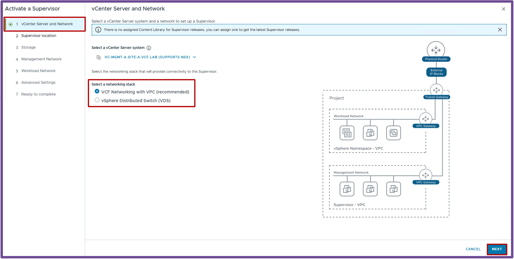
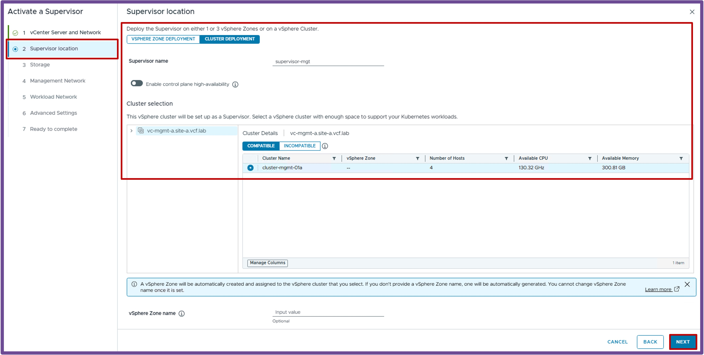
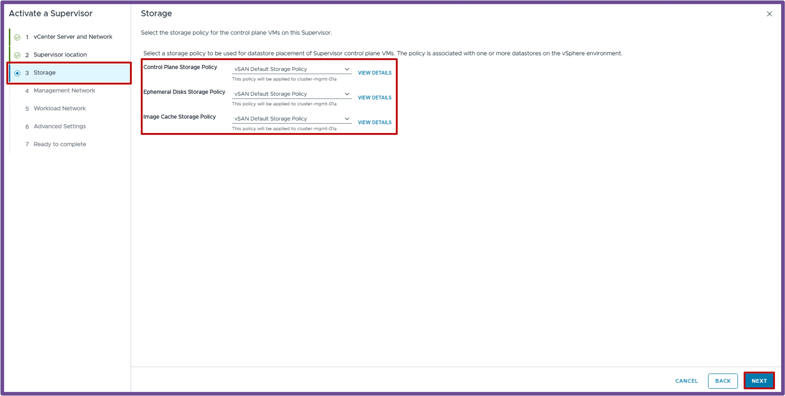
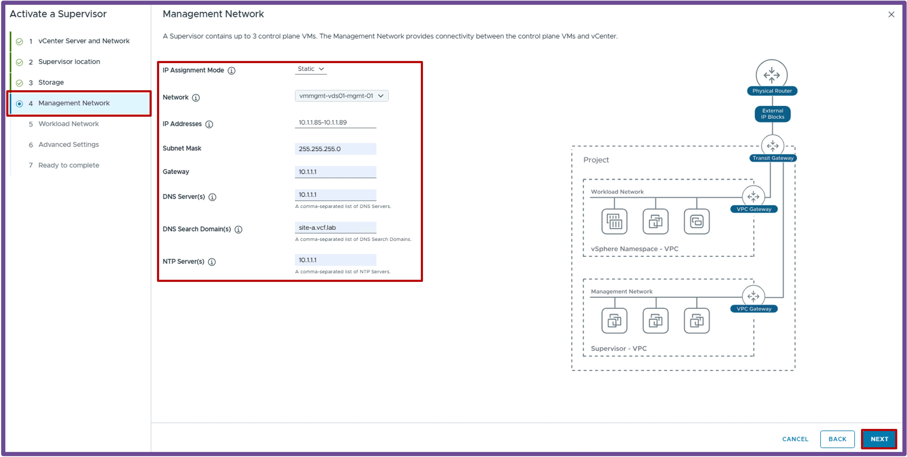
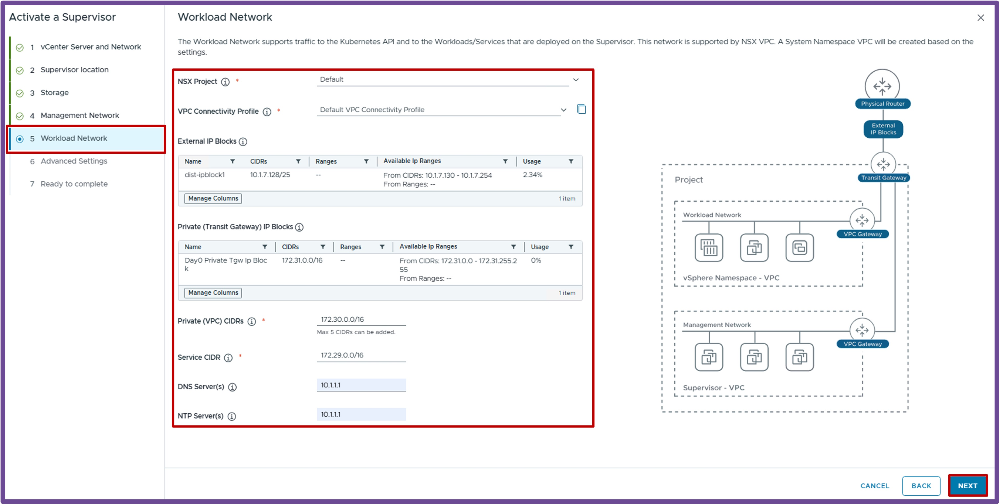
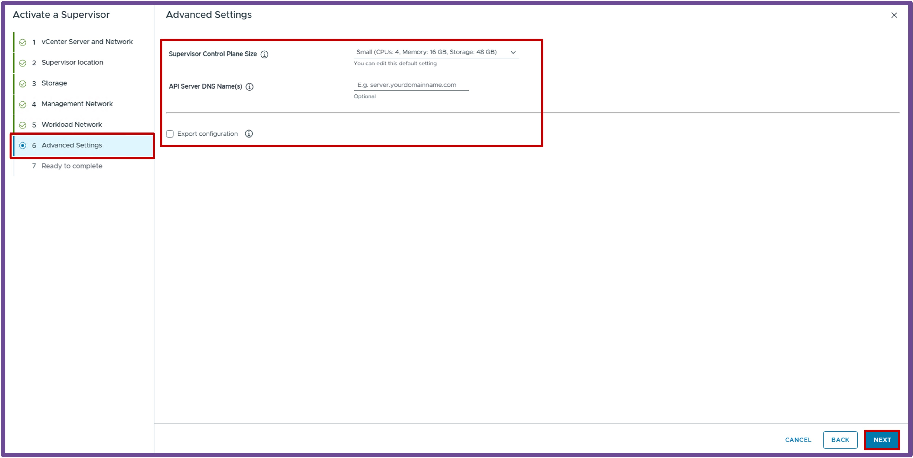

<h1>
   Supervisor with "NSX + DTGW/VNA"
</h1>

This section describes the procedures for **deploying the VKS Supervisor with "NSX + DTGW/VNA"** within a vSphere environment.

* [Requirements](2a-requirements.md)
* [**Supervisor Deployment**](#supervisordeployment)
* [Namespace Deployment](2c-deploy-namespace.md)

{ width="100%" }

---

## Supervisor Deployment {: #supervisordeployment }

{ width="80%" style="display: block; margin: 0 auto;" }

### Launch "Supervisor Creation Wizard"
Navigate to **vCenter** > **Supervisor Management** > **Supervisors**, and click **ADD SUPERVISOR**.
{ width="95%" style="display: block; margin: 0 auto;" }

1. **vCenter Server and Network**  
    * Select the network stack **VCF Networking with VPC (recommended)**, and click **Next**.  
    { width="95%" style="display: block; margin: 0 auto;" }  

1. **Supervisor Location**  
    * Select the **Cluster Deployment**, and click **Next**.  
    { width="95%" style="display: block; margin: 0 auto;" }  

1. **Storage**  
    * Select the different **Storage Policies**, and click **Next**.  
    { width="95%" style="display: block; margin: 0 auto;" }  

1. **Management Network**  
    * Configure the **Supervisor Management IP Settings**, and click **Next**.  
    { width="95%" style="display: block; margin: 0 auto;" }  

1. **Workload Network**  
    * Configure the **Workload Network** (fields are pre-populated, except for DNS and NTP Servers), and click **Next**.  
    { width="95%" style="display: block; margin: 0 auto;" }  

        ??? warning "Troubleshooting: Auto SNAT Error"
            If you receive the error *"Auto SNAT must be enabled for VPC Connectivity Profile Default"*, refer back to the **["DTGW + VNA" Requirements](2a-requirements.md#nsx)** page and ensure **Default Outbound NAT** is enabled in the Connectivity Profile.

1. **Advanced Settings**  
    * Select the **Supervisor Control Plane Size**, and click **Next**.  
    { width="95%" style="display: block; margin: 0 auto;" }  

1. **Ready to Complete**  
    * Review your configuration and click **Finish**.  
    { width="95%" style="display: block; margin: 0 auto;" }  

---

### Validate Deployment
Once the wizard completes, verify the deployment was successful by navigating to **vCenter** > **Supervisor Management** > **Supervisors**. 

Check the following fields to ensure they reflect a healthy state:
<ul style="margin-top: -10px; margin-bottom: 15px; line-height: 1.3;">
  <li style="margin-bottom: 2px;">Config Status</li>
  <li style="margin-bottom: 2px;">Host Config Status</li>
  <li style="margin-bottom: 2px;">Control Plane Node Address</li>
</ul>

{ width="95%" style="display: block; margin: 0 auto;" }

