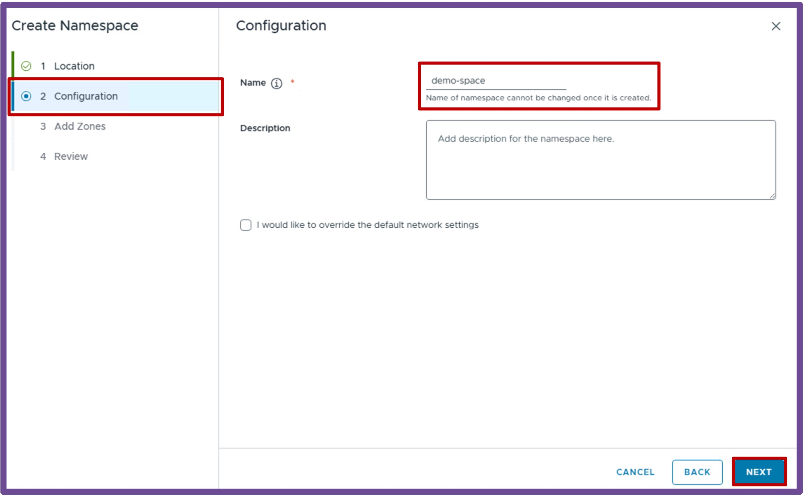
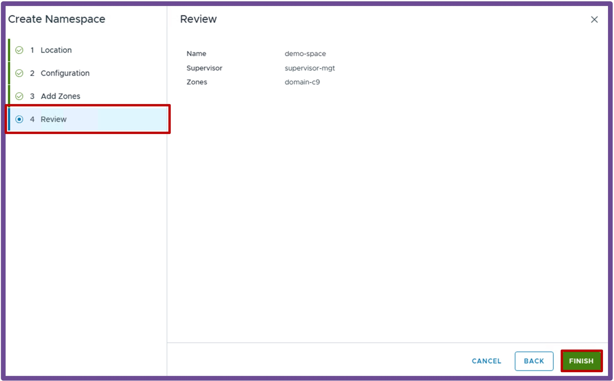
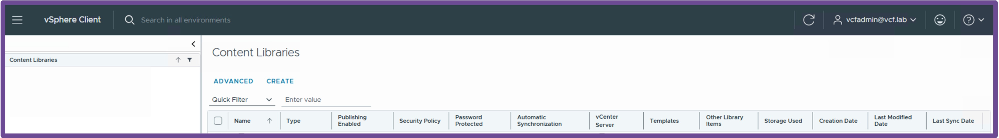
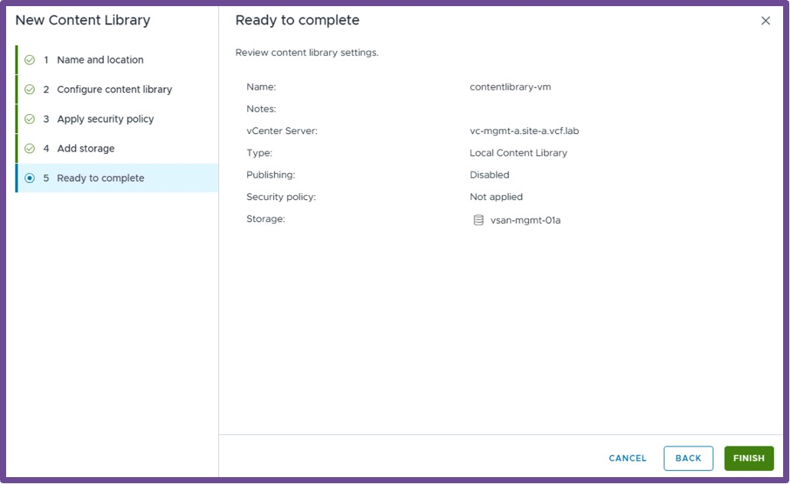
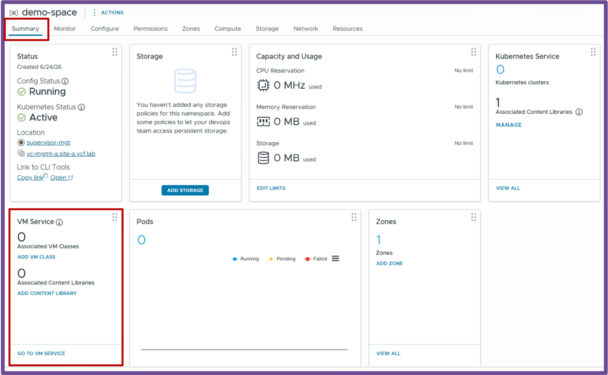
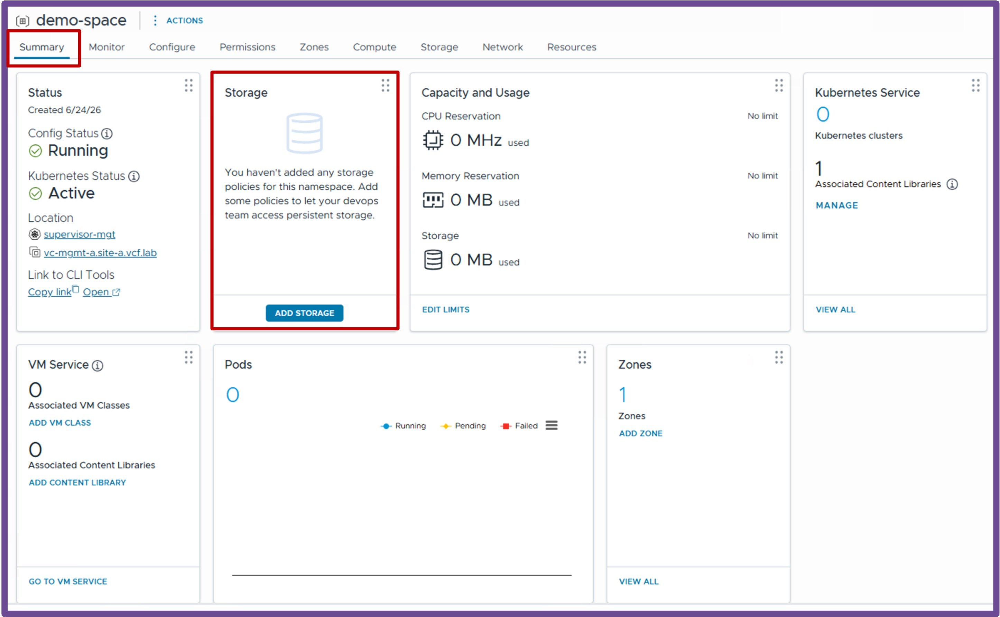
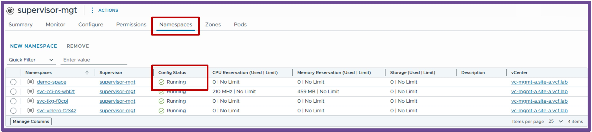
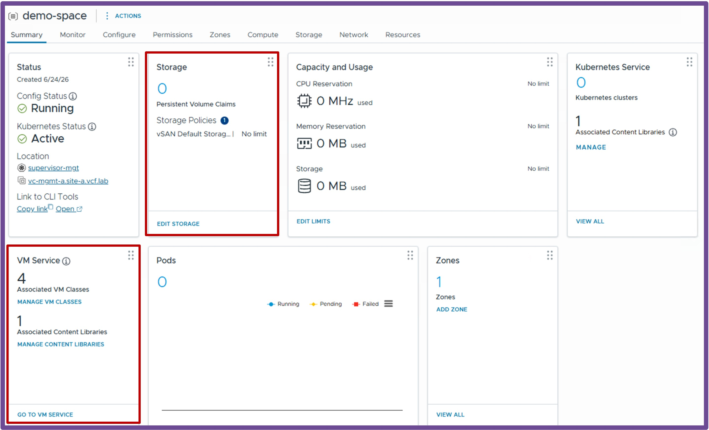

<h1>
   Supervisor with "NSX + DTGW/VNA"
</h1>

This section describes the procedures for **deploying the VKS Supervisor with "NSX + DTGW/VNA"** within a vSphere environment.

* [Requirements](2a-requirements.md)
* [Supervisor Deployment](2c-deploy-supervisor.md)
* [**Namespace Deployment**](#namespacedeployment)

{ width="100%" }

---

## Namespace Deployment {: #namespacedeployment }

### Create NameSpace
Navigate to **vCenter** > **Supervisor Management** > **Namespaces**, and click **NEW NAMESPACE**.
{ width="95%" style="display: block; margin: 0 auto;" }

1. **Location**  
    * Select the **Supervisor**, and click **Next**.  
    { width="95%" style="display: block; margin: 0 auto;" }  

1. **Configuration**  
    * Give a name to the **Namespace**, and click **Next**.  
    { width="95%" style="display: block; margin: 0 auto;" }  

1. **Add Zones**  
    * Select the **Workload Zone** (one or more vCenter Clusters), and click **Next**.  
    { width="95%" style="display: block; margin: 0 auto;" }  

1. **Review**  
    * Review the Namespace settings, and click **Finish**.  
    { width="95%" style="display: block; margin: 0 auto;" }  

### Finish Namespace Creation for future Applications

#### **Create a Content Library for future VMs**  
If you plan to deploy VMs, create a Content Library with VM images.  
Navigate to **vCenter** > **Content Libraries** > and click **Create**.  
{ width="95%" style="display: block; margin: 0 auto;" }  

  1. **Name and Location**  
    Give it a **Name** and select the **vCenter** hosting that Content Library, and click **Next**.  
    { width="85%" style="display: block; margin: 0 auto;" }  
    
  1. **Configure Content Library**  
    Choose between **Local content library** (you upload VM images) and **Subscribed content library** (vCenter downloads VM images from a repository), and click **Next**.  
    *I'm using here Local content library.*  
    { width="85%" style="display: block; margin: 0 auto;" }  

  2. **Apply Security Policy**  
    Apply **security policy** if you choose to, and click **Next**.  
    *I'm using here no security policy.*  
    { width="85%" style="display: block; margin: 0 auto;" }  

  3. **Add Storage**  
    Select a **storage** to host the content library images, and click **Next**.  
    { width="85%" style="display: block; margin: 0 auto;" }  

  4. **Ready to complete**  
    Review the content library, and click **Finish**.  
    { width="85%" style="display: block; margin: 0 auto;" }  

  5. **Import VM Image**  
    In the Content Library created, import a VM Image, click on **Import Item**.  
    { width="85%" style="display: block; margin: 0 auto;" }  

  6. **Choose VM Image**  
    Choose a **Source file** via URL or Local file, and click **Import**.  
    *I'm using here the URL https://cloud-images.ubuntu.com/noble/current/noble-server-cloudimg-amd64.ova to download Ubuntu 24.04.*  
    { width="85%" style="display: block; margin: 0 auto;" }  

#### **Associate the Content Library to the Namespace**   
Navigate to **vCenter** > **Supervisor Management** > **Supervisors**, select **[your supervisor]**, navigate to **Namespaces** and select **[your namespace]**, and click on **VM Service - Add Content Library**.
    { width="95%" style="display: block; margin: 0 auto;" }  

  1. **Add Content Library**  
    Select **Content Library with VM images**, and click **OK**.  
    { width="85%" style="display: block; margin: 0 auto;" }  

#### **Associate Storage Policy to the Namespace**   
Navigate to **vCenter** > **Supervisor Management** > **Supervisors**, select **[your supervisor]**, navigate to **Namespaces** and select **[your namespace]**, and click on **Storage - Add Storage**.
    { width="95%" style="display: block; margin: 0 auto;" }  

  1. **Add Storage Policy**  
    Select **Storage Policy**, and click **OK**.  
    { width="85%" style="display: block; margin: 0 auto;" }  

#### **Associate VM Class to the Namespace**   
Navigate to **vCenter** > **Supervisor Management** > **Supervisors**, select **[your supervisor]**, navigate to **Namespaces** and select **[your namespace]**, and click on **VM Service - Add VM Class**.
    { width="95%" style="display: block; margin: 0 auto;" }  

  1. **Add VM Classes**  
    Select **VM Classes**, and click **OK**.  
    *I filter here all VM Classes type "small" and "xsmall".*  
    { width="85%" style="display: block; margin: 0 auto;" }  

### Validate Deployment

#### **Validate Namespace Status**  
Once the wizard completes, verify the deployment was successful by navigating to **vCenter** > **Supervisor Management** > **Supervisors**, select **[your supervisor]**, navigate to **Namespaces**.

{ width="85%" style="display: block; margin: 0 auto;" }

#### **Validate Namespace Content Library**  
Validate Namespace has at least a **Content Library**, **VM Classes**, and **Storage** by navigating to **vCenter** > **Supervisor Management** > **Supervisors**, select **[your supervisor]**
{ width="85%" style="display: block; margin: 0 auto;" }

