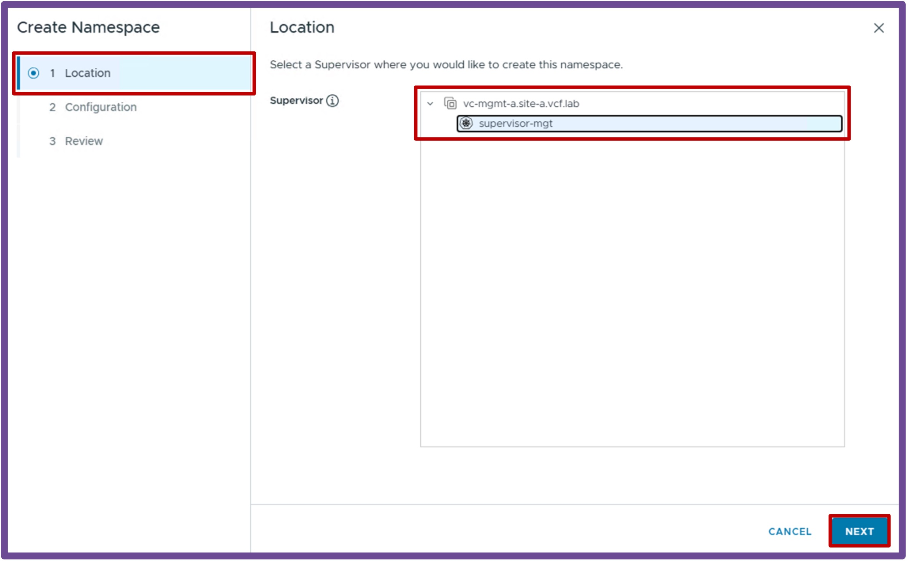
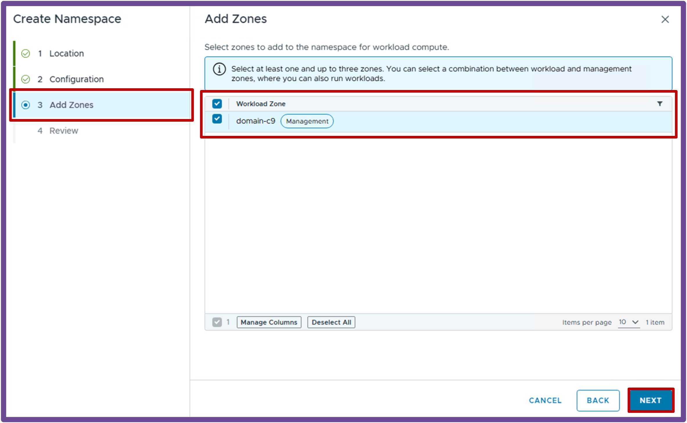
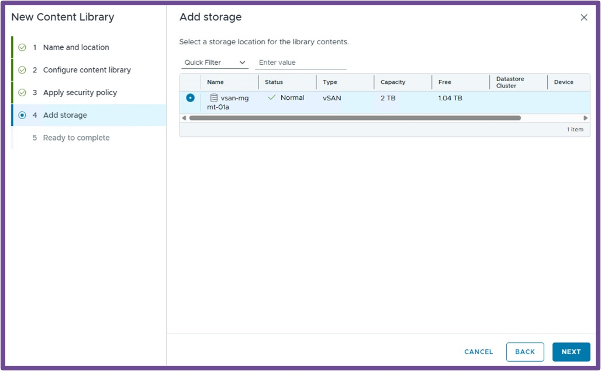
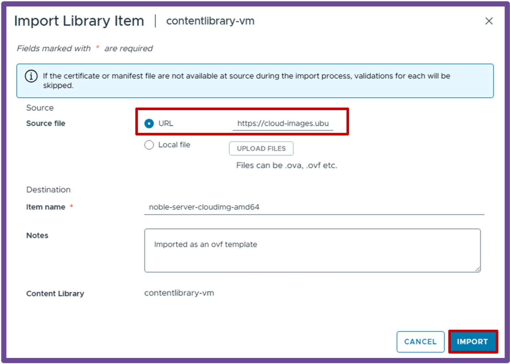
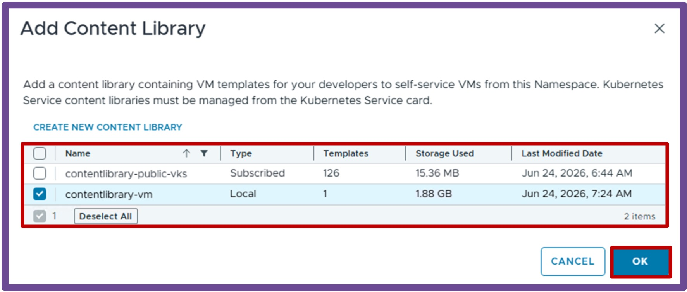
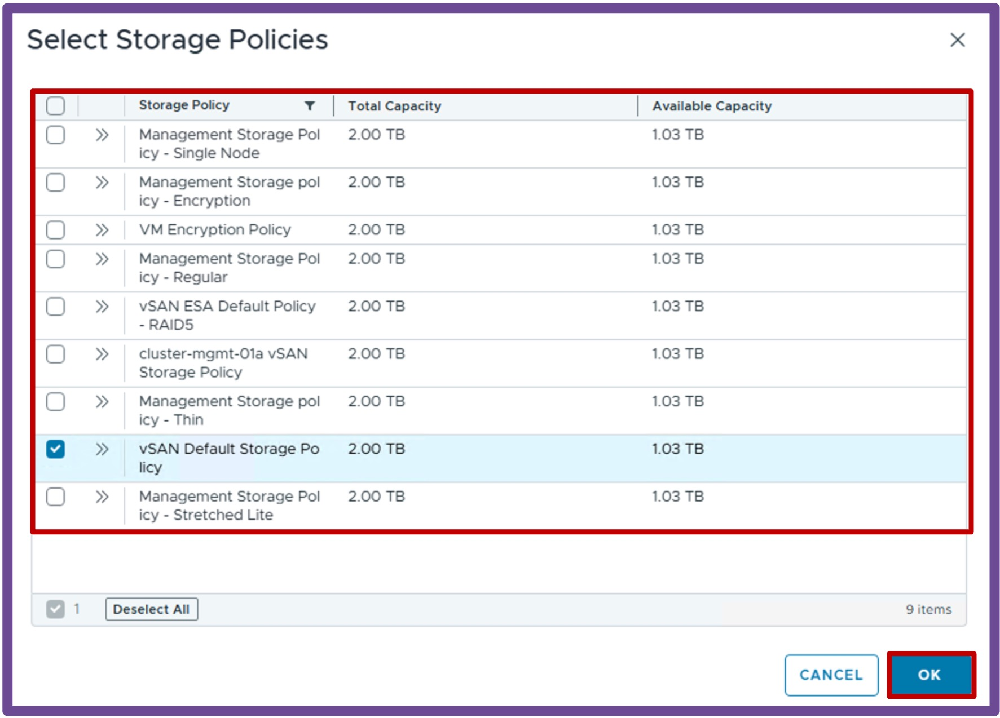
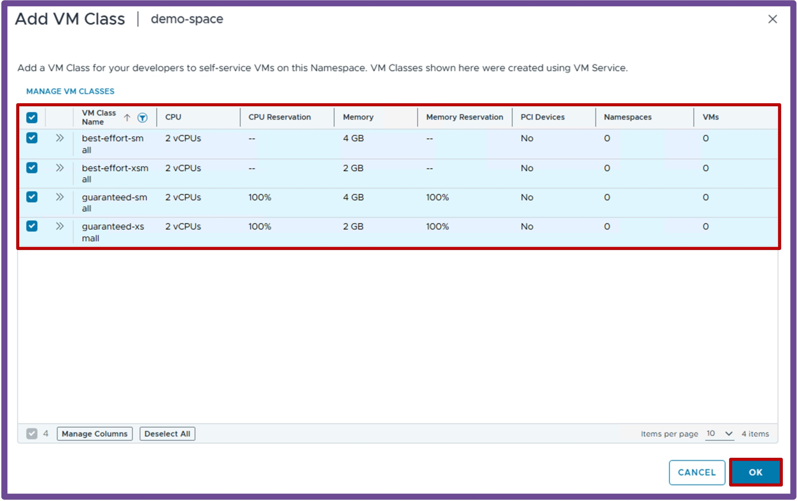
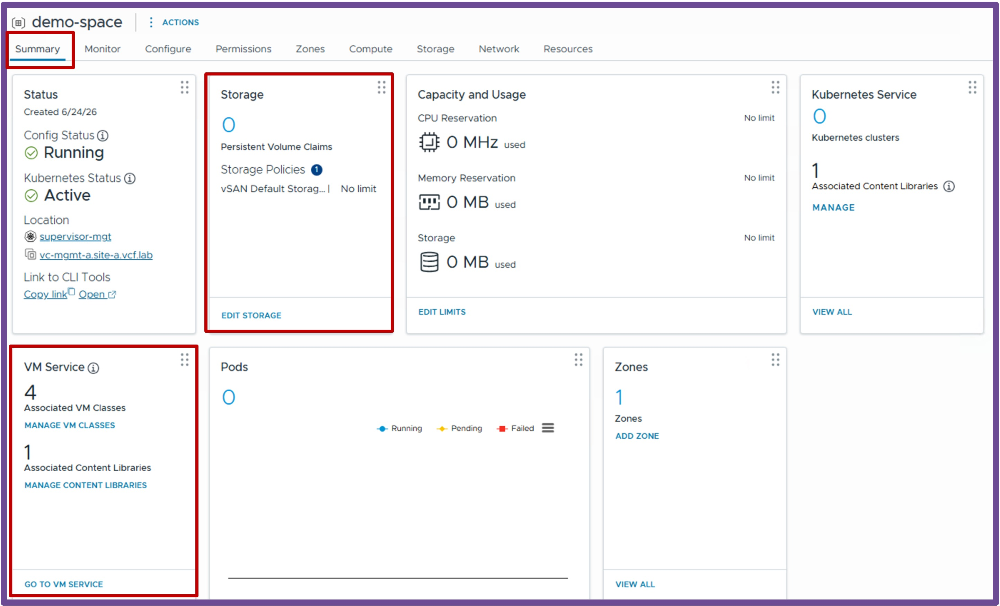

<h1>
   Supervisor with "NSX + DTGW/VNA"
</h1>

This section describes the procedures for **deploying a Supervisor Namespace utilizing an "NSX + DTGW/VNA" architecture** inside a vSphere environment.

* **Namespace**
    * [**Deployment**](#namespacedeployment)
    * [Accesss via CLI](2d2-access-namespace.md)

{ width="100%" }

---

## Namespace Deployment {: #namespacedeployment }

{ width="80%" style="display: block; margin: 0 auto;" }

### Create Namespace
Navigate to **vCenter** > **Supervisor Management** > **Namespaces**, and click **NEW NAMESPACE**.
{ width="95%" style="display: block; margin: 0 auto;" }

1. **Location** Select the **Supervisor**, and click **Next**.  
    { width="95%" style="display: block; margin: 0 auto;" }  

1. **Configuration** Give a name to the **Namespace**, and click **Next**.  
    { width="95%" style="display: block; margin: 0 auto;" }  

1. **Add Zones** Select the **Workload Zone** (one or more vCenter Clusters), and click **Next**.  
    { width="95%" style="display: block; margin: 0 auto;" }  

1. **Review** Review the Namespace settings, and click **Finish**.  
    { width="95%" style="display: block; margin: 0 auto;" }  

---

### Finish Namespace Creation for future Applications

#### **Create a Content Library for future VMs**  
If you plan to deploy VMs, create a Content Library with VM images.  
Navigate to **vCenter** > **Content Libraries** > and click **Create**.  
{ width="95%" style="display: block; margin: 0 auto;" }  

1. **Name and Location** Give it a **Name** and select the **vCenter** hosting that Content Library, and click **Next**.  
    { width="85%" style="display: block; margin: 0 auto;" }  
    
1. **Configure Content Library** Choose between **Local content library** (you upload VM images) and **Subscribed content library** (vCenter downloads VM images from a repository), and click **Next**.  
    *I'm using here Local content library.* { width="85%" style="display: block; margin: 0 auto;" }  

1. **Apply Security Policy** Apply **security policy** if you choose to, and click **Next**.  
    *I'm using here no security policy.* { width="85%" style="display: block; margin: 0 auto;" }  

1. **Add Storage** Select a **storage** to host the content library images, and click **Next**.  
    { width="85%" style="display: block; margin: 0 auto;" }  

1. **Ready to complete** Review the content library, and click **Finish**.  
    { width="85%" style="display: block; margin: 0 auto;" }  

1. **Import VM Image** In the Content Library created, import a VM Image, click on **Import Item**.  
    { width="85%" style="display: block; margin: 0 auto;" }  

1. **Choose VM Image** Choose a **Source file** via URL or Local file, and click **Import**.  
    *I'm using here the URL https://cloud-images.ubuntu.com/noble/current/noble-server-cloudimg-amd64.ova to download Ubuntu 24.04.* { width="85%" style="display: block; margin: 0 auto;" }  

#### **Associate the Content Library to the Namespace**  
Navigate to **vCenter** > **Supervisor Management** > **Supervisors**, select **[your supervisor]**, navigate to **Namespaces**, and select **[your namespace]**, and click on **VM Service - Add Content Library**.
{ width="95%" style="display: block; margin: 0 auto;" }  

1. **Add Content Library** Select **Content Library with VM images**, and click **OK**.  
    { width="85%" style="display: block; margin: 0 auto;" }  

#### **Associate Storage Policy to the Namespace**
Navigate to **vCenter** > **Supervisor Management** > **Supervisors**, select **[your supervisor]**, navigate to **Namespaces**, and select **[your namespace]**, and click on **Storage - Add Storage**.
{ width="95%" style="display: block; margin: 0 auto;" }  

1. **Add Storage Policy** Select **Storage Policy**, and click **OK**.  
    { width="85%" style="display: block; margin: 0 auto;" }  

#### **Associate VM Class to the Namespace**  
Navigate to **vCenter** > **Supervisor Management** > **Supervisors**, select **[your supervisor]**, navigate to **Namespaces**, and select **[your namespace]**, and click on **VM Service - Add VM Class**.
{ width="95%" style="display: block; margin: 0 auto;" }  

1. **Add VM Classes** Select **VM Classes**, and click **OK**.  
*I selected here all VM Classes type "small" and "medium".*
{ width="85%" style="display: block; margin: 0 auto;" }  

---

### Validate Deployment

#### **Validate Namespace Status** 
Once the wizard completes, verify the deployment was successful by navigating to **vCenter** > **Supervisor Management** > **Supervisors**, select **[your supervisor]**, and navigate to **Namespaces**.

{ width="85%" style="display: block; margin: 0 auto;" }

#### **Validate Namespace Content Library** 
Verify the Namespace has at least a **Content Library**, **VM Classes**, and **Storage** by navigating to **vCenter** > **Supervisor Management** > **Supervisors**, select **[your supervisor]**, navigate to **Namespaces**, and select **[your namespace]**.
{ width="85%" style="display: block; margin: 0 auto;" }

