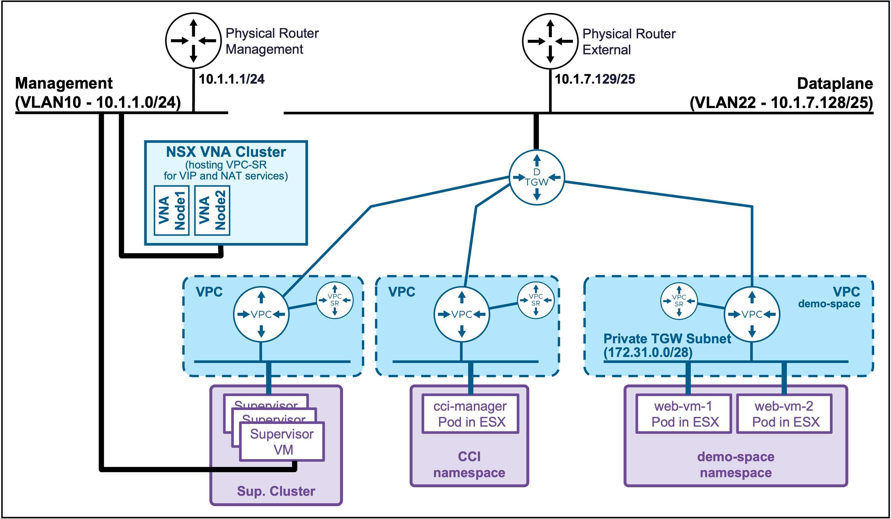

<h1>
   Supervisor with "NSX + DTGW/VNA"
</h1>

This section describes the procedures for **deploying the VKS Supervisor with "NSX + DTGW/VNA"** within a vSphere environment.

* [Requirements](2a-requirements.md)
* [Supervisor Deployment](2b-deployment.md)
* [**Deployment App (VMs)**](#deployment_vms)
* [Deployment App (k8s)](2e-deployment-k8s.md)

{ width="100%" }

---

## Deployment App (VMs) {: #deployment_vms }

{ width="80%" style="display: block; margin: 0 auto;" }

### Create Supervisor NameSpace
Navigate to **vCenter** > **Supervisor Management** > **Namespces**, and click **NEW NAMESPACE**.
{ width="95%" style="display: block; margin: 0 auto;" }

1. **Location**  
    * Select the **Supervisor**, and click **Next**.  
    { width="95%" style="display: block; margin: 0 auto;" }  

1. **Configuration**  
    * Give a name to the **Namespace**, and click **Next**.  
    { width="95%" style="display: block; margin: 0 auto;" }  

1. **Add Zones**  
    * Select the **Workload Zone** (one or more vCenter Clusters), and click **Next**.  
    { width="95%" style="display: block; margin: 0 auto;" }  

1. **Review**  
    * Review the Namespace settings, and click **Finish**.  
    { width="95%" style="display: block; margin: 0 auto;" }  

###  Supervisor NameSpace to be ready to host workloads (VMs and Containers)
Navigate to **vCenter** > **Supervisor Management** > **Namespces**, and click **NEW NAMESPACE**.
{ width="95%" style="display: block; margin: 0 auto;" }
