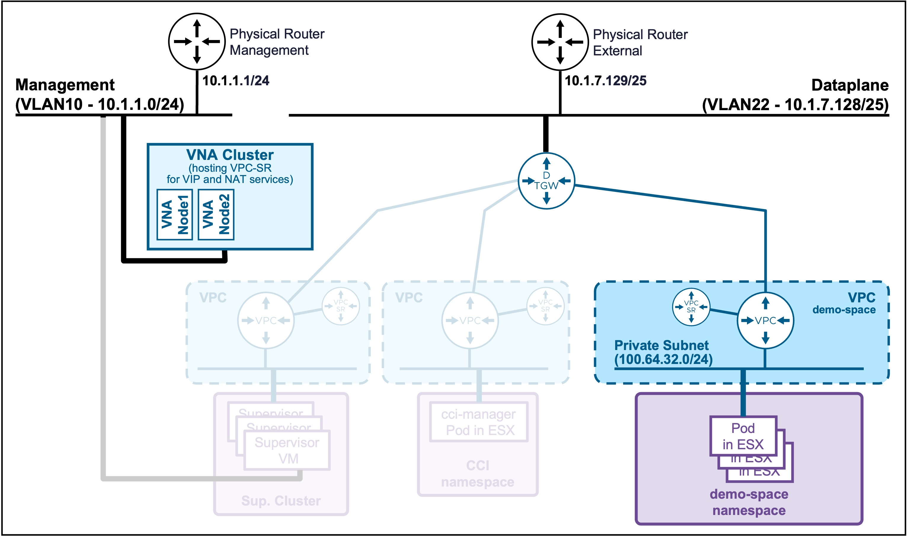
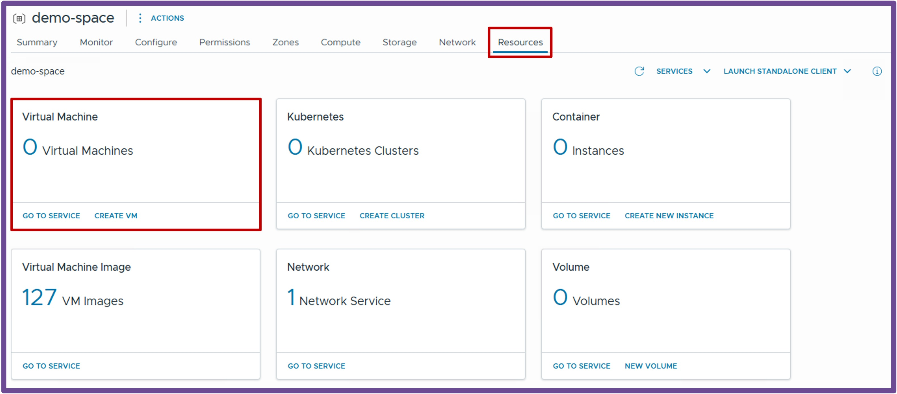
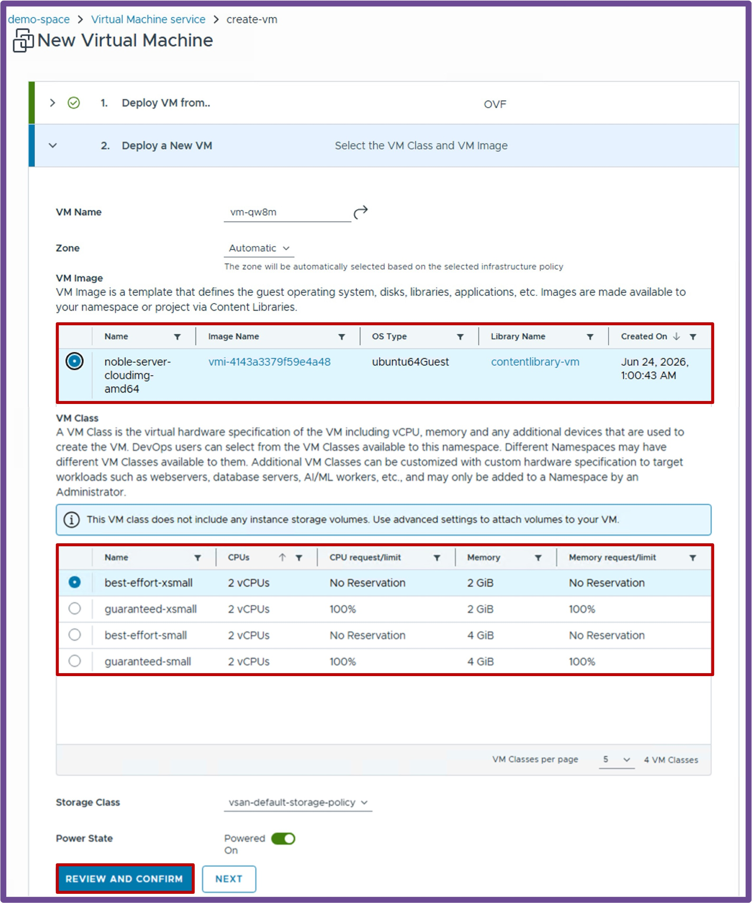

<h1>
   Supervisor with "NSX + DTGW/VNA"
</h1>

This section describes the procedures for **deploying an application (VMs/K8s) into the VKS Namespace with "NSX + DTGW/VNA"** within a vSphere environment.

* [**Deployment App (VMs)**](2e-deployment-vms.md#deployment_vms)
* [Deployment App (k8s)](2f-deployment-k8s.md)

{ width="100%" }

---

## Deployment App (VMs) {: #deployment_vms }

{ width="80%" style="display: block; margin: 0 auto;" }

### Deploy a VM via the vCenter UI
Navigate to **vCenter** > **Supervisor Management** > **Supervisors**, select **[your supervisor]**, navigate to **Namespaces**, select **[your namespace]**, and navigate to **Resources**.  
{ width="95%" style="display: block; margin: 0 auto;" }

1. **Deploy VM from..** Select between **OVF** or **ISO**, and click **Next**.  
    { width="95%" align="center" }  

1. **Deploy a New VM** Choose a **VM Name**, a **VM Image**, a **VM Class** (size and reservation of the VM), and click **Review and Confirm**.  
    { width="95%" align="center" }  

1. **Review and Confirm** Review the settings, and click **Deploy VM**.  
    { width="95%" align="center" }  

    ??? info "More options"
        More options are available under **Advanced Settings (Optional)** and **Network Configuration (Optional)**, such as Persistent Volumes and Cloud-Init for Guest Customization.  
        For more information, refer to the [VMware VM Service Documentation](https://techdocs.broadcom.com/us/en/vmware-cis/vcf/vcf-consumption/latest/vm-service.html).

### Deploy a Full Application (Load Balancer + VMs) via yaml file

1. **Connect to Supervisor Namespace via kubectl**  
    See [Connect to Namespace via Kubectl client](2d2-access-namespace.md#namespacek8sclient)

