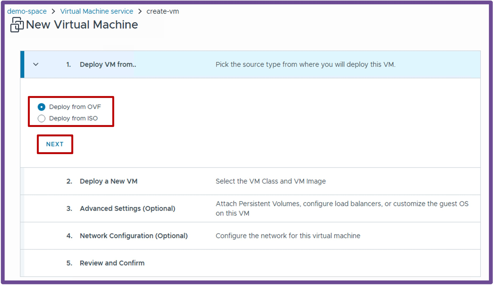
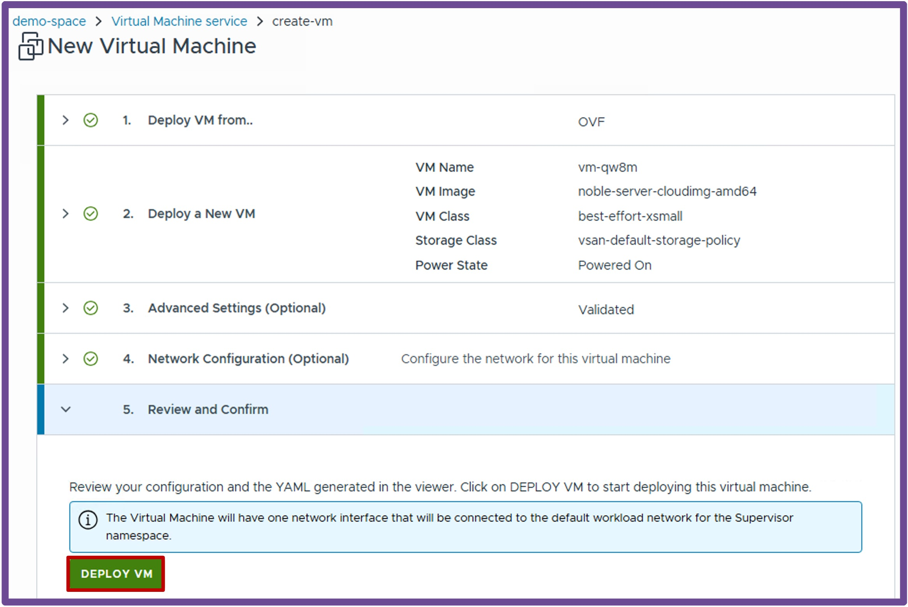
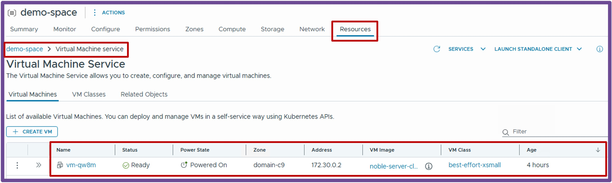
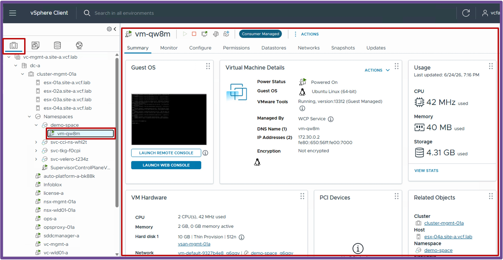

<h1>
   Supervisor with "NSX + DTGW/VNA"
</h1>

This section describes the procedures for **deploying an application (VMs/K8s) into the VKS Namespace with "NSX + DTGW/VNA"** within a vSphere environment.

- [Deployment App (VMs) {: #deployment\_vms }](#deployment-app-vms--deployment_vms-)
  - [Deploy a VM via the vCenter UI](#deploy-a-vm-via-the-vcenter-ui)
  - [Validate deployment and status of the VM](#validate-deployment-and-status-of-the-vm)
    - [via vCenter Supervisor Namespace](#via-vcenter-supervisor-namespace)
    - [via vCenter Inventory](#via-vcenter-inventory)
  - [Access the VM](#access-the-vm)

{ width="100%" }

---

## Deployment App (VMs) {: #deployment_vms }

### Deploy a VM via the vCenter UI

{ width="40%" style="display: block; margin: 0 auto;" }

Navigate to **vCenter** > **Supervisor Management** > **Supervisors**, select **[your supervisor]**, navigate to **Namespaces**, select **[your namespace]**, navigate to **Resources**, and click on **Virtual Machine - Create VM**  
{ width="95%" style="display: block; margin: 0 auto;" }

1. **Deploy VM from..** Select between **OVF** or **ISO**, and click **Next**.  
    { width="95%" align="center" }  

1. **Deploy a New VM** Choose a **VM Name**, a **VM Image**, a **VM Class** (size and reservation of the VM), and click **Review and Confirm**.  
    { width="95%" align="center" }  

1. **Review and Confirm** Review the settings, and click **Deploy VM**.  
    { width="95%" align="center" }  

    ??? info "More options"
        More options are available under **Advanced Settings (Optional)** and **Network Configuration (Optional)**, such as Persistent Volumes and Cloud-Init for Guest Customization.  
        For more information, refer to the [VMware VM Service Documentation](https://techdocs.broadcom.com/us/en/vmware-cis/vcf/vcf-consumption/latest/vm-service.html){: target="_blank"}.

### Validate deployment and status of the VM  
You can validate the status of the VM from:

#### via vCenter Supervisor Namespace  
  Navigate to **vCenter** > **Supervisor Management** > **Supervisors**, select **[your supervisor]**, navigate to **Namespaces**, select **[your namespace]**, navigate to **Resources**, and click on **Virtual Machine - Go to Service**
  { width="95%" style="display: block; margin: 0 auto;" }

#### via vCenter Inventory  
  Navigate to **vCenter** > **Inventory**, select the **VM in the Namespace**
  { width="95%" style="display: block; margin: 0 auto;" }

### Access the VM 
By default the VM is connected to a private network for security reasons.  
To offer direct access to the VM, differentes options sont possibles:  

* **Create a Subnet Public and plug the VM on it**  
  Under **vCenter** > **Supervisor Management** > **Supervisors**, select **[your supervisor]**, navigate to **Namespaces**, select **[your namespace]**, navigate to **Resources**, and click on **Network - Go to Service**

* **Create a Load Balancer in front of the VM**  
  Under **vCenter** > **Supervisor Management** > **Supervisors**, select **[your supervisor]**, navigate to **Namespaces**, select **[your namespace]**, navigate to **Resources**, and click on **Network - Go to Service**

