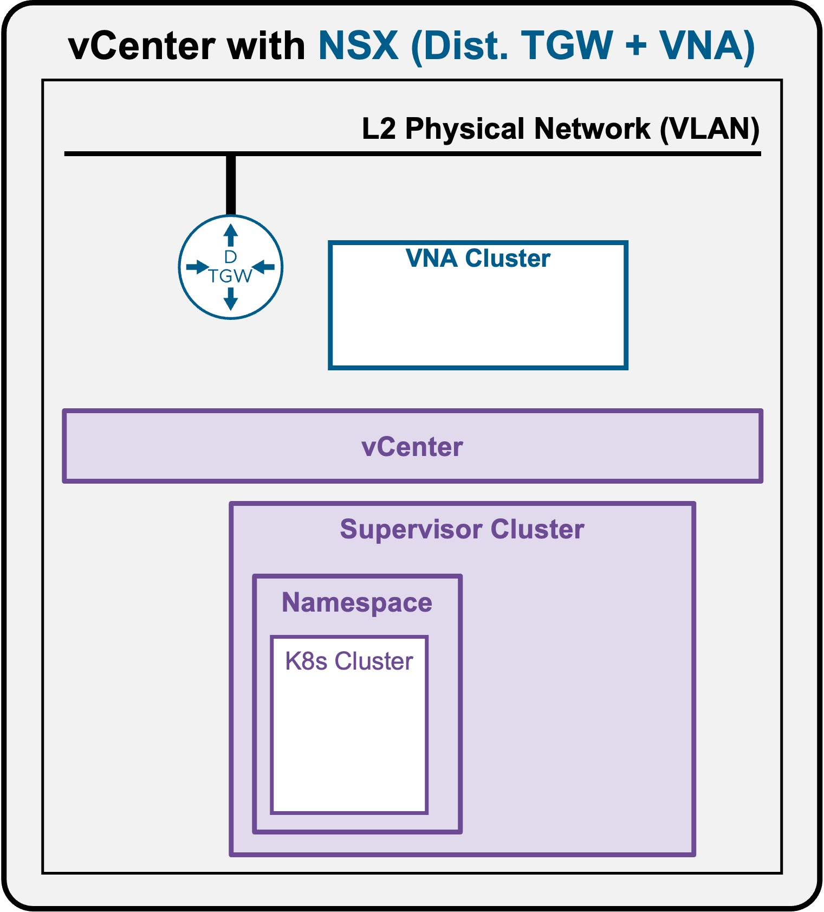
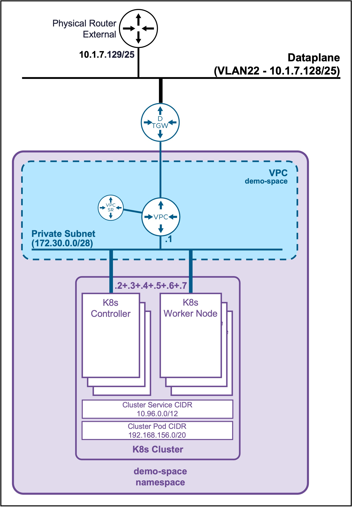

<h1>
   Supervisor with "NSX + DTGW/VNA"
</h1>

<div class="grid" markdown style="grid-template-columns: 60% 40%">

<div markdown>

This section describes the procedures for **deploying a K8s Cluster in a Namespace with "NSX + DTGW/VNA"** within a vSphere environment.  

* **K8s Cluster Deployment**
    * [via vCenter UI](2e1-deployment-k8s.md)
    * [**via CLI**](#deployment_k8s)

</div>

<div markdown>
{ width="100%" }
</div>
</div>

---

## K8s Cluster Deployment {: #deployment_k8s }

{ width="40%" style="display: block; margin: 0 auto;" }

??? info ":material-laptop: Client Operating System"
    While the command outputs below are captured from a **Windows client**, the `vcf` and `kubectl` CLI tools operate identically across **Linux** and **macOS** environments.

### Connect to the Supervisor Namespace

* **List the Supervisor Namespaces**  
    ```text
    vcf context list
    ```

    ??? info "Output example"
        <pre><code>PS C:\Users\Administrator\Documents> <b>vcf context list</b>
        NAME                             CURRENT  TYPE
        supervisor-mgt                   false    kubernetes
        <b>supervisor-mgt:demo-space        true     kubernetes</b>
        supervisor-mgt:svc-cci-ns-whl2t  false    kubernetes
        supervisor-mgt:svc-tkg-f0cpi     false    kubernetes
        supervisor-mgt:svc-velero-t234z  false    kubernetes
        </code></pre>

* **Connect to the Supervisor Namespace**  
If the current context is not the good one, connect to the Supervisor Namespace
    ```text
    vcf context use supervisor-mgt:demo-space
    ```

    ??? info "Output example"
        <pre><code>PS C:\Users\Administrator\Documents> <b>vcf context use supervisor-mgt:demo-space</b>
        [ok] Token is still active. Skipped the token refresh for context "supervisor-mgt:demo-space"
        </b>[i] Successfully activated context 'supervisor-mgt:demo-space' (Type: kubernetes)</b>
        [i] Fetching recommended plugins for active context 'supervisor-mgt:demo-space'...
        </code></pre>


---

### Create K8s Cluster

#### Check all K8s Cluster resources

* **Check TKR releases available**
    ```text
    kubectl get kubernetesreleases
    ```

    ??? info "Output example"
        <pre><code>PS C:\Users\Administrator\Documents> <b>kubectl get kubernetesreleases</b>
        NAME                                      VERSION                                 READY   COMPATIBLE   CREATED   TYPE
        <snip>
        v1.35.5---vmware.1-vkr.1                  v1.35.5+vmware.1-vkr.1                  True    True         4d8h<
        <snip>
        </code></pre>

* **Check VM Class available**
    ```text
    kubectl get virtualmachineclass
    ```

    ??? info "Output example"
        <pre><code>PS C:\Users\Administrator\Documents> <b>kubectl get virtualmachineclass</b>
        NAME                 CPU   MEMORY
        best-effort-medium   2     8Gi
        best-effort-small    2     4Gi
        guaranteed-medium    2     8Gi
        guaranteed-small     2     4Gi
        </code></pre>

* **Check Storage Class availablee**
    ```text
    kubectl get storageclass
    ```

    ??? info "Output example"
        <pre><code>PS C:\Users\Administrator\Documents> <b>kubectl get storageclass</b>
        NAME                                                   PROVISIONER              RECLAIMPOLICY   VOLUMEBINDINGMODE      ALLOWVOLUMEEXPANSION   AGE
        <snip>
        vsan-default-storage-policy                            csi.vsphere.vmware.com   Delete          Immediate              true                   22h
        <snip>
        </code></pre>


#### Create the K8s Cluster yaml file 
Create file "my-cluster.yaml"

??? info "my-cluster.yaml file"
    ```text
    apiVersion: cluster.x-k8s.io/v1beta2
    kind: Cluster
    metadata:
      name: my-cluster
      namespace: demo-space
    spec:
      clusterNetwork:
        services:
          cidrBlocks: ["10.96.0.0/12"]
        pods:
          cidrBlocks: ["192.168.156.0/20"]
        serviceDomain: "cluster.local"
      topology:
        classRef:
          name: builtin-generic-v3.6.0
        version: v1.35.5---vmware.1-vkr.1
        controlPlane:
          replicas: 3
        workers:
          machineDeployments:
            - class: node-pool
              name: workers
              metadata:
                annotations:
                  cluster.x-k8s.io/cluster-api-autoscaler-node-group-min-size: "3"
                  cluster.x-k8s.io/cluster-api-autoscaler-node-group-max-size: "5"
        variables:
          - name: vmClass
            value: best-effort-small
          - name: storageClass
            value: vsan-default-storage-policy
    ```

#### Deploy the K8s Cluster yaml file 
```text
kubectl apply -f my-cluster.yaml
```

??? info "Output example"
    <pre><code>PS C:\Users\Administrator\Documents> <b>kubectl apply -f my-cluster.yaml</b>
    cluster.cluster.x-k8s.io/my-cluster created
    </code></pre>


---

### Validate Deployment

#### **Validate K8s Cluster Status** 
It takes around 5 minutes to get the K8s Cluster ready
```text
kubectl get cluster
```

??? info "Output example"
    <pre><code>PS C:\Users\Administrator\Documents> <b>kubectl get cluster</b>
    NAME         CLUSTERCLASS             <b>AVAILABLE</b>   CP DESIRED   <b>CP AVAILABLE</b>   CP UP-TO-DATE   <b>W DESIRED</b>   W AVAILABLE   W UP-TO-DATE   <b>PHASE</b>         AGE    VERSION
    my-cluster   builtin-generic-v3.6.0   <b>True</b>        3            <b>3</b>              3               <b>3</b>           3             3              <b>Provisioned</b>   7m32s   v1.35.5+vmware.1
    </code></pre>

#### **Validate K8s Nodes Status** 
```text
kubectl get machines
```

??? info "Output example"
    <pre><code>PS C:\Users\Administrator\Documents> <b>kubectl get machines</b>
    NAME                                   CLUSTER      NODE NAME                              <b>READY</b>   AVAILABLE   UP-TO-DATE   PHASE     AGE     VERSION
    my-cluster-wglt6-dlpqm                 my-cluster   my-cluster-wglt6-dlpqm                 <b>True</b>    True        True         Running   5m57s   v1.35.5+vmware.1
    my-cluster-wglt6-jv9t5                 my-cluster   my-cluster-wglt6-jv9t5                 <b>True</b>    True        True         Running   3m47s   v1.35.5+vmware.1
    my-cluster-wglt6-n9m25                 my-cluster   my-cluster-wglt6-n9m25                 <b>True</b>    True        True         Running   109s    v1.35.5+vmware.1
    my-cluster-workers-qjq5s-xj695-2kt4z   my-cluster   my-cluster-workers-qjq5s-xj695-2kt4z   <b>True</b>    True        True         Running   5m47s   v1.35.5+vmware.1
    my-cluster-workers-qjq5s-xj695-dff4g   my-cluster   my-cluster-workers-qjq5s-xj695-dff4g   <b>True</b>    True        True         Running   5m47s   v1.35.5+vmware.1
    my-cluster-workers-qjq5s-xj695-p55n8   my-cluster   my-cluster-workers-qjq5s-xj695-p55n8   <b>True</b>    True        True         Running   5m47s   v1.35.5+vmware.1
    </code></pre>

---

### Connect to the K8s Cluster {: #connect_k8s }

#### **Create K8s Cluster kubeconfig file** 
<pre><code>[System.IO.File]::WriteAllBytes("$pwd\my-cluster-kubeconfig.yaml", [System.Convert]::FromBase64String((kubectl get secret <b>my-cluster-kubeconfig</b> -n <b>demo-space</b> -o jsonpath='{.data.value}')))
</code></pre>

??? info "Output example"
    <pre><code>PS C:\Users\Administrator\Documents> <b>[System.IO.File]::WriteAllBytes("$pwd\my-cluster-kubeconfig.yaml", [System.Convert]::FromBase64String((kubectl get secret my-cluster-kubeconfig -n demo-space -o jsonpath='{.data.value}')))</b>
    </code></pre>

??? info "File "my-cluster-kubeconfig.yaml" created"
    ```text
    apiVersion: v1
    clusters:
    - cluster:
        certificate-authority-data: LS0tLS1CRUdJTiBDRVJUSUZJQ0FURS0tLS0tCk1JSUM2akNDQWRLZ0F3SUJBZ0lCQURBTkJna3Foa2lHOXcwQkFRc0ZBREFWTVJNd0VRWURWUVFERXdwcmRXSmwKY201bGRHVnpNQjRYRFRJMk1EWXlPREUyTXpZeE9Gb1hEVE0yTURZeU5URTJOREV4T0Zvd0ZURVRNQkVHQTFVRQpBeE1LYTNWaVpYSnVaWFJsY3pDQ0FTSXdEUVlKS29aSWh2Y05BUUVCQlFBRGdnRVBBRENDQVFvQ2dnRUJBTE43Cjd2Z0ttTGxlYnVYd3FxNGUrUXJHTWhQWHEwMVhCcnpLc0tySjRqWEc1Zkc3TU8xalltaFk0cmxMMHNqeDl6U2oKcStZcnZKQ1I5TWFTRFJpZWxSU3craDQ3ejFuQ20yYjMzN1grSmxCYStYT0ZhZXFYTFZybHBlSy9FejNaM01HZApSWERMeENQS2tFN2VaZmRmVVA2Mld2K3JmVDYvai82T2RBOTY1ZmpxdVU3aTVaa2ZMQnRmRDFlZTRpSUJ6TjBTCnhxK2pmSml6ZUZDVFdmV296cjJXREpPM0pQNWZ2Q0J2b0xoeHVRMm92MWdyR3p3VHpYMytSekxZV00raGJXeXUKZFdyMnBqWGx4eUl4dDgrVzdWeHJiaU9PTVc2Z254N0V3RTNXTXB1UjNBM2R6TE5yblVHRC9HWVdjbVhVUkcrcQpYNnpxTDdpZGJURll3OTJlWElVQ0F3RUFBYU5GTUVNd0RnWURWUjBQQVFIL0JBUURBZ0trTUJJR0ExVWRFd0VCCi93UUlNQVlCQWY4Q0FRQXdIUVlEVlIwT0JCWUVGSUlwR3ljNTUzNTRyQ0h6ckE1R1NsT1VIclRpTUEwR0NTcUcKU0liM0RRRUJDd1VBQTRJQkFRQ1RWN1kvRjNhS21vMVRKN2E4WUdsN3lYNVRiRHlERjRydTJEMitUL2FjN1dyKwptd0tGcVIyQnJYdENxeFM1d0JhclRYQklpb1V5aGhlVFBkYUxuNit0Q0twVzFlanVpckNyT3pONUN1YXEvdVdWCkVVMzhEcS9raVdOTlE0ajA0Sm9tRERBZlRsd2tTdzVSZWZqbXFVL0k3ZDgwNjRseDRacDZjSkJEREN3NmRkYisKUXFTN0F3UWpnL0tUUmUxbjhJNjlERGZ1NmRSUDEvKzlmall0ajUzYWR3RnJ6R0ZIWXhtQmdEeENBUGdpM1Y0Ngp6M2UwOVJjUWdRVzdRblRWWXdoRjhFTThEMUl2T2RKNnkzeWtoN2JYTCtWc1BLY2JsYnFIczFicXU2TUFDekY2Cmx3dWY2STQ3WUpHQ1dzQnJ0UnNXSXhxUy9ISjRlZC9iRkZ2S3o0Rm4KLS0tLS1FTkQgQ0VSVElGSUNBVEUtLS0tLQo=
        server: https://10.1.7.137:6443
      name: my-cluster
    contexts:
    - context:
        cluster: my-cluster
        user: my-cluster-admin
      name: my-cluster-admin@my-cluster
    current-context: my-cluster-admin@my-cluster
    kind: Config
    users:
    - name: my-cluster-admin
      user:
        client-certificate-data: LS0tLS1CRUdJTiBDRVJUSUZJQ0FURS0tLS0tCk1JSURFekNDQWZ1Z0F3SUJBZ0lJWFBEQU5XVFAzQ3N3RFFZSktvWklodmNOQVFFTEJRQXdGVEVUTUJFR0ExVUUKQXhNS2EzVmlaWEp1WlhSbGN6QWVGdzB5TmpBMk1qZ3hOak0yTVRoYUZ3MHlOekEyTWpneE5qUXhNVGxhTURReApGekFWQmdOVkJBb1REbk41YzNSbGJUcHRZWE4wWlhKek1Sa3dGd1lEVlFRREV4QnJkV0psY201bGRHVnpMV0ZrCmJXbHVNSUlCSWpBTkJna3Foa2lHOXcwQkFRRUZBQU9DQVE4QU1JSUJDZ0tDQVFFQTRMeHpKL1hCRExIWE85d0gKSk1Zem5IcXd6Vm1hd1M1bWdMQ0luUFB6dkNscUtjS3RRemZZRnNjMnQreVBTTHpoTkkyMko0SGU3Q1ptM2p2eQpqYitwemhMenQ2cUh0ZnBTZUdVRTlGaWU0NmJ0UDJXdFBNS2dkd3ZYNkR1ZnNxMDlDZzJLTWRTVXFTa2hGOVdMCndoWUMwTldwNHh0MHRtOFlWc09hM3JPMmpnR1pzcVVjclJSMkFEOVgwaUlKa3d5YVd0Ky9BbW94M3IvTzkxQVMKTU82eElIVmsyVUwwdUh5QkJZUFVTUFFFbTFOVHRYODRBeHZYakZCNDMyK3FUUkNBcXptK3B6RmJHWllCSUtNegp0QklLSmpUK3hoYXJlR1o4OWhyK1F0WTZ3dW9VN2RsRjdCZFBzaWlIalQwQlIyU0E2L1hmSEJnTGQ0SExQb1dhCmlPM2NxUUlEQVFBQm8wZ3dSakFPQmdOVkhROEJBZjhFQkFNQ0JhQXdFd1lEVlIwbEJBd3dDZ1lJS3dZQkJRVUgKQXdJd0h3WURWUjBqQkJnd0ZvQVVnaWtiSnpubmZuaXNJZk9zRGtaS1U1UWV0T0l3RFFZSktvWklodmNOQVFFTApCUUFEZ2dFQkFBdk40bU5ZUzFDTzZhSGNxd3cxTElySWNNaEQ3T0pHTjc1ZGVETFc3bTRJUUsxa2tXK2dzbFpLCkROaUtOTkx3ak45bVBaUzZIVlViTDQ2MkNXemZCMGVPMWorR1NzR2lYVzJFSzNlUmNiYmpka2RYblZEcWdhNzYKWndWVkUrMEZaaVVmVmJLck00QnNzSjJheWl5QmNFUmFyMVArMVpFNUczQ1hQd3VpeVZpUG9IVW92YmVqalBPSwo1QjVBZ3ZNb0I0QlFPZUdlRmR5ZW5EQnlDUHhLczJRR25qOEFYbGxma2J0NnZMQ1RUYTZNZUIvVWMvb284TU5JClNXZDdjc2MxcUlaWFozTm5DMjlHdFZpaUROTUFNVFplWm1qTEgrNzRmZmsyVzJXZzlCNWJObnFVK3BVTzgxblUKSVNmeWpONVNpSWlVc2k5c2Zuek5xWko4OW1uQ2IrYz0KLS0tLS1FTkQgQ0VSVElGSUNBVEUtLS0tLQo=
        client-key-data: LS0tLS1CRUdJTiBSU0EgUFJJVkFURSBLRVktLS0tLQpNSUlFb2dJQkFBS0NBUUVBNEx4ekovWEJETEhYTzl3SEpNWXpuSHF3elZtYXdTNW1nTENJblBQenZDbHFLY0t0ClF6ZllGc2MydCt5UFNMemhOSTIySjRIZTdDWm0zanZ5amIrcHpoTHp0NnFIdGZwU2VHVUU5RmllNDZidFAyV3QKUE1LZ2R3dlg2RHVmc3EwOUNnMktNZFNVcVNraEY5V0x3aFlDME5XcDR4dDB0bThZVnNPYTNyTzJqZ0dac3FVYwpyUlIyQUQ5WDBpSUprd3lhV3QrL0Ftb3gzci9POTFBU01PNnhJSFZrMlVMMHVIeUJCWVBVU1BRRW0xTlR0WDg0CkF4dlhqRkI0MzIrcVRSQ0Fxem0rcHpGYkdaWUJJS016dEJJS0pqVCt4aGFyZUdaODlocitRdFk2d3VvVTdkbEYKN0JkUHNpaUhqVDBCUjJTQTYvWGZIQmdMZDRITFBvV2FpTzNjcVFJREFRQUJBb0lCQUE3Q0JxU05kek9ZaTNRZwpoYzQ4dnhvNzFhMFdnUEFiVmtYYkp6Z2tybEVoUGNSODhVTWthLzlLN21WSTYrYUY2TVZsRFBJdWpXOWYzTjk1CkpsRE5VUFJQRUV3ZVdiSng1c1V3aW1acXIyY1pzM2kzVDVkWmh6b1V3QVU5d25DZS93N1FSczZia1haRHFpc0EKMktCU2htQWxEU0ZKMEp5WS9Rc3RrSUpSWU4vcTlzYXFxVVZzb0RzY1N2bnk0bllsN2RWZTN4S0ZSeDdiaW9FWAo4cWFBaUpqOTNSYWtlb2N6eThuaHhEN01UZ2NMMkczSEh5RmgzSjZUa2k5cjhKVzJ3amJDNFI5VUtZWnlrRVpUCkpIRlhWKyt2K1hkRW1INzBGbjFmWUkxR3lOK1o0MXEveWwrV1F1a2RSWDNXbk5EQVE3YXROWXQ5TjAxU2dGdVUKL0l3d1U5RUNnWUVBL0hXYzJzaGpZeDdQWlZpcHRYTUpVVll1R3p6TjFFajZrVytvMWIzeWN1aEgrNDcwT2trdgpUL2NsQzI5OVh0dDJ4emdEd2VrMEFyQVl0K0daNldLQysydDBiUkp3TjZtTUR5NU1PTFNvaEtERi9qckRKVFpxCkliZ0hzK3FsL2lqZkNTeER5OE00YnBMZFlJRnpYaFlud0hTMHBudU12K2JDRndadGZCMmJqVDBDZ1lFQTQrTk4KMjRrcjZNTDlha2Z5cEs4Nk90ZmhWdW8yWHgraW5tNTI3aTVQVVJDRGYvdXM1ci9uTWxnaklsdi9uRFlMVmFYNgpZdHViTnoya09qMlRJWVR1OWJqNVg4NGp4WmhJMWgxY2xmYi9mQVdSV3VMaUh6ejVaVCtDeWIyUnJzUy9SQWVxCjNVY0g3dnJDYkFCaFhNMEttVThXZFhBWlBKOXAyUVBZdlp1MW05MENnWUJLR0s3djI2Nm44ZXdISDgyM2pzcm0KVDNmNjBJN014cHFjUXZ4M3QyZElhSHB3RDlZSW9XQThoUm9mVUJxbzA1cjUvNnZDcHhKMzAzMTl3cjRzckpncQorSy9VTDN3MktoSU1ocGNpY1l1Z1dadWk4VlpEUHNSSm56ekxob3d2bTRsU3BPWkZFTWdvVS95YmpZTHgwMmpaCmFLZDQwWHhPK29odXY1azB1Mi9qTlFLQmdFRTJVSmRjSDRhU0ZmYU45QytRUFRlTmcxeGQxWVZQQmpnVUlGQjAKVEJwRWdYemtSa3daNmswTHo3SUxaWkFNSHg0NVN2ZHpKRzJnWkJpT2VrWURSbVptc21YcUZXNTc3NHZtQnhLYgpCZTAxb3F6QmREZkFPUlh5SUxrZVdFd00zVGJZZ3RxamN1KytMbGk5bXg3MVJlMHRKcDRnbi9nckhoME43cjRECml1cTVBb0dBSWpyRXdySVFJVDh6a1llSy9XcUVFTlJTSlBkT3RXWjArdXhabTZOd2ZLY1Nzb1Nud1FFeVFLSjgKTW8zSjd4dVlmNEZnbkhsMFlXODhTTXVRVEN0ZzF3OW9IVkhxaEh0a2s4b043YUFaTmhNeXlSSTNoRUIyOXE3ZQprQk5xYTc5WVFkQzBtSlE2UkVKeEZNQ3NKdlhsZHFGM0pSS0NlMTZ5cjM2c1ZsSHJoa1E9Ci0tLS0tRU5EIFJTQSBQUklWQVRFIEtFWS0tLS0tCg==
    ```

#### **Connect to the K8s Cluster** 

* **Create KUBECONFIG variable**
```text
$env:KUBECONFIG="$pwd\my-cluster-kubeconfig.yaml"
```

??? info "Output example"
    <pre><code>PS C:\Users\Administrator\Documents> <b>$env:KUBECONFIG="$pwd\my-cluster-kubeconfig.yaml"</b>
    </code></pre>
    Note: To connect back to the Supervisor Namespace (demo-space)
    <pre><code>PS C:\Users\Administrator\Documents> <b>$env:KUBECONFIG = $null</b>
    </code></pre>

* **Validate Context is the K8s Cluster**
```text
kubectl config get-contexts
```

??? info "Output example"
    The current context is:  
    . **Cluster: my-cluster**  
    . **Namespace: default (empty)**  
    <pre><code>PS C:\Users\Administrator\Documents> <b>kubectl config get-contexts</b>
    CURRENT   NAME                          CLUSTER      AUTHINFO           NAMESPACE
    *         my-cluster-admin@my-cluster   my-cluster   my-cluster-admin
    </code></pre>

* **Validate K8s Cluster connection**
```text
kubectl get nodes
```

??? info "Output example"
    <pre><code>PS C:\Users\Administrator\Documents> <b>kubectl get nodes</b>
    NAME                                   STATUS   ROLES           AGE   VERSION
    my-cluster-wglt6-dlpqm                 Ready    control-plane   49m   v1.35.5+vmware.1
    my-cluster-wglt6-jv9t5                 Ready    control-plane   47m   v1.35.5+vmware.1
    my-cluster-wglt6-n9m25                 Ready    control-plane   45m   v1.35.5+vmware.1
    my-cluster-workers-qjq5s-xj695-2kt4z   Ready    <none>          48m   v1.35.5+vmware.1
    my-cluster-workers-qjq5s-xj695-dff4g   Ready    <none>          48m   v1.35.5+vmware.1
    my-cluster-workers-qjq5s-xj695-p55n8   Ready    <none>          48m   v1.35.5+vmware.1
    </code></pre>

