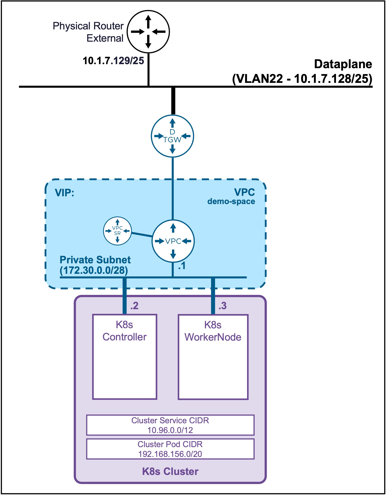
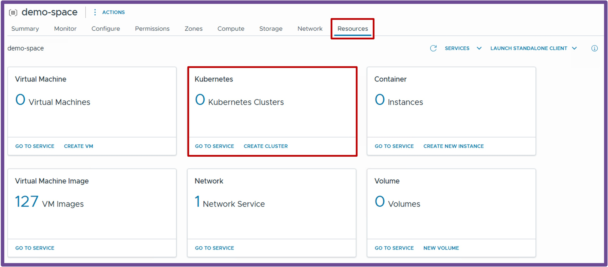
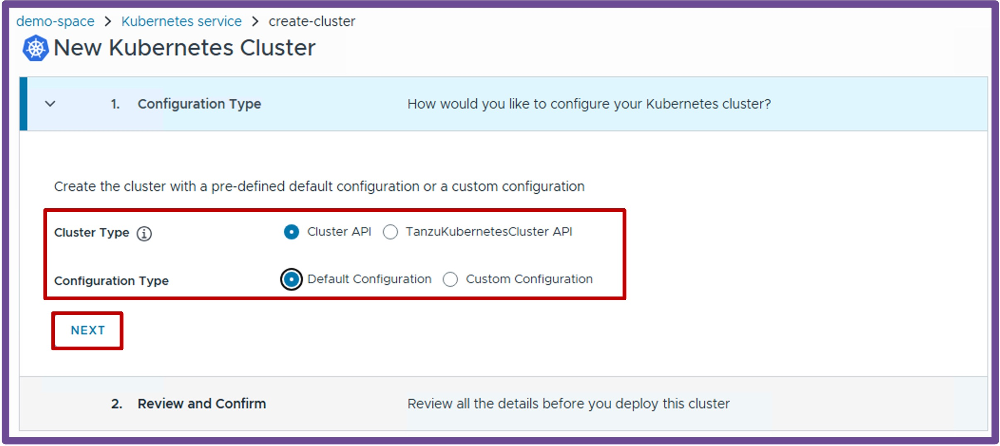
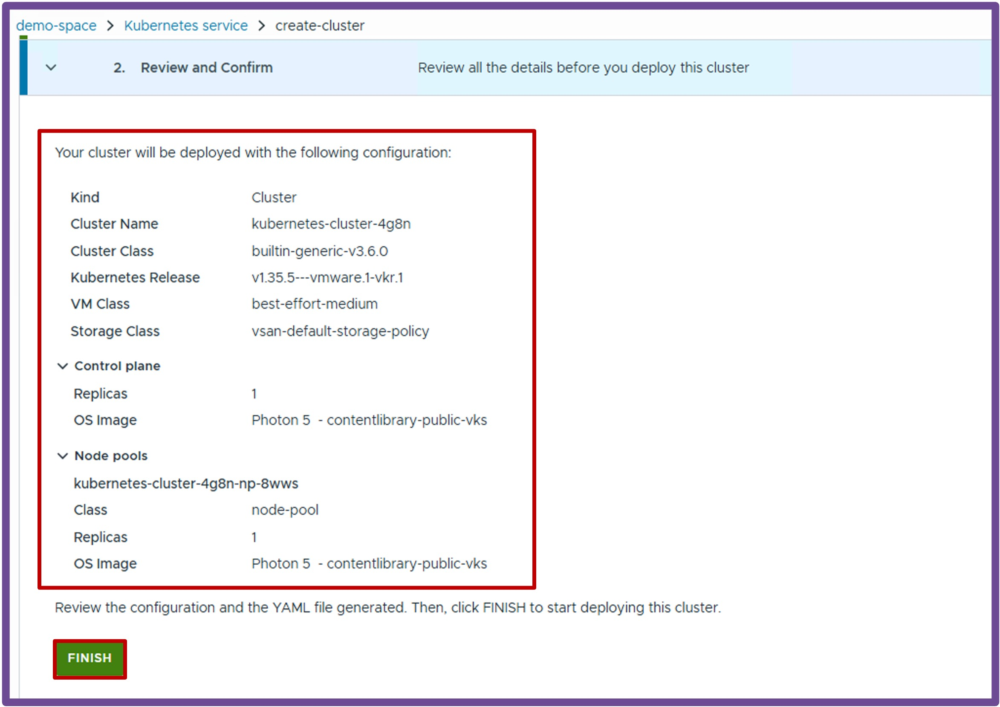
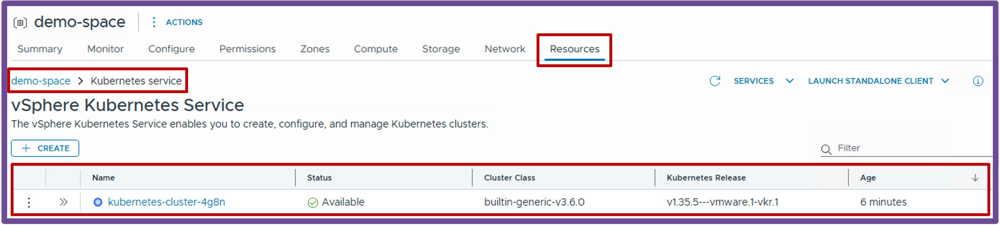
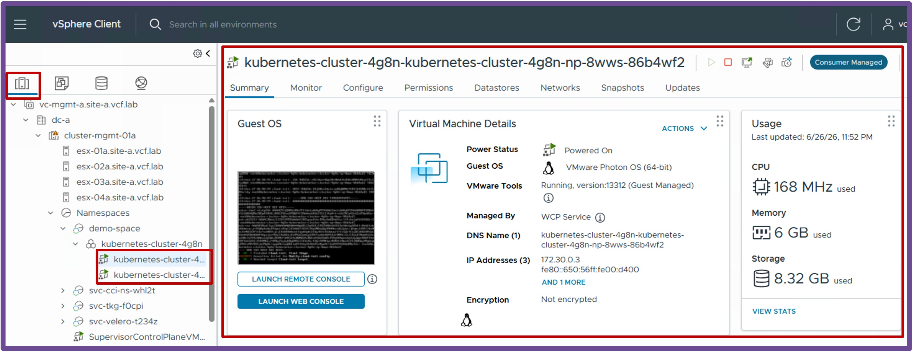

<h1>
   Supervisor with "NSX + DTGW/VNA"
</h1>

This section describes the procedures for **deploying a K8s Cluster in a Namespace with "NSX + DTGW/VNA"** within a vSphere environment.  

* **K8s Cluster Deployment**
    * [via vCenter UI](2e1-deployment-k8s.md)
    * [**via CLI**](#deployment_k8s)

{ width="100%" }

---

## K8s Cluster Deployment {: #deployment_k8s }

### Create K8s Cluster

{ width="40%" style="display: block; margin: 0 auto;" }

Navigate to **vCenter** > **Supervisor Management** > **Supervisors**, select **[your supervisor]**, navigate to **Namespaces**, select **[your namespace]**, navigate to **Resources**, and click on **Kubernetes - Create Cluster**  
{ width="95%" style="display: block; margin: 0 auto;" }

1. **Configuration Type**  
Select the **Cluster Type** and **Configuration Type**.
{ width="95%" align="center" }  

1. **Review and Confirm**  
Review and click **Finish** to deploy the k8s cluster.
{ width="95%" align="center" }  

??? info "More k8s cluster options"
    To get more options, such as **replicas** and **OS images**, select at step1 **Customer configuration**.

---

### Validate Deployment

#### **Validate K8s Cluster Status** 
Once the wizard completes, verify the deployment was successful by navigating to **vCenter** > **Supervisor Management** > **Supervisors**, select **[your supervisor]**, navigate to **Namespaces**, select **[your namespace]**, navigate to **Resources**, and click on **Kubernetes - Go to Service**.  

{ width="85%" style="display: block; margin: 0 auto;" }

#### **Check K8s Cluster VMs in vCenter Inventory** 
Verify the K8s Cluster VMs are running by navigating to **vCenter** > **Inventory**, select the **K8s VM in the Namespace**.
{ width="85%" style="display: block; margin: 0 auto;" }

