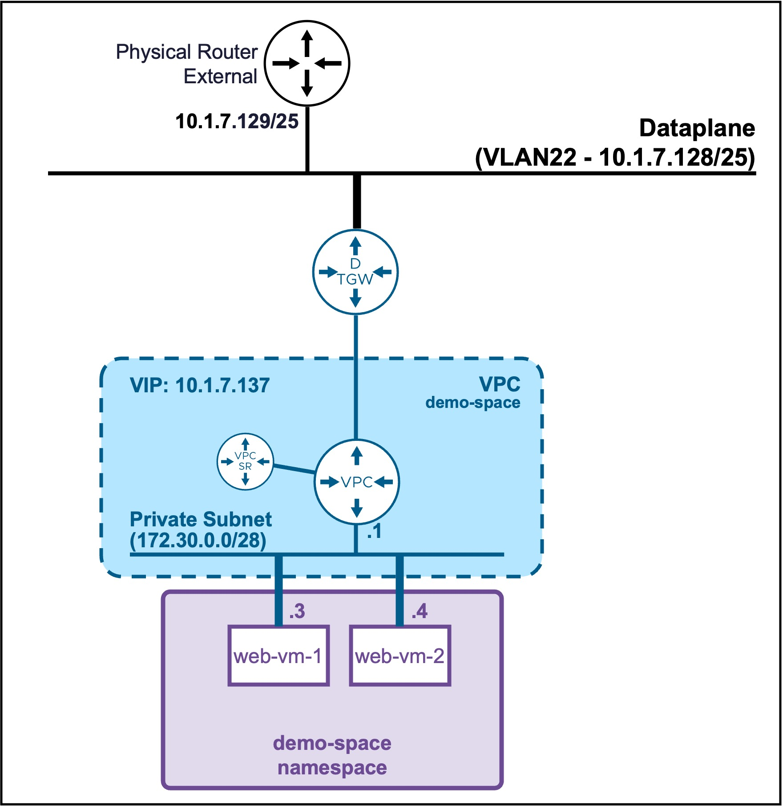

<h1>
   Supervisor with "NSX + DTGW/VNA"
</h1>

<div class="grid" markdown style="grid-template-columns: 60% 40%">

<div markdown>

This section describes the procedures for **deploying an application (VMs/K8s) into the VKS Namespace utilizing an "NSX + DTGW/VNA" architecture** inside a vSphere environment.

* **Deploy App (VMs)**
    * [via vCenter UI](2f1-deployment-vms.md)
    * [**via CLI**](#deployment_vms)
* Deploy App (K8s)
    * [via CLI](2g1-deployment-pods.md)
</div>

<div markdown>
{ width="100%" }
</div>
</div>

---

## Deploy App (VMs) {: #deployment_vms }

{ width="55%" style="display: block; margin: 0 auto;" }

??? info ":material-laptop: Client Operating System"
    While the command outputs below are captured from a **Windows client**, the `vcf` and `kubectl` CLI tools operate identically across **Linux** and **macOS** environments.

### Deploy a Full Application (Load Balancer + VMs)

#### Connect to Supervisor Namespace  
See [Namespace Access via CLI](2d2-access-namespace.md#namespacek8sclient)

#### Create application (LB + 2 VMs apache) yaml file  
Create file "my-web-farm.yaml"

??? info "my-web-farm.yaml file"
    ```text
    apiVersion: v1
    kind: Secret
    metadata:
      name: ubuntu-cloud-init
      namespace: demo-space
    stringData:
      user-data: |
        #cloud-config
        package_update: true
        packages:
          - apache2
          - unzip
          - open-vm-tools
          - net-tools
          - php
          - libapache2-mod-php
        
        # Create the user and add to sudo group
        users:
          - default
          - name: demouser
            groups: sudo
            shell: /bin/bash
            lock_passwd: false
        
        # Set the plain-text password and prevent it from expiring immediately
        chpasswd:
          list: |
            demouser:VMware123!VMware123!
          expire: false
        
        # Allow password authentication over SSH
        ssh_pwauth: true
            
        # Overwrite the default Apache page to show the VM hostname
        runcmd:
          - echo "<h1>Hello from $(hostname)</h1>" > /var/www/html/index.html
          - systemctl enable --now apache2
          - iptables -I INPUT 1 -p tcp --dport 80 -j ACCEPT
    
    ---
    apiVersion: vmoperator.vmware.com/v1alpha5
    kind: VirtualMachine
    metadata:
      name: web-vm-1
      namespace: demo-space
    labels:
        app: web-pool                  # <-- The label tying it to the Load Balancer
    spec:
      className: best-effort-xsmall
      imageName: noble-server-cloudimg-amd64
      storageClass: vsan-default-storage-policy
      powerState: PoweredOn
      bootstrap:
        cloudInit:
          rawCloudConfig:
            name: ubuntu-cloud-init
            key: user-data
    
    ---
    apiVersion: vmoperator.vmware.com/v1alpha5
    kind: VirtualMachine
    metadata:
      name: web-vm-2
      namespace: demo-space
      labels:
        app: web-pool                  # <-- The label tying it to the Load Balancer
    spec:
      className: best-effort-xsmall
      imageName: noble-server-cloudimg-amd64
      storageClass: vsan-default-storage-policy
      powerState: PoweredOn
      bootstrap:
        cloudInit:
          rawCloudConfig:
            name: ubuntu-cloud-init
            key: user-data
    
    ---
    apiVersion: vmoperator.vmware.com/v1alpha5
    kind: VirtualMachineService
    metadata:
      name: web-lb-vip
      namespace: demo-space
    spec:
      type: LoadBalancer
      ports:
        - name: http
          port: 80
          targetPort: 80
          protocol: TCP
      selector:
        app: web-pool
    ```

#### Deploy the application (LB + 2 VMs apache) 
```text
kubectl apply -f my-web-farm.yaml
```

??? info "Output example"
    <pre><code>PS C:\Users\Administrator\Documents> <b>kubectl apply -f my-web-vm.yaml</b>
    secret/ubuntu-cloud-init created
    virtualmachine.vmoperator.vmware.com/web-vm-1 created
    virtualmachine.vmoperator.vmware.com/web-vm-2 created
    virtualmachineservice.vmoperator.vmware.com/web-lb-vip created
    </code></pre>

---

### Validate deployment of the application (LB + 2 VMs apache) 
* **Check application VIP**  
```text
kubectl get service web-lb-vip
```

    ??? info "Output example"
        <pre><code>PS C:\Users\Administrator\Documents> <b>kubectl get service web-lb-vip</b>
        NAME         TYPE           CLUSTER-IP      EXTERNAL-IP   PORT(S)   AGE
        web-lb-vip   LoadBalancer   172.29.143.82   <b>10.1.7.137</b>    80/TCP    24s
        </code></pre>

    ??? warning "Load Balancer VM pool status"
        The Load Balancer does not offer VM pool member healthchecks.  
        If the VM or the application within the VM crashes, the load balancer will still use that member.


* **Check application VMs**  
```text
kubectl get virtualmachines -o wide
```
    
    ??? info "Output example"
        <pre><code>PS C:\Users\Administrator\Documents> <b>kubectl get virtualmachines -o wide</b>
        NAME       POWER-STATE   CLASS                IMAGE                   PRIMARY-IP4   AGE
        <b>web-vm-1</b>   PoweredOn     best-effort-xsmall   vmi-4143a3379f59e4a48   <b>172.30.0.3</b>    46s
        <b>web-vm-2</b>   PoweredOn     best-effort-xsmall   vmi-4143a3379f59e4a48   <b>172.30.0.4</b>    46
        </code></pre>

---

### Access the application (LB + 2 VMs apache) 
```text
curl http://10.1.7.137
```

??? info "Output example"
    <pre><code>PS C:\Users\Administrator\Documents> <b>curl http://10.1.7.137</b>
    &lt;h1&gt;Hello from <b>web-vm-1</b>&lt;/h1&gt;
    &nbsp;
    PS C:\Users\Administrator\Documents> <b>curl http://10.1.7.137</b>
    &lt;h1&gt;Hello from <b>web-vm-2</b>&lt;/h1&gt;
    </code></pre>


