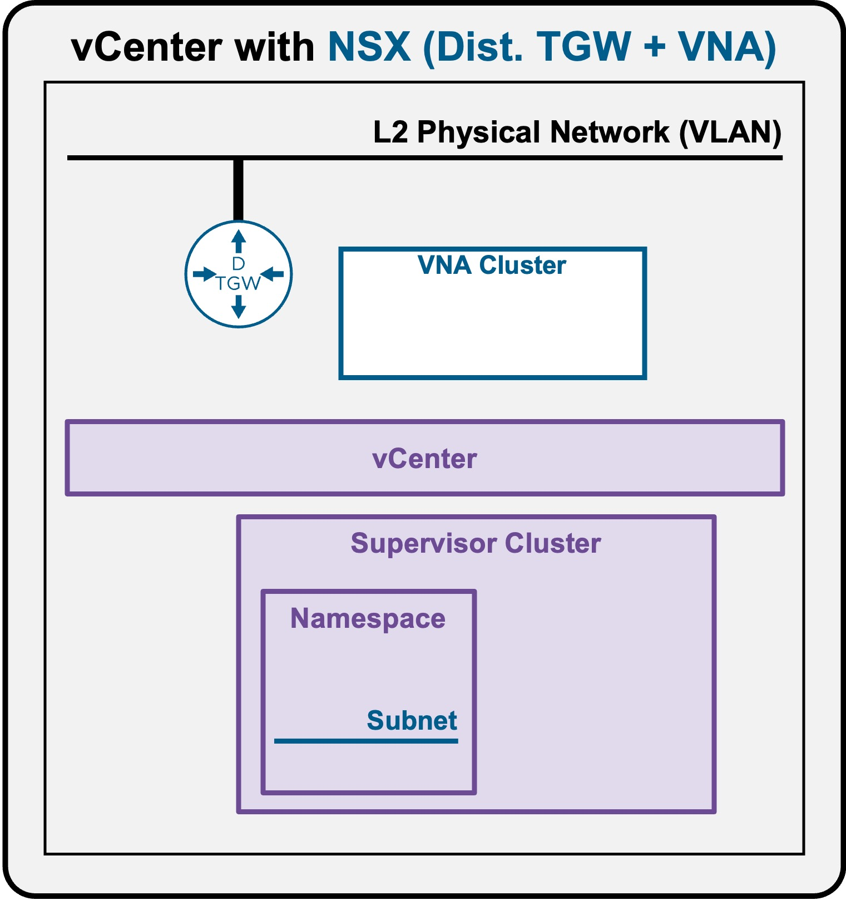
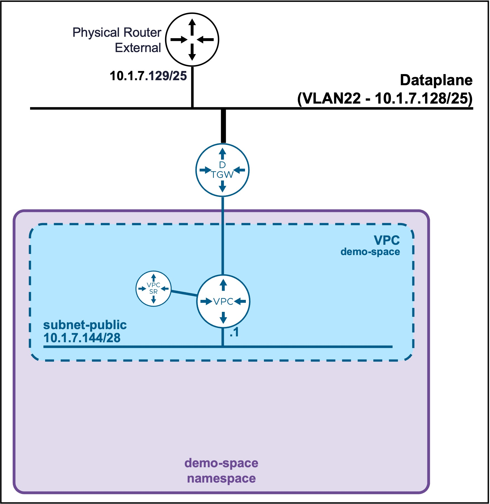
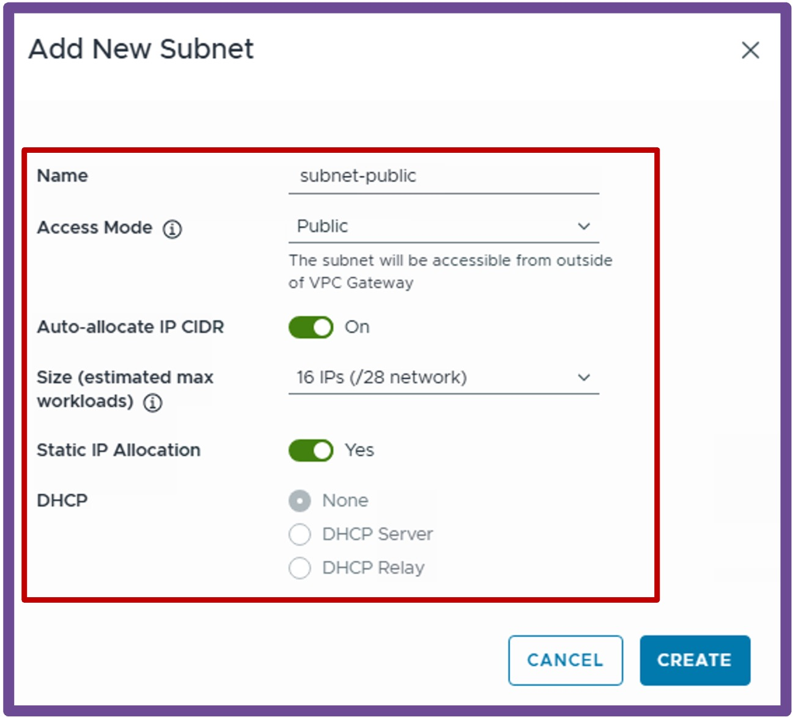

<h1>
   Supervisor with "NSX + DTGW/VNA"
</h1>

This section describes the procedures for **provisioning and managing Network Services within a VKS Namespace utilizing an "NSX + DTGW/VNA"** architecture inside a vSphere environment.

* **Network Services(ToDO)**
    * [**Subnets**](#networkservices)
    * [SubnetSets](2h2-network-subnetset.md)
    * [Static Routes](2h3-network-staticroute.md)
    * [External IPs(ToDO)](2h4-network-externalip.md)
    * [VM Load Balancers(ToDO)](2h5-network-lb.md)

{ width="100%" }

---

## Network Services - Subnets {: #networkservices }

{ width="55%" style="display: block; margin: 0 auto;" }

### Create Subnet

Navigate to **vCenter** > **Supervisor Management** > **Supervisors**, select **[your supervisor]**, navigate to **Namespaces**, select **[your namespace]**, navigate to **Resources**, and click on **Network - Go to Service**  
{ width="95%" style="display: block; margin: 0 auto;" }

1. **Create New Subnet**  
Navigate to **Subnets**, and click **New Subnet**  
{ width="50%" style="display: block; margin: 0 auto;" }  

For more information about Subnets settings review the [VPC Subnet Overlay page](../../vcenter/1b-vpc_subnet/#overlay){target="_blank"}.

