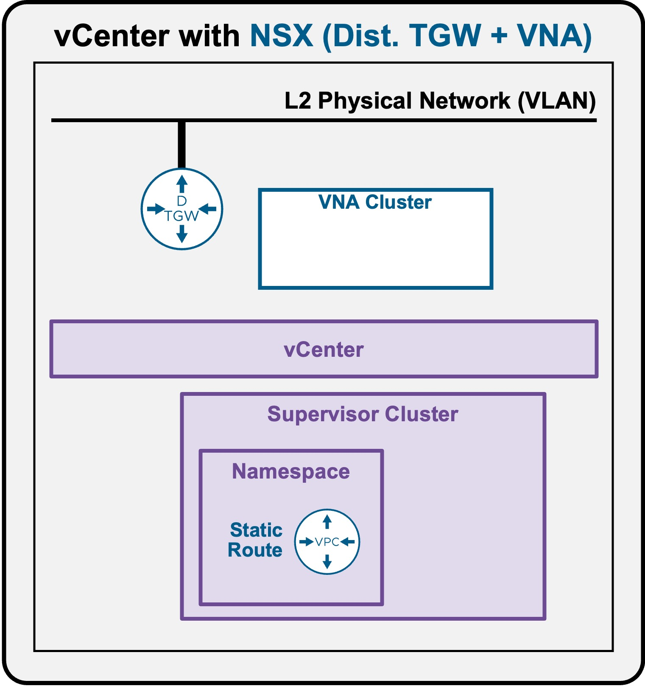
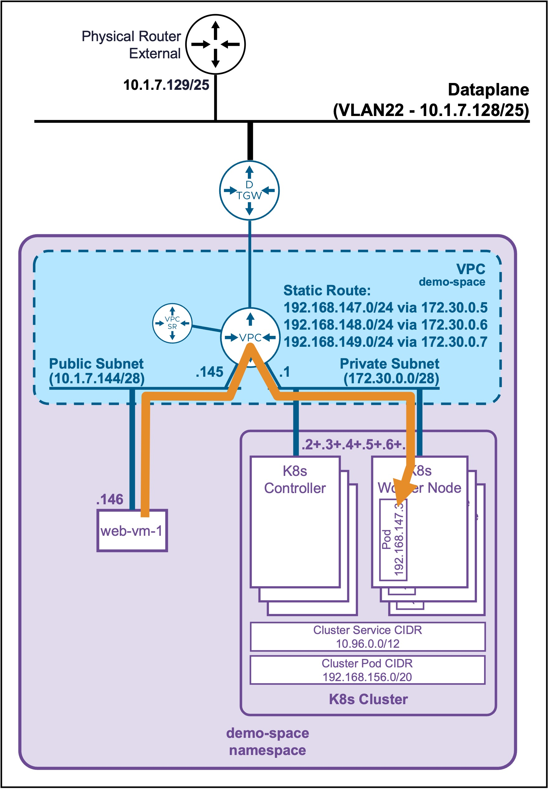
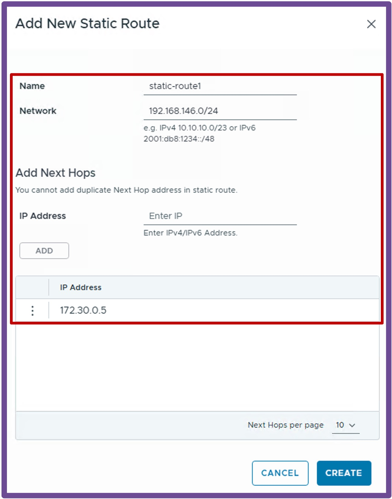

<h1>
   Supervisor with "NSX + DTGW/VNA"
</h1>

<div class="grid" markdown style="grid-template-columns: 60% 40%">

<div markdown>

This section describes the procedures for **provisioning and managing Network Services within a VKS Namespace utilizing an "NSX + DTGW/VNA"** architecture inside a vSphere environment.

* **Network Services(ToDO)**
    * [Subnets](2h1-network-subnet.md)
    * [SubnetSets](2h2-network-subnetset.md)
    * [**Static Routes**](#networkservices)
    * [External IPs(ToDO)](2h4-network-externalip.md)
    * [VM Load Balancers(ToDO)](2h5-network-lb.md)
</div>

<div markdown>
{ width="100%" }
</div>
</div>

---

## Network Services - Static Routes {: #networkservices }

The primary use case for configuring a **Static Route** is to enable direct, routable communication to individual K8s Pods residing on specific Worker Nodes.  
Note: With the "NSX + DTGW/VNA" architecture, communication to individual K8s Pods is only from VMs within the VPC.

{ width="55%" style="display: block; margin: 0 auto;" }

### Create Static Route

Navigate to **vCenter** > **Supervisor Management** > **Supervisors**, select **[your supervisor]**, navigate to **Namespaces**, select **[your namespace]**, navigate to **Resources**, and click on **Network - Go to Service**  
{ width="95%" style="display: block; margin: 0 auto;" }

1. **Create New Static Route**  
Navigate to **Static Routes**, and click **New Static Route**  
{ width="50%" style="display: block; margin: 0 auto;" }  

    ??? info "How to find required IP information via kubectl"
        1. **Find the Pod subnet (CIDR) of each K8s Node** 
        ```text
        kubectl get nodes -o custom-columns="NODE:.metadata.name,NODE-IP:.status.addresses[0].address,POD-CIDR:.spec.podCIDR"
        ```
          
            ??? abstract "Output example"
                <pre><code>PS C:\Users\Administrator\Documents> <b>kubectl get nodes -o custom-columns="NODE:.metadata.name,NODE-IP:.status.addresses[0].address,POD-CIDR:.spec.podCIDR"</b>
                NODE                                   NODE-IP      POD-CIDR
                my-cluster-wglt6-dlpqm                 172.30.0.2   192.168.144.0/24
                my-cluster-wglt6-jv9t5                 172.30.0.6   192.168.148.0/24
                my-cluster-wglt6-n9m25                 172.30.0.7   192.168.149.0/24
                my-cluster-workers-qjq5s-xj695-2kt4z   172.30.0.4   192.168.147.0/24
                <b>my-cluster-workers-qjq5s-xj695-dff4g   172.30.0.5   192.168.146.0/24</b>
                my-cluster-workers-qjq5s-xj695-p55n8   172.30.0.3   192.168.145.0/24
                </code></pre>

        1. **Find the target Pod's IP address**  
        ```text
        kubectl get pods -n <namespace> -o wide
        ```

            ??? abstract "Output example"
                <pre><code>PS C:\Users\Administrator\Documents> <b>kubectl get pods -n ns1 -o wide</b>
                NAME                                 READY   STATUS    RESTARTS   AGE   IP              NODE                                   NOMINATED NODE   READINESS GATES
                <b>apache-deployment-58bf9564f6-c8gqc   1/1     Running   0          8d    192.168.146.3   my-cluster-workers-qjq5s-xj695-dff4g   &lt;none&gt;           &lt;none&gt;</b>
                apache-deployment-58bf9564f6-dpmcd   1/1     Running   0          8d    192.168.147.3   my-cluster-workers-qjq5s-xj695-2kt4z   &lt;none&gt;           &lt;none&gt;
                </code></pre>

        1. **Find the target Pod's listening port**  
        ```text
        kubectl describe pod <pod> -n <namespace> | Select-String "Port" | Select-String -NotMatch "Host"
        ```

            ??? abstract "Output example"
                <pre><code>PS C:\Users\Administrator\Documents> <b>kubectl describe pod apache-deployment-58bf9564f6-c8gqc -n ns1 | Select-String "Port" | Select-String -NotMatch "Host"</b>
                    Port:          <b>8080/TCP</b>
                </code></pre>


### Validate the Static Route (Direct Access to Pod)
To verify connectivity, connect to a VM within the VPC and use `curl` to directly access the Pod's IP and port (assuming the application is web).
```text
root@vm-public:~# curl http://192.168.146.3:8080
<h1>It works - Pod: apache-deployment-58bf9564f6-c8gqc</h1>
```

