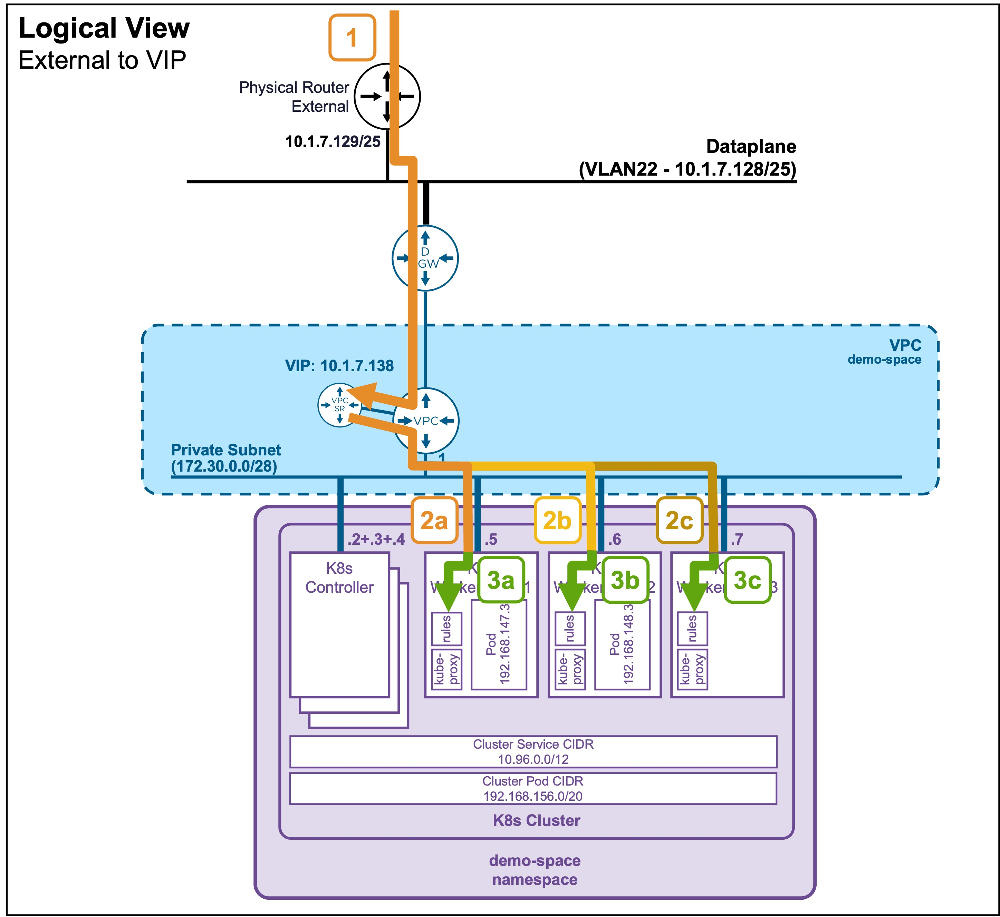

<h1>
   Supervisor with "NSX + DTGW/VNA"
</h1>

This section describes the procedures for **Troubleshooting Network Services into the VKS Namespace with "NSX + DTGW/VNA"** within a vSphere environment.

* **Packet Walk**  
    * [**N/S External to VIP**](#packetwalk)  
    * [N/S External to VM](2i2-packetwalk-ext_vm.md)  
    * [E/W pod to pod](2i3-packetwalk-pod_pod.md)  
    * [E/W VM to VM](2i4-packetwalk-vm_vm.md)  
* App Access broken(ToDO)  
    * [VIP access down](2j1-troubleshooting-vip.md)  
    * [VM access down](2j2-troubleshooting-vm.md)  
    * [Pod access down](2j3-troubleshooting-pod.md)  

{ width="100%" }

---

## Packet Walk - N/S External to VIP {: #packetwalk }
A Full Application (Load Balancer + Pods) has been deployed (see [Application Deployment > App Deployment (K8s) > via CLI](2g1-deployment-pods.md#deployment_pods)).

### View

#### Logical View
{ width="75%" style="display: block; margin: 0 auto;" }

#### Physical View
{ width="95%" style="display: block; margin: 0 auto;" }

---

### Packet Walk

* **Step1: External Client accesses the VIP**  
`Client-IP => VIP:80 (10.1.7.138)`  

    The traffic enters the ESX hosting the VNA Node that hosts the Active VPC-SR (Service Router).

* **Step2: VIP load balances traffic to the K8s Worker Nodes (kube-proxy)**  
`VPC-SR-Internal-IP => K8s WorkerNode[1-3]:31147 (172.30.0.[x])`  

    The load balancer (VPC-SR) forwards the traffic to the dynamically assigned NodePort on the K8s Worker Nodes.  
    If the Worker Nodes reside on a different ESX than the Active VPC-SR, the cross-ESX traffic is encapsulated using the ESX TEP IPs.  

    *Note: You can find the dynamically assigned Worker Node TCP port (`31147`) by running the command `kubectl get service apache-vip-service -n ns1` and looking under the PORT(S) column (see [Application Deployment > App Deployment (K8s) > via CLI](2g1-deployment-pods.md#deployment_pods)).*

* **Step 3: The K8s Worker Node intercepts the traffic**
    Once the traffic arrives at the Worker Node's network interface on the NodePort (`31147`), it is intercepted by the node's local routing rules (which are continuously programmed by the local `kube-proxy` pod).

* **Step 4 (not represented): The Worker Node load balances traffic to the Pods**
    Based on those `kube-proxy` rules, the Worker Node load balances the traffic to the different pods across the K8s cluster.  
    See [Packet Walk - E/W pod to pod](2i3-packetwalk-pod_pod.md#packetwalk) for cross-pod communication.

