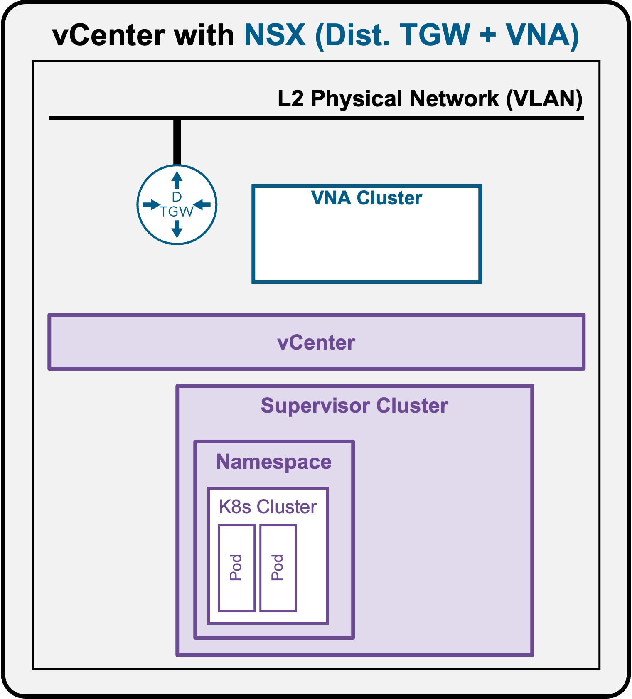

<h1>
   Supervisor with "NSX + DTGW/VNA"
</h1>

This section describes the procedures for **Troubleshooting Network Services into the VKS Namespace with "NSX + DTGW/VNA"** within a vSphere environment.

* **Packet Walk(ToDO)**  
    * [N/S External to VIP](2i1-packetwalk-ext_vip.md)  
    * [N/S External to VM](2i2-packetwalk-ext_vm.md)  
    * [E/W pod to pod](2i3-packetwalk-pod_pod.md)  
    * [**E/W VM to VM**](2i4-packetwalk-vm_vm.md)  
* App broken(ToDO)  
    * [VIP access down(ToDO)](2j1-troubleshooting-vip.md)  
    * [VM access down(ToDO)](2j2-troubleshooting-vm.md)  
    * [Pod access down(ToDO)](2j3-troubleshooting-pod.md)  

{ width="100%" }

---

## Troubleshooting - Pod access down {: #troubleshooting }

